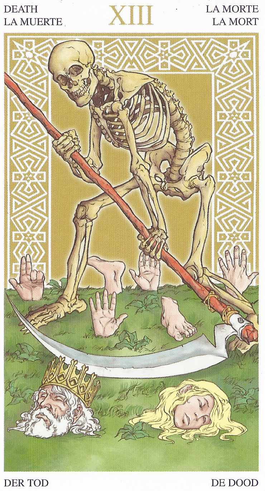
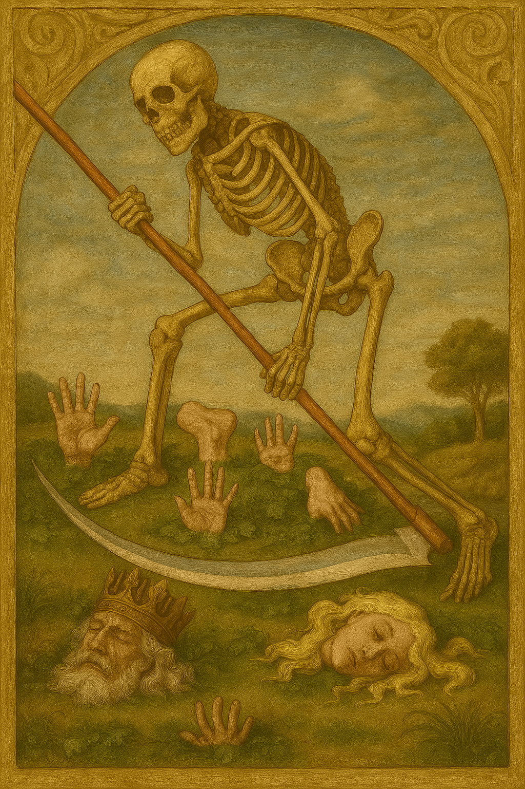
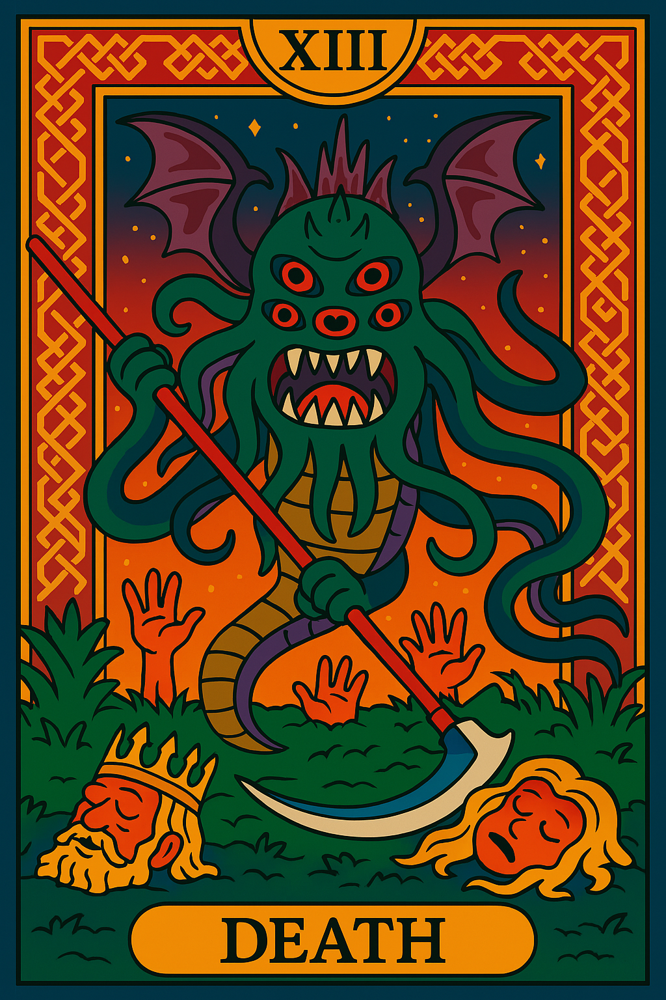
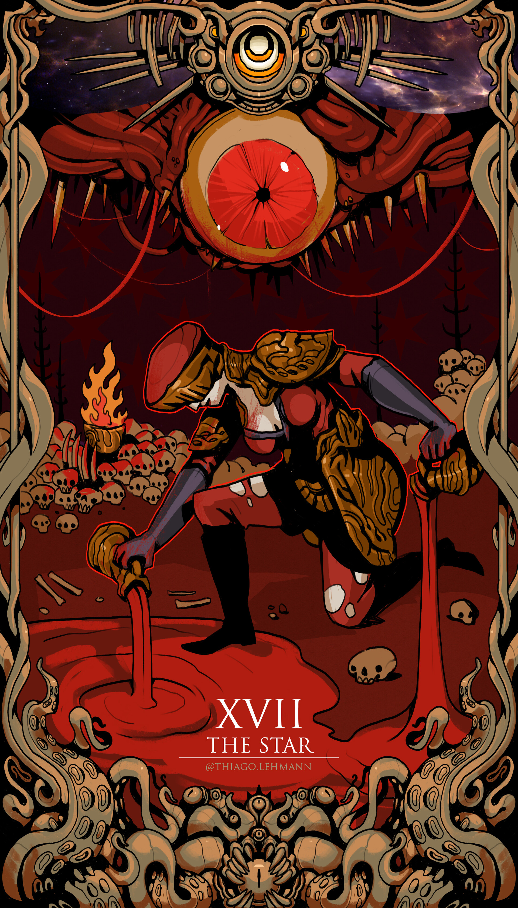

# 🔮 JodoTarot - Application de Tirage de Tarot avec IA

## ✨ Présentation

JodoTarot est une application web élégante et intuitive qui vous permet de réaliser des tirages de tarot et d'obtenir des interprétations générées par intelligence artificielle. Inspirée par l'univers mystique du tarot, cette application combine l'art divinatoire traditionnel avec les technologies modernes d'IA pour vous offrir une expérience de consultation unique.

[Essayer JodoTarot](https://habib256.github.io/jodotarot/index.html) | [Documentation complète](docs/index.md)

## 🚀 Guide rapide

1. **Choisissez votre langue** dans le menu déroulant
2. **Posez votre question** dans le champ dédié
3. **Sélectionnez** votre persona, jeu de cartes et type de tirage
4. **Cliquez sur "Tirer les cartes"**
5. **Explorez** l'interprétation générée par l'IA

## 🌟 Fonctionnalités principales

- 🎴 **4 types de tirages** (Croix, Fer à cheval, Amour, Croix celtique)
- 🧠 **Interprétation par IA** personnalisée
- 👤 **21 personas uniques** pour des lectures variées
- 🎨 **4 jeux de tarot** (Marseille, Thiago Lehmann, Renaissance, Rick & Morty)
- 🌍 **6 langues** supportées
- 🤖 **Modèles d'IA** flexibles (OpenAI et Ollama)

## 🃏 Aperçu des jeux

|  |  |
|:-------------------------:|:-------------------------:|
| **Tarot de Marseille** | **Tarot Renaissance** |

|  |  |
|:-------------------------:|:-------------------------:|
| **Tarot Rick & Morty** | **Tarot Thiago Lehmann** |

## ⚙️ Installation rapide

1. Clonez ce dépôt
2. Configurez votre clé API dans `assets/js/config.js`
3. Ouvrez `index.html` dans votre navigateur

Pour plus de détails sur l'installation et la configuration, consultez notre [guide technique](docs/index.md).

## 🔧 Besoin d'aide ?

- Consultez notre [guide de dépannage](docs/troubleshooting.md)
- Explorez la [documentation complète](docs/index.md)
- Découvrez nos [personas](docs/composants/personas.md)

## 📝 Licence

JodoTarot est distribué sous licence GNU General Public License v3.0.

---

*"Le tarot ne prédit pas l'avenir, il aide à le créer." – Alejandro Jodorowsky*

Développé avec ❤️ pour les amateurs de tarot et d'exploration intérieure.
