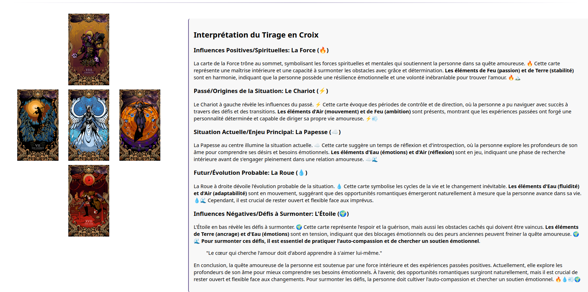

# 🔮 JodoTarot - Application de Tirage de Tarot avec IA

## ✨ Présentation

JodoTarot est une application web élégante et intuitive qui vous permet de réaliser des tirages de tarot et d'obtenir des interprétations générées par intelligence artificielle. Inspirée par l'univers mystique du tarot, cette application combine l'art divinatoire traditionnel avec les technologies modernes d'IA pour vous offrir une expérience de consultation unique.

[Lancer JodoTarot dans votre navigateur pour tester l'interface (Attention, l'accès à l'IA n'est pas fonctionelle d'ici)](https://habib256.github.io/jodotarot/index.html)  

## 🌟 Fonctionnalités principales

- 🎴 **Multiples modes de tirage**:
  - **Tirage en croix** avec 5 cartes (influences positives, passé, situation actuelle, futur, influences négatives)
  - **Tirage en fer à cheval** pour analyser la progression d'une situation
  - **Tirage de l'amour** dédié aux questions sentimentales
  - **Croix celtique** pour une analyse approfondie de 10 cartes
- 🧠 **Interprétation par IA** de votre tirage en fonction de votre question
- 👤 **Personnages variés** pour interpréter votre tirage (20 personas différents)
- 🔄 **Flexibilité des modèles d'IA** (OpenAI et modèles locaux Ollama)
- 📱 **Interface responsive** adaptée à tous les appareils
- 🖼️ **Visualisation claire** des cartes et de leur signification dans le tirage
- 🎨 **Choix de jeux de cartes** (Tarot de Marseille et Tarot Thiago Lehmann)
- 🌍 **Support multilingue** (Français, Anglais, Espagnol, Allemand, Italien, Chinois)
- 🔄 **Cache intégré** pour les réponses d'IA afin d'optimiser les performances

## 🎭 Les personas disponibles

JodoTarot propose 20 personnages différents pour interpréter votre tirage. Chaque persona possède:
- Un style d'expression unique
- Une approche spécifique d'interprétation du tarot
- Des **particularités langagières** distinctives (expressions typiques, vocabulaire spécifique, structures de phrases)
- Des **citations** représentatives de sa tradition ou de sa pensée

### Arts Divinatoires:
- 🔮 **Tarologue** - Expert des arts introspectifs inspiré par Jodorowsky, utilisant un langage métaphorique et poétique
- ✨ **Oracle Mystique** - Porte-parole énigmatique des forces cosmiques s'exprimant par prophéties ambiguës
- 🎯 **Voyante Gitane** - Diseuse de bonne aventure directe et colorée, mêlant expressions romanis et intuition brute

### Traditions Spirituelles:
- ✝️ **Prêtre Exégète** - Interprète des textes sacrés chrétiens, reliant les symboles du tarot aux récits bibliques
- ✡️ **Rabbin Kabbaliste** - Érudit associant les arcanes aux lettres hébraïques et sentiers de l'Arbre de Vie
- ☪️ **Imam Soufi** - Guide spirituel explorant les miroirs de l'âme (nafs) et le chemin vers le divin
- ☸️ **Dalaï-Lama** - Leader bouddhiste tibétain expliquant avec simplicité les causes de la souffrance et la voie du milieu
- 🏛️ **Maître Franc-Maçon** - Sage utilisant les symboles maçonniques pour dévoiler les vérités universelles

### Traditions Ésotériques:
- 🌙 **Sorcière Ancestrale** - Gardienne des savoirs païens reliant le tirage aux cycles naturels
- ⚗️ **Alchimiste Ésotérique** - Maître identifiant les phases alchimiques (nigredo, albedo, rubedo) dans les arcanes
- 🌟 **Mage Élémentaliste** - Expert des quatre éléments analysant leurs influences dans le tirage

### Psychanalystes:
- 🛋️ **Sigmund Freud** - Père de la psychanalyse interprétant les symboles comme manifestations de l'inconscient
- ☯️ **Carl Gustav Jung** - Explorateur des archétypes et du processus d'individuation révélés par les cartes
- 🔄 **Jacques Lacan** - Théoricien structuraliste décryptant le Réel-Symbolique-Imaginaire dans le tirage
- 👶 **Françoise Dolto** - Spécialiste de l'enfance analysant l'image inconsciente du corps et les schémas relationnels

### Philosophes et Sages:
- 🧠 **Socrate** - Maître de la maïeutique guidant vers la connaissance de soi par le questionnement
- 👑 **Roi Salomon** - Figure de sagesse biblique offrant discernement et jugement équilibré
- 📚 **Michel de Montaigne** - Humaniste explorant les contradictions humaines avec nuance et introspection
- 🛡️ **Don Quichotte** - Idéaliste transformant le tirage en quête chevaleresque et aventure extraordinaire

### Entités Spéciales:
- 💀 **Mortrarion** - Liche antique révélant des vérités brutales avec un mépris délibéré
- ☯️ **No EGO man** - Conscience non-duelle transcendant les dualités et dissolvant les questions plutôt que d'y répondre

## 🃏 Les jeux de tarot

L'application propose deux jeux complets des 22 arcanes majeurs:

### Tarot de Marseille (set01)
Le jeu traditionnel avec ses illustrations classiques.

### Tarot Thiago Lehmann (set02)
Une interprétation artistique moderne des arcanes.

## 🌍 Langues disponibles

JodoTarot prend en charge 6 langues différentes:

- 🇫🇷 **Français** (langue par défaut)
- 🇬🇧 **Anglais**
- 🇪🇸 **Espagnol**
- 🇩🇪 **Allemand**
- 🇮🇹 **Italien**
- 🇨🇳 **Chinois**

## 🔮 Types de tirages disponibles

### Tirage en Croix (Cross Spread)
Un tirage classique à 5 cartes qui examine la situation à travers différentes perspectives :
- Influences positives
- Passé
- Situation actuelle
- Futur
- Influences négatives

### Tirage en Fer à Cheval (Horseshoe Spread)
Un tirage à 7 cartes qui suit l'évolution d'une situation :
- Situation actuelle
- Obstacles immédiats
- Influences inconscientes
- Conseils à suivre
- Influences extérieures
- Espoirs et craintes
- Résultat final

### Tirage de l'Amour (Love Spread)
Un tirage spécialisé à 7 cartes pour les questions relationnelles et sentimentales :
- Vous (votre énergie)
- Partenaire (son énergie)
- Relation (ce qui vous lie)
- Obstacles (défis à surmonter)
- Désirs (passé/attentes)
- Résultat (présent/situation actuelle)
- Conseil (futur/direction)

### Croix Celtique (Celtic Cross Spread)
Un tirage approfondi à 10 cartes qui offre une lecture très complète de la situation :
- Situation actuelle
- Obstacle/Défi
- Base/Fondation
- Passé
- Couronne/Objectif
- Futur
- Vous-même
- Environnement
- Espoirs/Craintes
- Résultat final

## 🤖 Modèles d'IA supportés

### OpenAI (nécessite une clé API):
- GPT-4o Mini
- GPT-3.5 Turbo (par défaut si Ollama n'est pas disponible)
- GPT-4o

### Ollama (modèles locaux):
- Tous les modèles installés sur votre serveur Ollama local sont automatiquement détectés
- Premier modèle Ollama disponible utilisé par défaut si le serveur est accessible
- Support optimisé pour différentes familles de modèles (llama, mistral, phi, gemma, etc.)

## 🚀 Comment utiliser JodoTarot

1. **Choisissez votre langue** dans le menu déroulant en haut à gauche
2. **Posez votre question** dans le champ dédié
3. **Choisissez votre persona**, le **jeu de cartes**, le **mode de tirage** et le **modèle d'IA** souhaités
4. **Cliquez sur "Tirer les cartes"**
5. **Contemplez** le tirage qui s'affiche
6. **Lisez l'interprétation** générée par l'IA dans le style du persona choisi
7. **Cliquez sur une carte** pour l'agrandir et mieux l'observer

## 📸 Exemple de tirage

Voici un exemple de tirage en croix avec son interprétation complète:

*L'image montre un tirage complet avec l'interprétation de chaque carte et leur signification dans les différentes positions: influences positives (La Force), passé (Le Chariot), situation actuelle (La Papesse), futur (La Roue) et influences négatives (L'Étoile).*

## 💡 Conseils d'utilisation

- Formulez des questions ouvertes et personnelles pour obtenir des interprétations plus pertinentes
- Expérimentez avec différents personas pour découvrir diverses perspectives sur votre tirage
- Les modèles plus avancés comme GPT-4o offrent généralement des interprétations plus nuancées
- Essayez les deux jeux de cartes pour voir lequel résonne le plus avec vous
- Expérimentez les différents types de tirages en fonction de vos questions
- Prenez le temps de méditer sur chaque carte avant de lire l'interprétation complète

## 🙏 Remerciements

- Inspiré par l'univers symbolique d'Alejandro Jodorowsky
- Personas créés spécifiquement pour cette application
- Technologie propulsée par les API OpenAI et Ollama

---

*"Le tarot ne prédit pas l'avenir, il aide à le créer." – Alejandro Jodorowsky*

---

## 🔮 Exemples d'arcanes de tarot

|  |  |  |
|:-------------------------:|:-------------------------:|:-------------------------:|
| **XIII - La Mort** Tarot de Marseille | **XVII - L'Étoile** Tarot Thiago Lehmann | **0 - Le Fou** Tarot Thiago Lehmann |

Développé avec ❤️ pour les amateurs de tarot et d'exploration intérieure.

## ⚙️ Installation et configuration

1. Clonez ce dépôt sur votre serveur
2. Ouvrez le fichier `assets/js/config.js` et configurez votre clé API OpenAI: `const API_KEY = "Your OpenAI KEY";`
3. Pour utiliser les modèles Ollama, assurez-vous que le serveur Ollama est en cours d'exécution sur `http://localhost:11434`
4. Ouvrez `index.html` dans votre navigateur ou déployez l'application sur un serveur web

## 🔧 Caractéristiques techniques

- Application entièrement modulaire en JavaScript ES6
- Architecture orientée composants avec séparation claire des responsabilités:
  - `main.js` (259 lignes): Point d'entrée et initialisation de l'application
  - `app.js` (188 lignes): Gestion des événements et de l'interaction utilisateur
  - `api.js` (658 lignes): Communication avec les API d'IA (OpenAI et Ollama)
  - `ui.js` (281 lignes): Gestion de l'interface utilisateur
  - `prompt.js` (72 lignes): Gestion des prompts IA
  - `config.js` (103 lignes): Configuration globale de l'application

- Architecture MVC claire avec:
  - **Contrôleurs** pour la logique métier:
    - `AppController.js` (215 lignes): Contrôleur principal de l'application
    - `ReadingController.js` (545 lignes): Contrôleur de lecture de tarot
    - `ConfigController.js` (752 lignes): Contrôleur de configuration
  - **Services** pour la gestion des ressources:
    - `AIService.js` (417 lignes): Service d'intelligence artificielle
    - `DeckService.js` (435 lignes): Service de gestion du jeu de cartes
    - `UIService.js` (127 lignes): Service d'interface utilisateur
  - **Modèles** pour les données:
    - `spreads/`: Types de tirages disponibles
      - `BaseSpread.js` (331 lignes): Classe de base pour tous les tirages
      - `CrossSpread.js` (140 lignes): Tirage en Croix
      - `HorseshoeSpread.js` (183 lignes): Tirage en Fer à Cheval
      - `LoveSpread.js` (216 lignes): Tirage de l'Amour
      - `CelticCrossSpread.js` (295 lignes): Croix Celtique
    - `personas/`: 21 personas différents avec leurs styles d'interprétation uniques
    - `cards/`: Définition des cartes et de leurs significations

- Support multilingue complet:
  - 6 langues supportées avec fichiers de traduction dédiés:
    - Français (195 lignes)
    - Anglais (195 lignes)
    - Espagnol (165 lignes)
    - Allemand (165 lignes)
    - Italien (165 lignes)
    - Chinois (166 lignes)

- Gestionnaire d'état centralisé:
  - `StateManager.js` (200 lignes): Gestion de l'état global de l'application
  - Persistance des préférences utilisateur
  - Système d'événements pour la synchronisation UI/État

## 📝 Licence

JodoTarot est distribué sous licence GNU General Public License v3.0. Vous êtes libre de:
- Utiliser le logiciel

Voir le fichier [LICENSE](LICENSE) pour plus de détails.

## 🔧 Dépannage

### Problèmes courants et solutions

1. **"Erreur de connexion à l'API OpenAI"**
   - Vérifiez que votre clé API est correcte et possède des crédits suffisants
   - Assurez-vous que votre connexion internet fonctionne correctement

2. **"Impossible de se connecter à Ollama"**
   - Vérifiez que le serveur Ollama est bien lancé: `ollama serve`
   - Assurez-vous qu'Ollama écoute sur le port 11434
   - Vérifiez que vous avez au moins un modèle installé: `ollama list`

3. **"Le tirage ne s'affiche pas correctement"**
   - Essayez de rafraîchir la page
   - Vérifiez que JavaScript est activé dans votre navigateur
   - Assurez-vous que le chemin vers les images est correct

4. **"L'interprétation est toujours la même"**
   - Essayez de poser des questions plus variées
   - Utilisez un modèle d'IA plus avancé (comme GPT-4o)
   - Alternez entre différents personas

5. **"Problèmes avec le changement de langue"**
   - Assurez-vous que la page est entièrement chargée avant de changer de langue
   - Si certains textes ne sont pas traduits, rafraîchissez la page
   - Vérifiez que le modèle d'IA que vous utilisez est compatible avec la langue sélectionnée
   - Pour les modèles locaux Ollama, assurez-vous qu'ils peuvent générer du contenu dans la langue choisie

## 🔄 Mises à jour futures envisageables

- Support pour les arcanes mineurs (jeu complet de 78 cartes)
- Possibilité de sauvegarder et partager vos tirages
- Thèmes visuels alternatifs pour l'interface comme un mode sombre
- Intégration d'autres modèles d'IA locaux
- Rajout de la gestion des Oracles et du Yi King
- Permettre à l'IA de lire les images des cartes pour identifier les particularités symboliques spécifiques à chaque set. Ce sera très utile pour les oracles.
