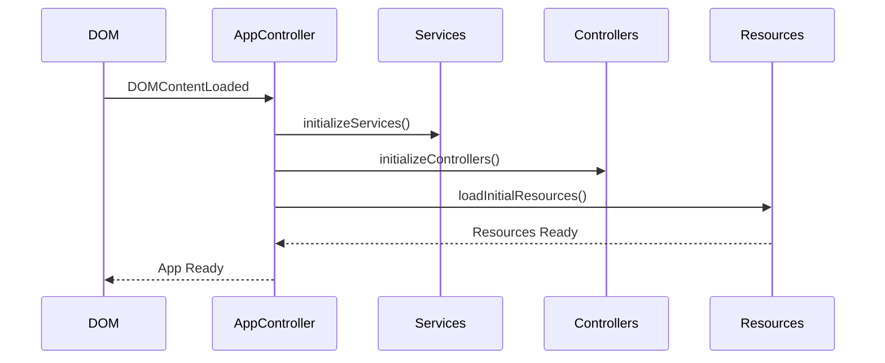
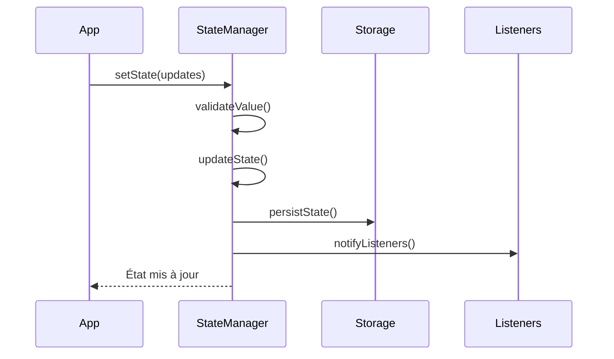

# 🔧 Structure Technique de JodoTarot

## Architecture Globale

JodoTarot est une application web modulaire construite en JavaScript ES6. L'architecture suit un modèle orienté composants avec une séparation claire des responsabilités.

## 📁 Structure des Fichiers

```
jodotarot/
├── assets/
│   ├── js/
│   │   ├── main.js           # Point d'entrée et initialisation (198 lignes)
│   │   ├── api.js            # Communication avec OpenAI et Ollama (868 lignes)
│   │   ├── ui.js             # Gestion de l'interface utilisateur (281 lignes)
│   │   ├── config.js         # Configuration globale (143 lignes)
│   │   ├── app.js            # Gestion des événements et interactions (228 lignes)
│   │   ├── prompt.js         # Gestion des prompts IA (72 lignes)
│   │   ├── translations/     # Fichiers de traduction
│   │   │   ├── fr.js        # Français (246 lignes)
│   │   │   ├── en.js        # Anglais (246 lignes)
│   │   │   ├── es.js        # Espagnol (166 lignes)
│   │   │   ├── de.js        # Allemand (166 lignes)
│   │   │   ├── it.js        # Italien (166 lignes)
│   │   │   ├── zh.js        # Chinois (167 lignes)
│   │   │   ├── README.md    # Documentation des traductions (66 lignes)
│   │   │   └── index.js     # Point d'entrée des traductions (80 lignes)
│   │   ├── services/
│   │   │   ├── AIService.js     # Service d'intelligence artificielle (787 lignes)
│   │   │   ├── UIService.js     # Service d'interface utilisateur (128 lignes)
│   │   │   └── DeckService.js   # Service de gestion du jeu de cartes (445 lignes)
│   │   ├── controllers/
│   │   │   ├── AppController.js       # Contrôleur principal (216 lignes)
│   │   │   ├── ConfigController.js    # Contrôleur de configuration (1184 lignes)
│   │   │   └── ReadingController.js   # Contrôleur de lecture (634 lignes)
│   │   ├── utils/
│   │   │   └── StateManager.js   # Gestionnaire d'état (645 lignes)
│   │   └── models/
│   │       ├── personas/         # Définitions des personas (23 personas)
│   │       │   ├── BasePersona.js           # Classe de base (94 lignes)
│   │       │   ├── TarologuePersona.js      # (75 lignes)
│   │       │   ├── OraclePersona.js         # (80 lignes)
│   │       │   ├── VoyantePersona.js        # (82 lignes)
│   │       │   ├── PretrePersona.js         # (82 lignes)
│   │       │   ├── RabbinPersona.js         # (82 lignes)
│   │       │   ├── ImamPersona.js           # (82 lignes)
│   │       │   ├── DalailamaPersona.js      # (82 lignes)
│   │       │   ├── SorcierePersona.js       # (82 lignes)
│   │       │   ├── AlchimistePersona.js     # (82 lignes)
│   │       │   ├── MagePersona.js           # (82 lignes)
│   │       │   ├── FrancmaconPersona.js     # (82 lignes)
│   │       │   ├── FreudPersona.js          # (97 lignes)
│   │       │   ├── JungPersona.js           # (82 lignes)
│   │       │   ├── LacanPersona.js          # (82 lignes)
│   │       │   ├── DoltoPersona.js          # (82 lignes)
│   │       │   ├── SocratePersona.js        # (82 lignes)
│   │       │   ├── SalomonPersona.js        # (82 lignes)
│   │       │   ├── MontaignePersona.js      # (82 lignes)
│   │       │   ├── QuichottePersona.js      # (82 lignes)
│   │       │   ├── DemonPersona.js          # (82 lignes)
│   │       │   ├── NoEgoPersona.js          # (82 lignes)
│   │       │   └── index.js                 # (75 lignes)
│   │       ├── spreads/          # Types de tirages
│   │       │   ├── BaseSpread.js         # Classe de base (331 lignes)
│   │       │   ├── CrossSpread.js        # Tirage en Croix (141 lignes)
│   │       │   ├── HorseshoeSpread.js    # Tirage en Fer à Cheval (184 lignes)
│   │       │   ├── LoveSpread.js         # Tirage de l'Amour (216 lignes)
│   │       │   ├── CelticCrossSpread.js  # Croix Celtique (295 lignes)
│   │       │   └── index.js              # (50 lignes)
│   │       └── cards/            # Définitions des cartes
│   ├── css/                      # Styles
│   │   ├── main.css              # Point d'entrée CSS (66 lignes)
│   │   ├── style.css             # Styles généraux (24 lignes)
│   │   ├── base/                 # Styles de base
│   │   │   ├── variables.css     # Variables CSS (168 lignes)
│   │   │   ├── reset.css         # Reset CSS (222 lignes)
│   │   │   └── typography.css    # Typographie (138 lignes)
│   │   ├── modules/              # Modules CSS
│   │   │   ├── cross-spread.css         # Tirage en Croix (130 lignes)
│   │   │   ├── horseshoe-spread.css     # Tirage en Fer à Cheval (113 lignes)
│   │   │   ├── love-spread.css          # Tirage de l'Amour (118 lignes)
│   │   │   ├── celtic-cross-spread.css  # Croix Celtique (160 lignes)
│   │   │   ├── interpretations.css      # Interprétations (504 lignes)
│   │   │   ├── persona.css              # Styles des personas (1372 lignes)
│   │   │   └── select.css               # Styles des select (60 lignes)
│   │   ├── layouts/              # Mises en page
│   │   ├── components/           # Composants CSS
│   │   └── utils/                # Utilitaires CSS
│   └── images/                   # Images et ressources graphiques
├── index.html                    # Page principale (148 lignes)
├── favicon.ico                   # Icône du site (23 lignes)
├── screenshot.png                # Capture d'écran de l'application (2165 lignes)
├── LICENSE                       # Licence du projet (675 lignes)
├── README.md                     # Documentation du projet (289 lignes)
└── codestructure.md              # Structure technique du projet (905 lignes)
```

## 🧩 Composants Principaux

### 1. Système de Configuration (`config.js`, `ConfigController.js`)
- Gestion des clés API (OpenAI)
- Configuration des endpoints (Ollama: http://localhost:11434)
- Paramètres globaux de l'application
- Interface utilisateur de configuration
- Gestion des modèles IA disponibles
- Tests de connectivité des modèles

### 2. API Integration (`api.js`, `AIService.js`)
- Communication avec OpenAI API
- Intégration avec Ollama pour les modèles locaux
- Support du streaming pour les réponses
- Gestion du cache des réponses
- Formatage des prompts et réponses
- Détection automatique des modèles Ollama

### 3. Interface Utilisateur (`ui.js`, `UIService.js`)
- Rendu des cartes de tarot
- Gestion des animations
- Mise à jour dynamique du DOM
- Gestion des événements utilisateur
- Adaptation multilingue de l'interface

### 4. Gestion des Données

#### Modèles de Cartes (`models/cards/`)
- 22 arcanes majeurs
- 2 jeux disponibles (Marseille et Thiago Lehmann)
- Attributs et significations

#### Types de Tirages (`models/spreads/`)
- Tirage en Croix (5 cartes)
- Fer à Cheval (7 cartes)
- Tirage de l'Amour (7 cartes)
- Croix Celtique (10 cartes)

#### Personas (`models/personas/`)
23 personas différents avec:
- Style d'expression unique
- Approche d'interprétation
- Particularités langagières
- Citations caractéristiques

### 5. Système de Traduction (`translations/`)
- Support de 6 langues (fr, en, es, de, it, zh)
- Fichiers de traduction modulaires
- Changement dynamique de langue
- Documentation pour les traducteurs

### 6. Gestion d'État Global (`StateManager.js`)
- Validation stricte des données d'état
- Persistance dans localStorage
- Gestion des événements et notifications
- Schéma de migration pour les mises à jour

## 🔄 Flux de Données

1. **Initialisation**
   - Chargement des configurations
   - Initialisation des modèles
   - Chargement des traductions
   - Restauration de l'état précédent

2. **Tirage de Cartes**
   - Sélection du type de tirage
   - Génération aléatoire des cartes
   - Positionnement selon le schéma choisi
   - Affichage avec animations

3. **Interprétation IA**
   - Construction du prompt avec contexte
   - Appel API (OpenAI ou Ollama)
   - Streaming de la réponse si disponible
   - Mise en cache des réponses
   - Formatage et affichage avec effet machine à écrire

## 🔄 Interactions entre Composants

### Architecture MVC

```
Controllers (AppController, ReadingController, ConfigController)
     ↑↓                    ↑↓                     ↑↓
Services (AIService, DeckService, UIService, StateManager)
     ↑↓                    ↑↓                     ↑↓
Models (Personas, Spreads, Cards, Translations)
```

### Responsabilités et Interactions Détaillées

#### 1. Controllers
- **AppController**: Point d'entrée principal
  - Initialise les autres contrôleurs
  - Gère le cycle de vie de l'application
  - Coordonne les interactions entre services

- **ReadingController**: Gestion des tirages
  - Coordonne DeckService et AIService
  - Gère le flux de tirage complet
  - Valide la cohérence des tirages
  - Implémente le système de défilement pour les interprétations
  - Gère l'effet de machine à écrire
  - Assure l'accessibilité du contenu généré

- **ConfigController**: Configuration
  - Gère les paramètres utilisateur
  - Coordonne les changements de langue
  - Configure les services IA
  - Gère la synchronisation UI/État
  - Gère la connectivité des modèles IA
  - Implémente un système robuste de gestion des erreurs
  - Maintient la cohérence entre l'UI et l'état global
  - Gère les modèles Ollama et OpenAI de manière dynamique

#### 2. Services

- **AIService**: 
  - Communique UNIQUEMENT via api.js pour les appels IA
  - Gère le cache des réponses
  - Construit les prompts via prompt.js
  - NE MODIFIE PAS directement l'UI

- **DeckService**:
  - Gère l'état du deck
  - Mélange et tire les cartes
  - Maintient l'historique des tirages
  - NE FAIT PAS d'appels API

- **UIService**:
  - SEUL responsable des mises à jour DOM
  - Gère les animations et transitions
  - Coordonne l'affichage des cartes
  - Gère les interactions de défilement
  - Optimise l'expérience utilisateur pour le contenu dynamique
  - NE CONTIENT PAS de logique métier

- **StateManager**:
  - Gère l'état global de l'application
  - Persiste les préférences utilisateur
  - POINT UNIQUE de vérité pour l'état

#### 3. Models

- **Personas**:
  - Chaque persona est une classe distincte
  - Hérite de BasePersona
  - Définit son propre style et prompts
  - NE FAIT PAS d'appels API directs

- **Spreads**:
  - Définit la logique de placement des cartes
  - Valide le nombre de cartes nécessaires
  - Fournit les positions et significations
  - NE GÈRE PAS le tirage effectif

- **Cards**:
  - Modèles de données purs
  - Contient les attributs et significations
  - NE GÈRE PAS la logique de tirage

#### 4. Utilitaires

- **translations/**: 
  - Fichiers de traduction isolés
  - Importés via index.js
  - NE CONTIENT PAS de logique

- **config.js**:
  - Configuration globale uniquement
  - Points d'accès API
  - Paramètres système
  - NE CONTIENT PAS de logique

- **prompt.js**:
  - Construction des prompts IA
  - Enrichissement contextuel
  - Formatage des réponses
  - DÉLÈGUE les appels API à api.js

- **main.js**:
  - Point d'entrée de l'application
  - Initialisation des composants
  - Configuration des écouteurs d'événements
  - Amélioration du défilement (`enhanceScrolling()`)
  - Gestion des erreurs globales

### Points d'Attention pour le Développement

1. **Modifications UI**:
   - TOUJOURS passer par UIService
   - NE JAMAIS modifier le DOM directement depuis les controllers
   - TOUJOURS vérifier la validité des options avant mise à jour
   - UTILISER les événements personnalisés pour la synchronisation
   - IMPLÉMENTER le défilement avec les propriétés appropriées (`overflow`, `pointer-events`)

2. **Gestion des Modèles IA**:
   - TOUJOURS vérifier la connectivité avant changement
   - GÉRER les fallbacks de manière appropriée
   - MAINTENIR la cohérence entre UI et état
   - SUPPORTER l'ajout dynamique de modèles Ollama

3. **État Application**:
   - TOUJOURS utiliser StateManager
   - NE JAMAIS stocker l'état dans les composants
   - SYNCHRONISER l'UI avec l'état de manière bidirectionnelle
   - VALIDER les options avant mise à jour

4. **Traductions**:
   - TOUJOURS utiliser getTranslation()
   - NE JAMAIS hardcoder les textes

5. **Personas**:
   - TOUJOURS hériter de BasePersona
   - TOUJOURS définir les méthodes requises
   - NE JAMAIS modifier d'autres composants

6. **Services**:
   - Respecter la séparation des responsabilités
   - NE PAS dupliquer la logique entre services
   - UTILISER les interfaces définies

7. **Gestion du Défilement et Interactions**:
   - UTILISER la méthode `initScrollHandlers()` pour initialiser le défilement
   - ÉVITER `pointer-events: none` sur les conteneurs défilables
   - ASSURER la compatibilité avec la molette de souris et le tactile
   - MAINTENIR des niveaux z-index cohérents pour éviter les problèmes d'interaction
   - PERMETTRE les interactions utilisateur avec le texte généré

### 🤖 Construction du Prompt Système

Le système de construction des prompts suit une architecture en couches qui assure une génération cohérente et personnalisée des instructions pour l'IA. Voici le détail du processus:

#### 1. Structure des Composants

```
assets/js/
├── prompt.js              # Gestion centrale des prompts (72 lignes)
├── services/
│   └── AIService.js      # Service d'IA et construction des prompts (787 lignes)
├── models/
│   └── personas/         # Définitions des personas (23 personas)
└── translations/         # Traductions des prompts (6 langues)
```

#### 2. Flux de Construction du Prompt

1. **Initialisation** (`AIService.getInterpretation`):
   - Reçoit: cartes, question, persona, modèle, langue, type de tirage, callback streaming
   - Coordonne la construction des prompts système et utilisateur
   - Gère la décision entre mode standard et streaming

2. **Construction des Prompts Système** (`AIService.buildSystemPrompts`):
   - Récupère le métaprompt via `getMetaPrompt(langue)`
   - Obtient le prompt du persona via `getPersonaPrompt(persona, language, spreadType)`
   - Combine dans l'ordre:
     1. Métaprompt (règles générales)
     2. Prompt du persona (style et approche)

3. **Construction du Prompt Principal** (`AIService.buildPrompt`):
   - Crée une instance du type de tirage
   - Génère la description détaillée des cartes
   - Enrichit avec la question via `enrichirPromptContextuel()`
   - Adapte la structure selon le type de tirage

#### 3. Composants du Prompt Final

1. **Métaprompt** (via `prompt.js` et les traductions):
   ```
   Format obligatoire (400-450 mots):
   - Réponse concise et complète
   - Utilisation d'émojis pertinents
   - Formatage HTML spécifique
   - Aspects psychologiques et symboliques
   - Connexions entre cartes
   - Langage accessible
   - Conseil pratique final
   ```

2. **Prompt du Persona**:
   - Style d'expression unique
   - Approche d'interprétation spécifique
   - Vocabulaire caractéristique
   - Citations représentatives
   - Spécialisations particulières

3. **Description du Tirage**:
   - Position et signification de chaque carte
   - Relations entre les cartes
   - Contexte du type de tirage

4. **Emphase sur la Question**:
   ```
   ====================
   Question de l'utilisateur:
   "Question précise posée par l'utilisateur"
   ====================

   IMPORTANT: Réponse DIRECTEMENT liée à la question
   - Focus sur les éléments spécifiques
   - Adaptation à la demande précise
   - Pas de réponse générique
   ```

#### 4. Validation et Contrôles

- Vérification des paramètres essentiels
- Validation du format des cartes
- Contrôle de la cohérence du tirage
- Logs de débogage en mode développement
- Affichage du prompt complet en mode debug

#### 5. Gestion des Langues

- Support multilingue intégré via translations
- Traductions des prompts système
- Adaptation des personas aux différentes langues
- Messages d'interface localisés

## 🔧 Caractéristiques Techniques

- **Cache**: LocalStorage pour les préférences et réponses IA
- **Gestion d'Erreurs**: Système robuste pour les erreurs API
- **Responsive Design**: Adaptation à tous les écrans
- **Système de Défilement**: Gestion optimisée pour la zone d'interprétation avec:
  - Détection automatique du contenu défilable
  - Support de la molette de souris et des interactions tactiles
  - Styles adaptés pour une meilleure expérience utilisateur
  - Séparation propre des événements pour éviter les conflits
- **Performance**: Optimisation des appels API et du rendu
- **Modularité**: Architecture permettant l'ajout facile de:
  - Nouveaux jeux de cartes
  - Nouveaux types de tirages
  - Nouveaux personas
  - Nouvelles langues

## 🃏 Système de Positionnement des Cartes

Le positionnement des cartes de tarot est défini à travers une architecture en deux couches:

### 1. Définition Logique (JavaScript)

Les classes dans `assets/js/models/spreads/` définissent:
- Le nombre de cartes pour chaque tirage
- Les noms des positions (ex: 'center', 'top', 'left', etc.)
- Les significations de chaque position dans différentes langues
- Les classes CSS à utiliser pour chaque carte

**Exemple pour le tirage en Croix:**
```javascript
// CrossSpread.js
this.cardPositions = [
  { name: 'center' },  // Centre - Situation actuelle
  { name: 'top' },     // Haut - Ce qui influence
  { name: 'left' },    // Gauche - Passé
  { name: 'right' },   // Droite - Futur
  { name: 'bottom' }   // Bas - Résultat
];
```

### 2. Définition Visuelle (CSS)

Le positionnement exact est défini dans deux endroits:

#### a. Variables CSS (`assets/css/base/variables.css`)

Ce fichier centralise toutes les coordonnées sous forme de variables CSS:

```css
/* Tirage en croix */
--cross-center-x: 50%;
--cross-center-y: 50%;
--cross-top-x: 50%;
--cross-top-y: 20%;
--cross-left-x: 10%;
--cross-left-y: 50%;
--cross-right-x: 90%;
--cross-right-y: 50%;
--cross-bottom-x: 50%;
--cross-bottom-y: 80%;

/* Positions en fer à cheval */
--horseshoe-past-x: 10%;
--horseshoe-past-y: 70%;
--horseshoe-recent-x: 25%;
--horseshoe-recent-y: 60%;
/* etc. */

/* Positions du tirage de l'amour */
/* Première ligne - Vous et Partenaire */
--love-you-x: 50%;          /* card-1: self */
--love-you-y: 55%;
--love-partner-x: 50%;      /* card-2: partner */
--love-partner-y: 20%;

/* Deuxième ligne - Relation et Obstacles */
--love-relationship-x: 30%; /* card-3: relationship */
--love-relationship-y: 40%;
--love-foundation-x: 70%;   /* card-4: obstacles */
--love-foundation-y: 40%;

/* Troisième ligne - Passé (Désirs), Présent (Résultat), Futur (Conseil) */
--love-past-x: 30%;         /* card-5: desires */
--love-past-y: 75%;
--love-present-x: 50%;      /* card-6: outcome */
--love-present-y: 90%;
--love-future-x: 70%;       /* card-7: advice */
--love-future-y: 75%;

/* Positions de la croix celtique */
/* Centre de la croix */
--celtic-present-x: 35%;    /* Carte 1: Situation actuelle */
--celtic-present-y: 45%;
--celtic-challenge-x: 35%;  /* Carte 2: Obstacle/Défi (croisée) */
--celtic-challenge-y: 45%;
/* etc. */
```

#### b. Modules CSS spécifiques aux tirages (`assets/css/modules/`)

Chaque type de tirage a son propre fichier CSS qui utilise les variables:
- `cross-spread.css` (130 lignes) - Pour le tirage en Croix
- `horseshoe-spread.css` (110 lignes) - Pour le tirage en Fer à Cheval
- `love-spread.css` (115 lignes) - Pour le tirage de l'Amour  
- `celtic-cross-spread.css` (157 lignes) - Pour la Croix Celtique

**Exemple pour le tirage en Croix:**
```css
.center {
  left: var(--cross-center-x);
  top: var(--cross-center-y);
  transform: translate(-50%, -50%);
  z-index: 3;
}

.top {
  left: var(--cross-top-x);
  top: var(--cross-top-y);
  transform: translate(-50%, 0);
  z-index: 2;
}
/* etc. */
```

### 3. Nouvelle Architecture de Positionnement

La nouvelle architecture suit le principe de "CSS comme source unique de vérité" pour le positionnement des cartes.

#### a. Classes JavaScript (`assets/js/models/spreads/`)

Les classes JavaScript ne définissent plus les coordonnées, mais uniquement les noms des positions :

```javascript
// Exemple dans CrossSpread.js
this.cardPositions = [
  { name: 'center' },  // Centre - Situation actuelle
  { name: 'top' },     // Haut - Ce qui influence
  { name: 'left' },    // Gauche - Passé
  { name: 'right' },   // Droite - Futur
  { name: 'bottom' }   // Bas - Résultat
];
```

#### b. Classe de Base (`BaseSpread.js`)

La classe `BaseSpread` utilise les variables CSS pour le positionnement :

```javascript
initializeCardPositions() {
  // ...
  if (position.name) {
    positionElement.style.left = `var(--${this.key}-${position.name}-x)`;
    positionElement.style.top = `var(--${this.key}-${position.name}-y)`;
  }
  // ...
}
```

#### c. Avantages de la Nouvelle Architecture

1. **Séparation des Responsabilités**
   - JavaScript : Logique et structure des tirages
   - CSS : Positionnement et style visuel

2. **Maintenance Simplifiée**
   - Un seul endroit pour modifier les positions (variables.css)
   - Pas de duplication des coordonnées

3. **Flexibilité Accrue**
   - Support facile des media queries
   - Adaptation dynamique aux différentes tailles d'écran
   - Possibilité d'animations CSS complexes

4. **Meilleure Performance**
   - Utilisation du moteur de rendu CSS natif
   - Moins de calculs JavaScript

5. **Extensibilité**
   - Ajout facile de nouveaux types de tirages
   - Personnalisation simple des positions par thème

#### d. Structure des Fichiers

```
assets/
├── css/
│   ├── base/
│   │   └── variables.css      # Source unique de vérité pour les positions (165 lignes)
│   └── modules/
│       ├── cross-spread.css            # (130 lignes)
│       ├── horseshoe-spread.css        # (110 lignes)
│       ├── love-spread.css             # (115 lignes)
│       └── celtic-cross-spread.css     # (157 lignes)
└── js/
    └── models/
        └── spreads/
            ├── BaseSpread.js           # Logique commune de positionnement (331 lignes)
            ├── CrossSpread.js          # Définition des noms de positions (141 lignes)
            ├── HorseshoeSpread.js      # (184 lignes)
            ├── LoveSpread.js           # (216 lignes)
            ├── CelticCrossSpread.js    # (295 lignes)
            └── index.js                # Point d'entrée pour les tirages (50 lignes)
```

## 🤖 Intégration IA

### Modèles Supportés

#### OpenAI
- GPT-4o Mini
- GPT-3.5 Turbo (défaut)
- GPT-4o

#### Ollama (Local)
- Support automatique des modèles installés
- Détection automatique du premier modèle disponible
- Optimisation pour différentes familles (llama, mistral, phi, gemma)

### Système de Prompts
- Construction dynamique selon le contexte
- Adaptation au persona sélectionné
- Intégration des éléments de tirage
- Formatage des réponses en HTML

## 🔐 Sécurité
- Validation des entrées utilisateur
- Gestion sécurisée des clés API
- Protection contre les injections
- Gestion des limites de rate

## 📊 État Actuel du Projet

### Implémenté
- Interface utilisateur complète
- Système de tirage
- Intégration IA (OpenAI et Ollama)
- Support multilingue
- Système de personas
- Cache des réponses
- Gestion optimisée du défilement
- Affichage HTML dans l'interprétation

### En Développement
- Support des arcanes mineurs
- Sauvegarde des tirages
- Mode sombre
- Intégration d'oracles
- Analyse d'images par IA

## 🔄 Cycles de Vie et Événements

### Initialisation de l'Application



### Cycle de Vie des Composants

1. **AppController**
   - Démarrage: `initialize()`
   - Séquence:
     1. Initialisation des services
     2. Initialisation des contrôleurs
     3. Chargement des ressources
     4. Configuration des écouteurs globaux

2. **ReadingController**
   - Démarrage: `constructor()`
   - Séquence:
     1. Initialisation des écouteurs
     2. Initialisation des spreads
     3. Initialisation du deck
     4. Configuration du tirage par défaut

3. **ConfigController**
   - Démarrage: `constructor()`
   - Séquence:
     1. Initialisation des éléments UI
     2. Configuration des écouteurs
     3. Chargement des préférences
     4. Application de la configuration initiale

### Flux d'Événements Principaux

1. **Changement de Langue**
```
languageSelect.change
  → ConfigController.handleLanguageChange()
    → StateManager.setLanguage()
      → UIService.updateUILanguage()
        → Événement 'language:changed'
```

2. **Tirage de Cartes**
```
drawButton.click
  → ReadingController.performReading()
    → DeckService.drawCards()
      → UIService.displayCards()
        → AIService.getInterpretation()
          → ReadingController.startTypewriterEffect()
            → ReadingController.initScrollHandlers()
              → UIService.displayInterpretation()
```

3. **Changement de Persona**
```
personaSelect.change
  → ConfigController.handlePersonaChange()
    → StateManager.setPersona()
      → UIService.updatePersonaDisplay()
        → Événement 'persona:changed'
          → ReadingController.resetDisplays()
```

### Gestionnaires d'Événements Clés

#### 1. Événements Globaux
```javascript
window.addEventListener('DOMContentLoaded', initApp)
window.addEventListener('resize', handleResize)
window.addEventListener('error', handleError)
```

#### 2. Événements de Configuration
```javascript
languageSelect.addEventListener('change', handleLanguageChange)
personaSelect.addEventListener('change', handlePersonaChange)
cardSetSelect.addEventListener('change', handleCardSetChange)
spreadTypeSelect.addEventListener('change', handleSpreadTypeChange)
iaModelSelect.addEventListener('change', handleModelChange)
```

#### 3. Événements de Tirage
```javascript
drawButton.addEventListener('click', performReading)
cardElements.forEach(card => 
  card.addEventListener('click', handleCardClick)
)
```

### Règles de Gestion des Événements

1. **Propagation**
   - TOUJOURS utiliser la délégation d'événements quand possible
   - NE JAMAIS arrêter la propagation sans raison valide

2. **État**
   - TOUJOURS mettre à jour StateManager avant l'UI
   - TOUJOURS émettre des événements personnalisés pour les changements d'état

3. **Performance**
   - UTILISER la délégation pour les listes dynamiques
   - DÉBOUNCER les événements fréquents (resize, scroll)

4. **Erreurs**
   - TOUJOURS avoir un gestionnaire d'erreurs global
   - LOGGER les erreurs importantes
   - INFORMER l'utilisateur de manière appropriée

### Points de Synchronisation

1. **Chargement Initial**
   - Attendre DOMContentLoaded
   - Charger les configurations
   - Initialiser les services
   - Charger les ressources

2. **Changements d'État**
   - Mettre à jour StateManager
   - Émettre l'événement approprié
   - Attendre la confirmation
   - Mettre à jour l'UI

3. **Appels API**
   - Valider l'état avant l'appel
   - Gérer les timeouts
   - Mettre en cache les résultats
   - Notifier les changements

### 🔄 StateManager: Gestionnaire d'État Global

Le `StateManager` est un composant crucial qui gère l'état global de l'application de manière centralisée. Voici ses caractéristiques principales:

#### 1. Structure de l'État

L'état est défini par un schéma strict qui inclut:

```javascript
{
  language: {type: 'string', enum: ['fr', 'en', 'es', 'de', 'it', 'zh'], default: 'fr'},
  persona: {
    type: 'string', 
    enum: ['tarologue', 'oracle', 'voyante', 'pretre', 'rabbin', 'imam',
          'dalailama', 'sorciere', 'alchimiste', 'mage', 'francmacon',
          'freud', 'jung', 'lacan', 'dolto', 'socrate', 'salomon',
          'montaigne', 'quichotte', 'demon', 'noegoman'],
    default: 'tarologue'
  },
  cardSet: {type: 'string', enum: ['set01', 'set02'], default: 'set01'},
  deckId: {type: 'string', enum: ['set01', 'set02']},
  spreadType: {type: 'string', enum: ['cross', 'horseshoe', 'love', 'celticCross']},
  iaModel: {type: 'string', validate: /* validation personnalisée */},
  cards: {type: 'array', validate: /* validation détaillée */},
  question: {type: 'string', maxLength: 1000},
  interpretation: {type: 'object', nullable: true},
  isLoading: {type: 'boolean'},
  error: {type: 'string', nullable: true},
  isCardEnlarged: {type: 'boolean'},
  enlargedCardId: {type: 'number', nullable: true},
  availableModels: {type: 'array'},
  currentSpreadType: {type: 'string', enum: ['cross', 'horseshoe', 'love', 'celticCross']},
  currentCardsDrawn: {type: 'array'}
}
```

#### 2. Fonctionnalités Principales

1. **Validation Stricte**
   - Validation de type pour chaque propriété
   - Validation des énumérations
   - Validations personnalisées pour les structures complexes
   - Rapports d'erreurs détaillés

2. **Persistance**
   - Sauvegarde automatique dans localStorage
   - Restauration au démarrage
   - Migration des données entre versions
   - Sérialisation/désérialisation des types complexes

3. **Gestion des Événements**
   - Système d'abonnement/désabonnement
   - Notification des changements
   - Émission d'événements personnalisés
   - Propagation sélective des modifications

4. **Sécurité et Intégrité**
   - Validation avant chaque mise à jour
   - Protection contre les mutations directes
   - Gestion des erreurs robuste
   - Limites de taille pour le stockage

#### 3. Cycle de Vie des Données



#### 4. Méthodes Clés

1. **setState(updates)**
   ```javascript
   // Met à jour l'état avec validation
   setState({language: 'fr', persona: 'tarologue'})
   ```

2. **validateValue(key, value)**
   ```javascript
   // Valide une valeur selon le schéma
   validateValue('language', 'fr') // {isValid: true, value: 'fr'}
   ```

3. **persistState()**
   ```javascript
   // Sauvegarde l'état dans localStorage
   persistState() // {version: '1.0.0', data: {...}}
   ```

4. **subscribe(listener)**
   ```javascript
   // Abonne un écouteur aux changements
   const unsubscribe = subscribe((state, changes) => {})
   ```

5. **getState()**
   ```javascript
   // Obtient une copie de l'état actuel
   const state = getState()
   ```

6. **restoreState()**
   ```javascript
   // Restaure l'état depuis localStorage
   restoreState()
   ```

#### 5. Migration des Données

Le StateManager inclut un système de migration pour gérer les changements de version:

```javascript
{
  version: '1.0.0',
  timestamp: Date.now(),
  data: {
    // État sérialisé
  }
}
```

Les migrations sont gérées via des fonctions dédiées comme `migrate_0_9_0_to_1_0_0(oldData)` qui permettent de mettre à jour les données entre les versions de l'application.
