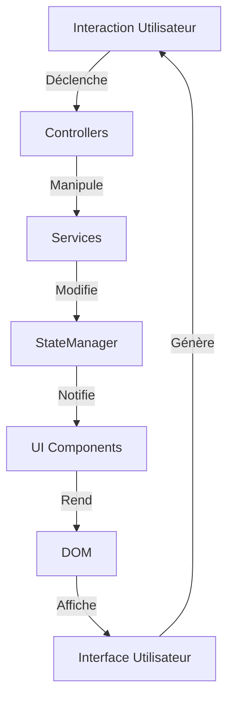
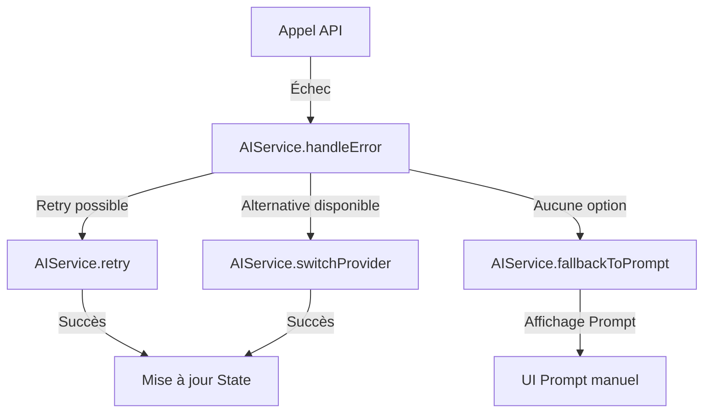
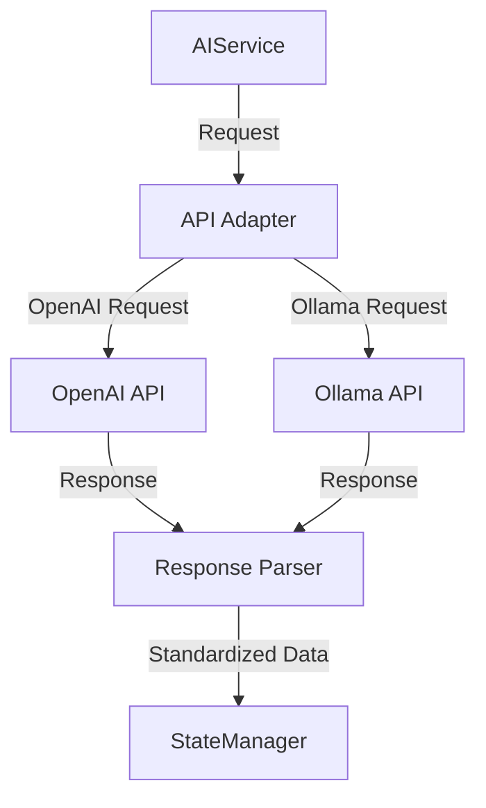

# Flux de Données dans JodoTarot

## Vue d'Ensemble

Le flux de données dans JodoTarot suit un modèle circulaire unidirectionnel, garantissant la prévisibilité et la traçabilité des changements d'état. Ce document décrit comment les données circulent entre les différents composants de l'application.

## Principes du Flux de Données



### Caractéristiques Clés

1. **Unidirectionnalité** : Les données circulent toujours dans la même direction
2. **Centralisation** : Le StateManager est le point central de toutes les données
3. **Réactivité** : Les changements d'état déclenchent automatiquement des mises à jour UI
4. **Séparation** : Claire distinction entre la manipulation des données et l'affichage
5. **Traçabilité** : Chaque changement d'état peut être tracé à son origine

## Cycle de Vie des Données

### 1. Acquisition des Données

Les données entrent dans le système par plusieurs sources :

- **Interactions utilisateur** (clics, formulaires, sélections)
- **Chargement initial** (configuration par défaut, état sauvegardé)
- **Réponses des API externes** (OpenAI, Ollama)
- **Événements système** (redimensionnement, orientation, etc.)

### 2. Traitement par les Controllers

Les controllers orchestrent le traitement des données :

```javascript
// Exemple dans ReadingController
handleUserSelection(spreadType, personaId) {
  // Validation des entrées
  if (!this.spreadValidator.isValid(spreadType)) {
    this.uiService.showError('Invalid spread type');
    return;
  }
  
  // Coordination des services
  const spread = this.spreadService.getSpread(spreadType);
  const persona = this.personaService.getPersona(personaId);
  
  // Mise à jour de l'état centralisé
  this.stateManager.transaction(() => {
    this.stateManager.set('reading', 'spreadType', spreadType);
    this.stateManager.set('reading', 'selectedPersona', personaId);
    this.stateManager.set('ui', 'currentScreen', 'cardSelection');
  });
}
```

### 3. Transformation par les Services

Les services appliquent la logique métier aux données :

```javascript
// Exemple dans DeckService
drawCards(spreadType) {
  // Récupère la configuration du tirage
  const spread = this.spreads[spreadType];
  const cardCount = spread.cardCount;
  
  // Applique la logique métier (mélange, sélection)
  const shuffledDeck = this.shuffleDeck(this.deck);
  const selectedCards = shuffledDeck.slice(0, cardCount);
  
  // Enrichit les données avec des métadonnées
  return selectedCards.map((card, index) => ({
    ...card,
    position: spread.positions[index],
    isReversed: Math.random() > 0.5
  }));
}
```

### 4. Stockage dans le StateManager

Toutes les données sont centralisées dans le StateManager :

```javascript
// Mise à jour atomique dans le StateManager
stateManager.set('reading', 'cards', selectedCards);

// Transaction pour plusieurs modifications liées
stateManager.transaction(() => {
  stateManager.set('reading', 'timestamp', Date.now());
  stateManager.set('reading', 'isComplete', true);
  stateManager.set('ui', 'currentScreen', 'interpretation');
});
```

### 5. Notification aux Abonnés

Le StateManager notifie les composants abonnés des changements :

```javascript
// Système d'abonnement
class UIComponent {
  constructor(stateManager) {
    this.stateManager = stateManager;
    this.subscriptionId = stateManager.subscribe('reading', 
      this.handleStateUpdate.bind(this)
    );
  }
  
  handleStateUpdate(domain, changes) {
    if ('cards' in changes) {
      this.renderCards(changes.cards);
    }
    if ('interpretation' in changes) {
      this.renderInterpretation(changes.interpretation);
    }
  }
  
  destroy() {
    // Importante pour éviter les fuites mémoire
    this.stateManager.unsubscribe('reading', this.subscriptionId);
  }
}
```

### 6. Rendu de l'Interface Utilisateur

Les composants UI actualisent l'affichage en fonction des changements d'état :

```javascript
// Exemple de UIService
updateInterpretationSection(interpretation) {
  const container = document.getElementById('interpretation-container');
  
  // Nettoyage
  container.innerHTML = '';
  
  // Création des éléments DOM selon l'état
  const header = document.createElement('h2');
  header.textContent = interpretation.title;
  container.appendChild(header);
  
  // ... création d'autres éléments ...
  
  // Animations et scroll
  this.animateElement(container, 'fade-in');
  this.scrollToElement(container);
}
```

## Flux de Données Spécifiques

### Flux de Tirage de Cartes

1. **Déclencheur** : Utilisateur clique sur "Effectuer un tirage"
2. **Controller** : `ReadingController.performReading()`
3. **Service** : `DeckService.drawCards()`
4. **État** : Mise à jour de `reading.cards`, `reading.spreadType`
5. **UI** : Affichage des cartes selon positions définies
6. **Persistance** : Sauvegarde du tirage dans localStorage

### Flux d'Interprétation IA

1. **Déclencheur** : Cartes tirées et persona sélectionné
2. **Controller** : `ReadingController.requestInterpretation()`
3. **Service** : `AIService.interpretReading()`
4. **API** : Appel à OpenAI ou Ollama
5. **État** : Mise à jour de `reading.interpretation`, `reading.status`
6. **UI** : Affichage progressif de l'interprétation
7. **Historique** : Ajout à `history.readings`

### Flux de Configuration

1. **Déclencheur** : Utilisateur modifie les préférences
2. **Controller** : `ConfigController.updateConfig()`
3. **Validation** : Vérification des valeurs entrées
4. **État** : Mise à jour de `config.language`, `config.apiKey`, etc.
5. **UI** : Adaptation de l'interface selon la configuration
6. **Persistance** : Sauvegarde des préférences

## Gestion des Erreurs et Cas Particuliers

### Erreurs de Connexion API



### État de Chargement

Les états de chargement sont propagés à travers le système :

```javascript
// Exemple de gestion d'état de chargement
async requestInterpretation() {
  try {
    // Indique l'état de chargement
    this.stateManager.set('ui', 'isLoading', true);
    this.stateManager.set('reading', 'status', 'requesting');
    
    // Opération asynchrone
    const interpretation = await this.aiService.interpretReading();
    
    // Mise à jour de l'état avec le résultat
    this.stateManager.set('reading', 'interpretation', interpretation);
    this.stateManager.set('reading', 'status', 'complete');
  } catch (error) {
    // Gestion d'erreur
    this.stateManager.set('reading', 'status', 'error');
    this.stateManager.set('reading', 'error', error.message);
  } finally {
    // Toujours réinitialiser l'état de chargement
    this.stateManager.set('ui', 'isLoading', false);
  }
}
```

## Interactions entre États Dépendants

Les composants peuvent réagir à des combinaisons d'états :

```javascript
// Réagir à des combinaisons d'états
stateManager.subscribe(['config', 'reading'], (domains, changes) => {
  if (changes.config && changes.config.language && changes.reading && changes.reading.interpretation) {
    // L'utilisateur a changé de langue alors qu'une interprétation est affichée
    // Demander une nouvelle interprétation dans la nouvelle langue
    aiService.retranslateInterpretation(
      changes.reading.interpretation,
      changes.config.language
    );
  }
});
```

## Performance et Optimisations

### Mise à jour Sélective

Le StateManager et les composants UI n'actualisent que ce qui est nécessaire :

```javascript
// Optimisation des mises à jour
handleStateUpdate(domain, changes) {
  // Vérifier si la mise à jour est pertinente
  if (!this.isVisible()) return;
  
  // Mise à jour sélective par propriété
  Object.keys(changes).forEach(key => {
    const updateMethod = this.updateMap[key];
    if (updateMethod) {
      updateMethod.call(this, changes[key]);
    }
  });
}
```

### Debouncing et Throttling

Pour les événements fréquents :

```javascript
// Debouncing pour les événements fréquents
const debouncedUpdate = debounce((value) => {
  stateManager.set('ui', 'windowSize', value);
}, 250);

window.addEventListener('resize', () => {
  debouncedUpdate({ 
    width: window.innerWidth, 
    height: window.innerHeight 
  });
});
```

## Débogage du Flux de Données

Le système inclut des outils de traçage du flux de données :

```javascript
// Activation du mode debug
stateManager.enableDebug();

// Événements de cycle de vie
stateManager.on('beforeUpdate', (domain, key, oldValue, newValue) => {
  console.log(`[StateManager] Before update ${domain}.${key}:`, { old: oldValue, new: newValue });
});

stateManager.on('afterUpdate', (domain, key, value) => {
  console.log(`[StateManager] After update ${domain}.${key}:`, value);
});
```

## Intégration avec les Systèmes Externes

### API externes



### Événements du Navigateur

```javascript
// Intégration avec les API du navigateur
window.addEventListener('online', () => {
  stateManager.set('system', 'isOnline', true);
  // Tenter de reconnecter les services
  serviceManager.reconnectServices();
});

window.addEventListener('offline', () => {
  stateManager.set('system', 'isOnline', false);
  // Basculer vers mode hors ligne
  serviceManager.enableOfflineMode();
});
```

## Bonnes Pratiques

1. **Toujours passer par le StateManager** pour les données partagées
2. **Éviter les effets de bord** dans les abonnements aux changements d'état
3. **Utiliser les transactions** pour les mises à jour groupées
4. **Valider toutes les entrées utilisateur** avant de modifier l'état
5. **Gérer tous les états possibles** (chargement, erreur, vide, etc.)
6. **Se désabonner proprement** pour éviter les fuites mémoire
7. **Maintenir une séparation claire** entre données et présentation

## Références

- [Vue d'Ensemble de l'Architecture](vue-ensemble.md)
- [Gestionnaire d'État](../composants/state-manager.md)
- [Interactions entre Composants](interactions-composants.md)
- [Bonnes Pratiques](../standards/bonnes-pratiques.md) 