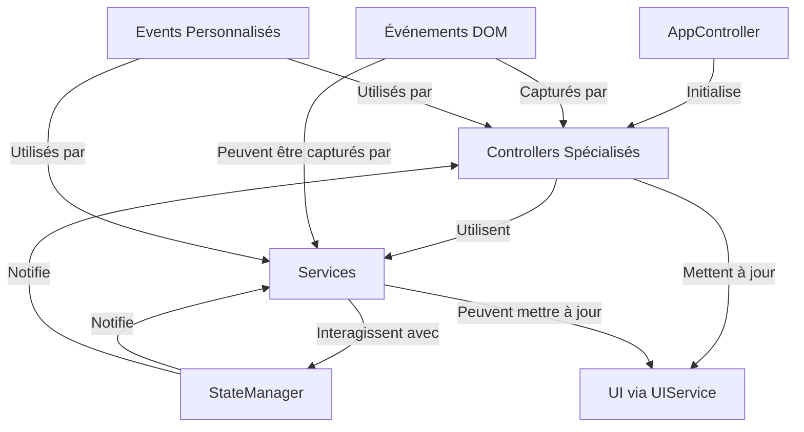
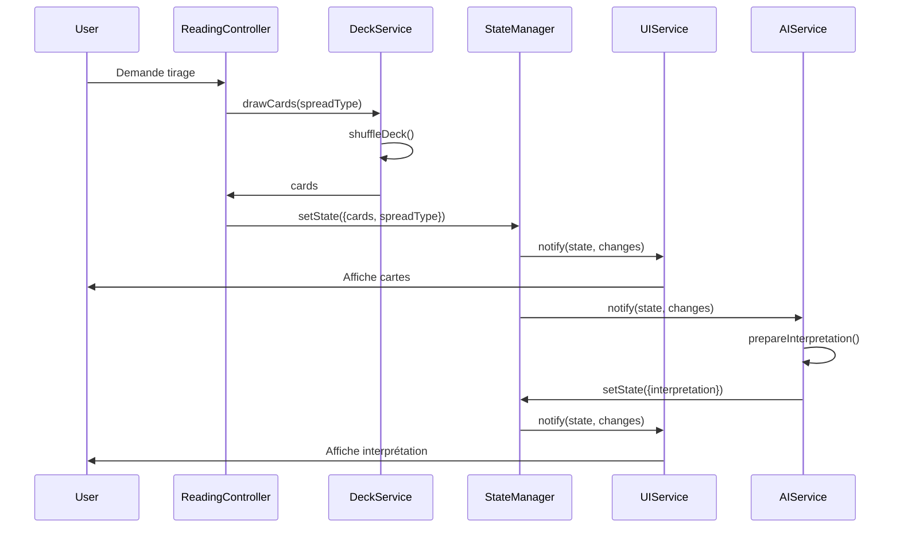
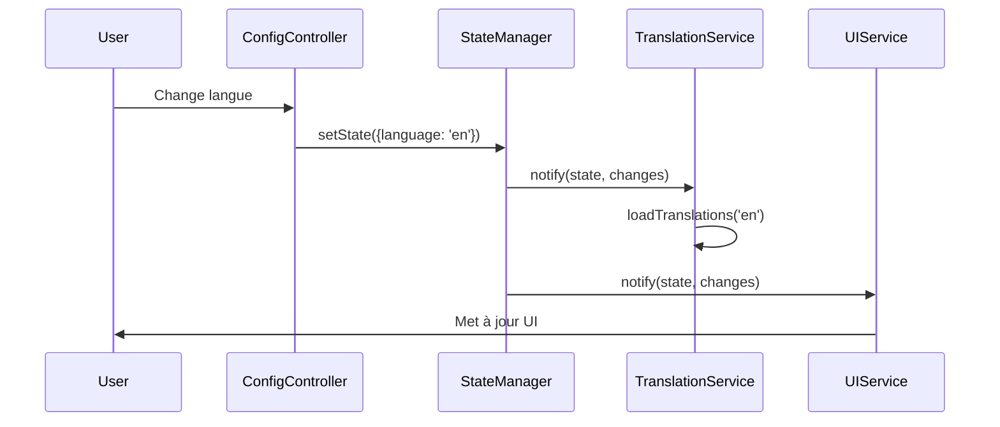

# Interactions entre Composants

## Vue d'Ensemble

L'architecture de JodoTarot repose sur une communication claire et structurée entre ses différents composants. Ce document décrit les mécanismes d'interaction, les patterns de communication et les principes qui régissent ces échanges.

## Architecture de Communication



## Principes d'Interaction

JodoTarot suit plusieurs principes fondamentaux pour les interactions entre composants :

1. **Communication Indirecte** : Les composants ne communiquent pas directement entre eux mais passent par le StateManager
2. **Dépendances Explicites** : Les dépendances sont injectées via constructeurs
3. **Interfaces Bien Définies** : Chaque composant expose une API publique claire
4. **Événements pour les Notifications** : Utilisation d'événements pour les communications asynchrones
5. **Source Unique de Vérité** : Le StateManager comme point central de l'état
6. **Propagation Unidirectionnelle** : Flux de données dans une seule direction

## Types d'Interactions

### 1. Interactions via StateManager

Le mode d'interaction principal entre les composants passe par le StateManager :

```javascript
// Controller qui met à jour l'état
class ReadingController {
  constructor(stateManager, deckService) {
    this.stateManager = stateManager;
    this.deckService = deckService;
  }
  
  performReading(spreadType) {
    const cards = this.deckService.drawCards(spreadType);
    
    // Mise à jour de l'état centralisé
    this.stateManager.setState({ 
      cards: cards,
      spreadType: spreadType
    });
  }
}

// Service qui réagit aux changements d'état
class AIService {
  constructor(stateManager) {
    this.stateManager = stateManager;
    
    // Abonnement aux changements d'état
    this.unsubscribe = this.stateManager.subscribe((state, changes) => {
      if (changes.cards && changes.spreadType) {
        this.prepareInterpretation(state.cards, state.spreadType);
      }
    });
  }
}
```

### 2. Communication par Événements Personnalisés

Pour certaines interactions spécifiques, JodoTarot utilise des événements personnalisés :

```javascript
// Émission d'un événement personnalisé
class DeckService {
  shuffleDeck() {
    // Logique de mélange
    
    // Notification via événement
    const event = new CustomEvent('deck:shuffled', {
      detail: { timestamp: Date.now() }
    });
    document.dispatchEvent(event);
  }
}

// Réception d'un événement personnalisé
class UIService {
  constructor() {
    document.addEventListener('deck:shuffled', (e) => {
      this.showShuffleAnimation(e.detail.timestamp);
    });
  }
}
```

### 3. Appels Directs via API Publiques

Dans certains cas, les composants s'appellent directement via leurs API publiques :

```javascript
// Appel direct à l'API d'un service
class ReadingController {
  getInterpretation() {
    const state = this.stateManager.getState();
    const cards = state.cards;
    const persona = state.persona;
    
    // Appel direct au service
    this.aiService.getInterpretation(
      cards,
      this.currentQuestion,
      persona,
      state.iaModel,
      state.language
    ).then(interpretation => {
      this.stateManager.setState({ interpretation: interpretation });
    });
  }
}
```

## Flux d'Interactions Typiques

### Exemple 1: Processus de Tirage Complet



### Exemple 2: Changement de Configuration



## Mécanismes d'Interaction Spécifiques

### Injection de Dépendances

JodoTarot utilise l'injection de dépendances pour créer des interactions flexibles :

```javascript
// Dans main.js - Initialisation avec injection de dépendances
const stateManager = new StateManager();
const aiService = new AIService(stateManager);
const deckService = new DeckService(stateManager);
const uiService = new UIService();

const configController = new ConfigController(
  stateManager, 
  aiService, 
  uiService
);

const readingController = new ReadingController(
  stateManager, 
  deckService, 
  aiService
);

const appController = new AppController(
  stateManager,
  configController,
  readingController
);

// Démarrage de l'application
appController.initialize();
```

### Abonnements et Notifications

Le système d'abonnement du StateManager permet des interactions réactives :

```javascript
// Abonnement simple avec filtrage
class InterpretationComponent {
  constructor(stateManager) {
    this.stateManager = stateManager;
    
    // Système d'abonnement simple
    this.unsubscribe = this.stateManager.subscribe(
      this.handleStateChanges.bind(this)
    );
  }
  
  handleStateChanges(state, changes) {
    // Réagir uniquement aux changements pertinents
    if ('cards' in changes) {
      this.updateCardDisplay(state.cards);
    }
    
    if ('language' in changes) {
      this.updateLanguage(state.language);
    }
    
    // Interaction combinée entre propriétés
    if ('interpretation' in changes && 'displayMode' in state) {
      this.renderInterpretation(
        state.interpretation,
        state.displayMode
      );
    }
  }
  
  // Nettoyage pour éviter les fuites mémoire
  destroy() {
    if (this.unsubscribe) {
      this.unsubscribe();
    }
  }
}
```

### Délégation d'Événements DOM

Pour les interactions UI, JodoTarot utilise la délégation d'événements :

```javascript
// Délégation d'événements pour gérer de multiples éléments
class UIService {
  initCardInteractions() {
    const container = document.getElementById('reading-area');
    
    // Un seul gestionnaire pour tous les éléments de carte
    container.addEventListener('click', (e) => {
      const cardElement = e.target.closest('.card');
      if (cardElement) {
        const cardId = cardElement.dataset.cardId;
        this.handleCardSelection(cardId);
      }
    });
  }
}
```

## Gestion des Conflits et Synchronisation

### Mises à Jour Atomiques

Pour éviter les états incohérents lors de mises à jour multiples :

```javascript
// Utilisation de setState pour les mises à jour atomiques
this.stateManager.setState({
  cards: selectedCards,
  spreadType: spreadType,
  timestamp: Date.now()
});
```

### Priorités des Notifications

Le StateManager gère efficacement les notifications pour tous les abonnés :

```javascript
// Gestion des notifications dans StateManager
notifyListeners(changes = {}) {
  this.listeners.forEach(listener => {
    try {
      listener(this.state, changes);
    } catch (error) {
      console.error('❌ Erreur dans un écouteur d\'état:', error);
    }
  });
}
```

## Interactions avec les Systèmes Externes

### Intégration API

L'AIService coordonne les interactions avec les API externes :

```javascript
// Interaction avec système externe
class AIService {
  async getInterpretation(reading, question, persona, model, language, spreadType, onChunk) {
    try {
      // Notification d'état de chargement
      this.stateManager.setState({ isLoading: true });
      
      // Créer un AbortController pour pouvoir annuler la requête
      this.currentController = new AbortController();
      this.isGenerating = true;
      
      // Interaction avec système externe
      const response = await this.sendRequest(
        reading,
        question, 
        persona,
        model,
        language,
        spreadType,
        this.currentController.signal,
        onChunk
      );
      
      // Mise à jour de l'état avec résultat externe
      this.isGenerating = false;
      
      return response;
    } catch (error) {
      // Vérifier si c'est une annulation par l'utilisateur
      if (this.handleAbortError(error)) {
        throw error; // Propager l'erreur d'annulation
      }
      
      // Gestion des erreurs d'interaction
      console.error('Erreur lors de l\'interprétation:', error);
      this.stateManager.setState({ 
        error: error.message,
        isLoading: false
      });
      throw error;
    } finally {
      this.stateManager.setState({ isLoading: false });
    }
  }
}
```

### Interactions avec le Navigateur

L'application interagit également avec les API du navigateur :

```javascript
// Interaction avec les API du navigateur
class ConfigController {
  detectSystemPreferences() {
    // Détection du mode sombre
    if (window.matchMedia && window.matchMedia('(prefers-color-scheme: dark)').matches) {
      this.stateManager.setState({ theme: 'dark' });
    }
    
    // Détection de la langue du navigateur
    const browserLang = navigator.language.split('-')[0];
    if (this.supportedLanguages.includes(browserLang)) {
      this.stateManager.setState({ language: browserLang });
    }
  }
}
```

## Patterns d'Interaction Avancés

### Mediator Pattern

AppController joue le rôle de médiateur entre les différents contrôleurs :

```javascript
class AppController {
  constructor(stateManager, configController, readingController) {
    this.stateManager = stateManager;
    this.configController = configController;
    this.readingController = readingController;
  }
  
  // Coordination des interactions entre contrôleurs
  startNewReading() {
    // Vérification de l'état de configuration
    const state = this.stateManager.getState();
    const isConfigValid = state.language && state.persona && state.iaModel;
    
    if (isConfigValid) {
      // Transition entre contrôleurs
      this.readingController.initializeNewReading();
    } else {
      // Redirection vers configuration
      this.configController.showConfigurationRequired();
    }
  }
}
```

### Observer Pattern

Le système d'abonnement du StateManager implémente le pattern Observer :

```javascript
// Implémentation du pattern Observer dans StateManager
class StateManager {
  constructor() {
    this.state = this.getDefaultState();
    this.listeners = [];
  }
  
  subscribe(listener) {
    if (typeof listener !== 'function') {
      console.error('❌ L\'écouteur doit être une fonction');
      return () => {}; // Retourner une fonction vide en cas d'erreur
    }
    
    // Ajouter l'écouteur au tableau
    this.listeners.push(listener);
    
    // Retourner une fonction de désabonnement
    return () => {
      const index = this.listeners.indexOf(listener);
      if (index !== -1) {
        this.listeners.splice(index, 1);
      }
    };
  }
  
  notifyListeners(changes = {}) {
    this.listeners.forEach(listener => {
      try {
        listener(this.state, changes);
      } catch (error) {
        console.error('❌ Erreur dans un écouteur d\'état:', error);
      }
    });
  }
}
```

### Command Pattern

Pour les opérations complexes, JodoTarot utilise le pattern Command :

```javascript
// Pattern Command pour encapsuler des opérations complexes
class ReadingCommand {
  constructor(stateManager, deckService, spreadType) {
    this.stateManager = stateManager;
    this.deckService = deckService;
    this.spreadType = spreadType;
    this.previousState = null;
  }
  
  execute() {
    // Sauvegarde de l'état précédent pour undo
    this.previousState = this.stateManager.getState();
    
    // Exécution de la commande
    const cards = this.deckService.drawCards(this.spreadType);
    this.stateManager.setState({
      cards: cards,
      spreadType: this.spreadType
    });
  }
  
  undo() {
    if (this.previousState) {
      this.stateManager.setState(this.previousState);
    }
  }
}

// Utilisation
const command = new ReadingCommand(stateManager, deckService, 'cross');
command.execute();
// Plus tard si besoin d'annuler
command.undo();
```

## Optimisations des Interactions

### Debouncing et Throttling

Pour les interactions fréquentes :

```javascript
// Debouncing pour éviter les interactions trop fréquentes
class UIService {
  constructor() {
    // Création d'une fonction debounced
    this.debouncedUpdateLayout = this.debounce(this.updateLayout.bind(this), 250);
    
    window.addEventListener('resize', () => {
      this.debouncedUpdateLayout();
    });
  }
  
  debounce(func, wait) {
    let timeout;
    return function(...args) {
      clearTimeout(timeout);
      timeout = setTimeout(() => func.apply(this, args), wait);
    };
  }
}
```

### Mise en Cache des Interactions

**Note: Cette fonctionnalité est décrite ici comme une pratique recommandée mais n'est actuellement pas implémentée dans le code.**

```javascript
// Exemple conceptuel - Non implémenté dans la version actuelle
class AIService {
  getInterpretationWithCache(cards, spreadType) {
    // La mise en cache pourrait être implémentée comme ceci
    const cacheKey = this.getCacheKey(cards, spreadType);
    
    // Vérification si résultat en cache
    if (this.interpretationCache && this.interpretationCache.has(cacheKey)) {
      return this.interpretationCache.get(cacheKey);
    }
    
    // Sinon, générer une nouvelle interprétation
    const interpretation = this.generateInterpretation(cards, spreadType);
    
    // Mettre en cache pour future utilisation
    if (this.interpretationCache) {
      this.interpretationCache.set(cacheKey, interpretation);
    }
    
    return interpretation;
  }
}
```

Cette approche pourrait être implémentée dans de futures versions pour améliorer les performances en évitant de régénérer des interprétations identiques.

## Bonnes Pratiques pour les Interactions

1. **Éviter les Dépendances Circulaires** : Les composants ne doivent pas créer de boucles de dépendance
2. **Limiter la Portée des Interactions** : Préférer les interactions locales aux interactions globales
3. **Documenter les Contrats d'API** : Clarifier les attentes des interfaces publiques
4. **Valider les Entrées** : Vérifier la validité des données avant de les propager
5. **Gérer les Erreurs** : Toujours prévoir la gestion des erreurs dans les interactions
6. **Désabonner Proprement** : Se désabonner des événements et notifications quand un composant est détruit
7. **Préférer les Interactions Asynchrones** : Utiliser Promises et async/await pour les opérations longues

## Débogage des Interactions

JodoTarot inclut des outils pour tracer les interactions :

```javascript
// Traçage des changements d'état dans le StateManager
setState(updates) {
  try {
    // ... validation et traitement ...
    
    // Log des changements importants
    const importantKeys = ['language', 'persona', 'cardSet', 'spreadType', 'iaModel'];
    const importantUpdates = Object.keys(updates).filter(key => importantKeys.includes(key));

    if (importantUpdates.length > 0) {
      console.log('🔄 Mise à jour de clés importantes:', importantUpdates.map(key => `${key}: ${updates[key]}`));
    }
    
    // ... mise à jour de l'état ...
    
    // Log des changements effectifs
    if (Object.keys(changedValues).length > 0) {
      const importantChanges = Object.keys(changedValues).filter(key => importantKeys.includes(key));
      if (importantChanges.length > 0) {
        console.log('✅ Changements effectifs de clés importantes:', importantChanges.map(key => `${key}: ${changedValues[key]}`));
      }
    }
  } catch (error) {
    console.error('❌ Erreur lors de la mise à jour de l\'état:', error);
    throw error;
  }
}
```

## Références

- [Vue d'Ensemble de l'Architecture](vue-ensemble.md)
- [Flux de Données](flux-donnees.md)
- [Gestionnaire d'État](../composants/state-manager.md)
- [Bonnes Pratiques](../standards/bonnes-pratiques.md) 