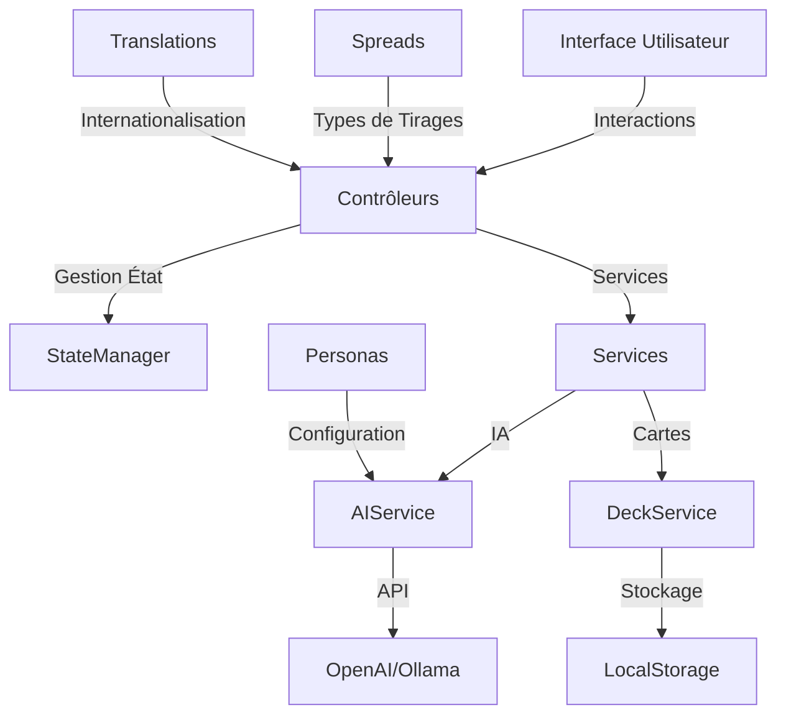

# 🏗️ Architecture Technique de JodoTarot

## 📋 Vue d'ensemble

JodoTarot est construit avec une architecture modulaire en JavaScript ES6, suivant les principes du pattern MVC (Modèle-Vue-Contrôleur).

## 🔧 Structure du Code

### 📁 Organisation des Fichiers

```
jodotarot/
├── assets/
│   ├── js/
│   │   ├── controllers/     # Contrôleurs
│   │   ├── models/          # Modèles
│   │   ├── services/        # Services métier
│   │   ├── utils/           # Utilitaires
│   │   ├── translations/    # Système de traduction
│   │   ├── main.js          # Point d'entrée
│   │   ├── api.js           # Appels API IA
│   │   ├── config.js        # Configuration
│   │   ├── prompt.js        # Construction de prompts
│   │   ├── ui.js            # Fonctions UI
│   │   └── app.js           # Initialisation
│   ├── css/
│   └── images/
├── docs/
└── index.html
```

### 🎯 Composants Principaux

#### Contrôleurs
- `AppController.js` (222 lignes) : Contrôleur principal
- `ReadingController.js` (935 lignes) : Gestion des tirages
- `ConfigController.js` (1193 lignes) : Configuration et paramètres

#### Services
- `AIService.js` (764 lignes) : Communication avec les modèles d'IA
- `DeckService.js` (194 lignes) : Gestion des cartes et des tirages
- `UIService.js` (187 lignes) : Interface utilisateur

#### Utilitaires
- `StateManager.js` (907 lignes) : Gestionnaire d'état centralisé

#### Modèles
- `spreads/` : Types de tirages
  - `BaseSpread.js` (370 lignes) : Classe de base
  - `CrossSpread.js` (118 lignes) : Tirage en croix
  - `HorseshoeSpread.js` (138 lignes) : Fer à cheval
  - `LoveSpread.js` (136 lignes) : Tirage amour
  - `CelticCrossSpread.js` (176 lignes) : Croix celtique
  - `ReadingDescriptionGenerator.js` (81 lignes) : Générateur de descriptions

## 🎨 Interface Utilisateur

### Système CSS
- `main.css` : Point d'entrée
- Composants modulaires :
  - `buttons.css`
  - `cards.css`
  - `forms.css`
  - `modal.css`
  - `warnings.css`

### 🌍 Support Multilingue
- 6 langues supportées (fr, en, es, de, it, zh)
- Fichiers de traduction par langue
- Système de changement dynamique via la fonction `getTranslation`

## 🔄 Gestion de l'État

- `StateManager.js` (utils/) : Gestion centralisée de l'état
- Validation des données
- Persistance des préférences via localStorage
- Système d'événements personnalisés
- Migrations automatiques entre versions

## 🤖 Intégration IA

### Modèles Supportés
- OpenAI (GPT-3.5, GPT-4)
- Ollama (modèles locaux)
- Mode "prompt" (sans appel API)

### Gestion des Prompts
- Templates personnalisés par persona
- Adaptation multilingue
- Construction dynamique des prompts

## 🔒 Sécurité

- Gestion des clés API (encodage Base64)
- Validation des entrées
- Protection contre les injections
- Gestion des erreurs et timeouts

## 📈 Performance

- Chargement asynchrone des ressources
- Optimisation des appels API
- Streaming des réponses
- Gestion efficace de la mémoire

## Architecture Globale



## Composants Principaux

### 1. Interface Utilisateur
- Interface responsive et moderne
- Support multilingue via le système de traduction
- Animations fluides

### 2. Gestionnaire d'État (StateManager)
- État global centralisé
- Persistance via localStorage
- Validation des données
- Système d'abonnement

### 3. Services
- **AIService** : Communication avec les modèles d'IA
- **DeckService** : Gestion des cartes et tirages
- **UIService** : Interaction avec l'interface utilisateur

### 4. Contrôleurs
- **AppController** : Initialisation et coordination
- **ReadingController** : Gestion des tirages et interprétations
- **ConfigController** : Configuration et paramètres système

### 5. Modèles
- **Personas** : Styles d'interprétation (22 personas)
- **Spreads** : Types de tirages (Croix, Fer à Cheval, Amour, Croix Celtique)
- **Cards** : Cartes de tarot

## Principes de Conception

1. **Modularité**
   - Composants indépendants
   - Couplage faible
   - Interfaces claires

2. **Extensibilité**
   - Architecture pluggable
   - Points d'extension définis
   - Configuration flexible

3. **Maintenabilité**
   - Code documenté
   - Standards de codage
   - Organisation claire

4. **Performance**
   - Chargement optimisé
   - Validation des données
   - Streaming des réponses

## Flux de Données

1. **Entrée Utilisateur**
   - Sélection des cartes
   - Configuration du tirage
   - Questions et paramètres

2. **Traitement**
   - Validation des données via StateManager
   - Construction des prompts dans AIService
   - Communication IA via api.js

3. **Sortie**
   - Interprétation avec effet de machine à écrire
   - Affichage progressif
   - Sauvegarde locale via StateManager

## Technologies Utilisées

- **Frontend** : JavaScript ES6+, HTML5, CSS3
- **Storage** : LocalStorage
- **IA** : OpenAI API, Ollama (API locale)

## Sécurité

1. **Protection des Données**
   - Stockage local des préférences
   - Mode "prompt" sans envoi de données
   - Validation des entrées

2. **API Security**
   - Gestion des clés API avec encodage simple
   - Timeouts et limites de requêtes
   - Gestion robuste des erreurs

## Évolutions Futures

1. **Fonctionnalités**
   - Support des arcanes mineurs
   - Historique des tirages
   - Mode hors-ligne complet

2. **Technique**
   - PWA complète
   - Synchronisation cloud
   - API publique

3. **IA**
   - Nouveaux modèles
   - Apprentissage continu
   - Personnalisation avancée 