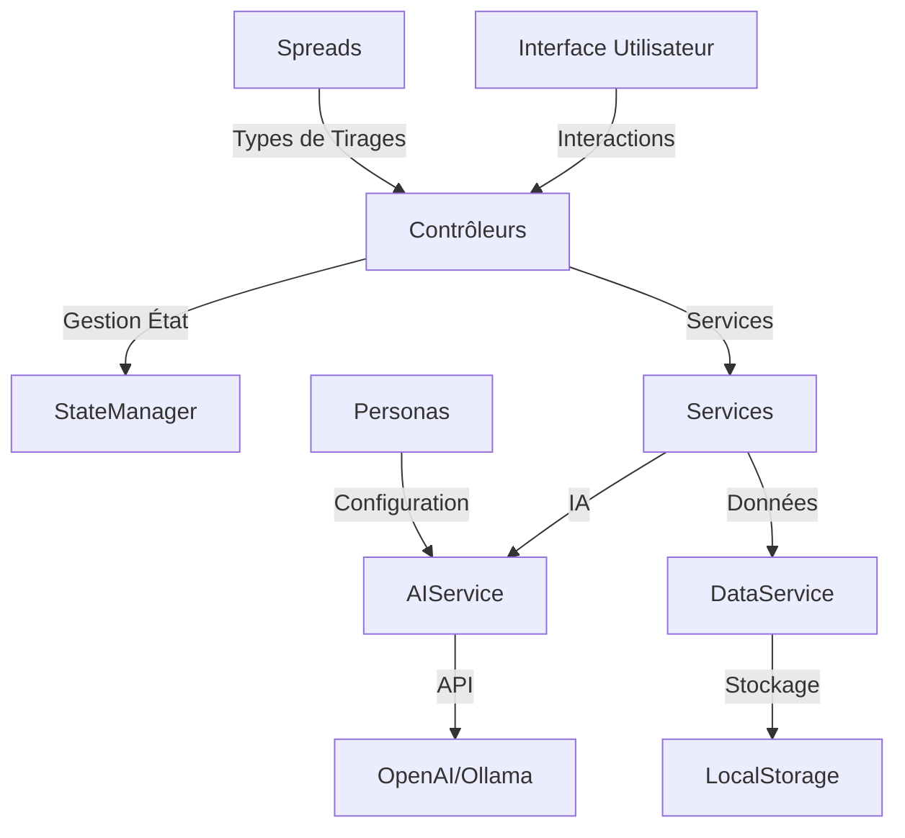

# Vue d'Ensemble de l'Architecture

## Introduction

JodoTarot est une application web modulaire pour les tirages de tarot, construite en JavaScript ES6. Elle permet de réaliser des tirages de tarot interprétés par une intelligence artificielle avec différents personas et styles d'interprétation.

## Architecture Globale

## Composants Principaux

### 1. Interface Utilisateur
- Interface responsive et moderne
- Support multilingue
- Thèmes personnalisables
- Animations fluides

### 2. Gestionnaire d'État (StateManager)
- État global centralisé
- Persistance automatique
- Gestion des changements
- Synchronisation UI

### 3. Services
- **AIService** : Communication avec les IA
- **DataService** : Gestion des données
- **LocalizationService** : Traductions
- **ThemeService** : Gestion des thèmes

### 4. Contrôleurs
- **ReadingController** : Gestion des tirages
- **DeckController** : Gestion des jeux
- **PersonaController** : Gestion des personas
- **ConfigController** : Configuration

### 5. Modèles
- **Personas** : Styles d'interprétation
- **Spreads** : Types de tirages
- **Cards** : Cartes de tarot
- **Settings** : Paramètres

## Principes de Conception

1. **Modularité**
   - Composants indépendants
   - Couplage faible
   - Interfaces claires

2. **Extensibilité**
   - Architecture pluggable
   - Points d'extension définis
   - Configuration flexible

3. **Maintenabilité**
   - Code documenté
   - Tests automatisés
   - Standards de codage

4. **Performance**
   - Chargement optimisé
   - Mise en cache intelligente
   - Streaming des réponses

## Flux de Données

1. **Entrée Utilisateur**
   - Sélection des cartes
   - Configuration du tirage
   - Questions et paramètres

2. **Traitement**
   - Validation des données
   - Construction des prompts
   - Communication IA

3. **Sortie**
   - Interprétation
   - Affichage progressif
   - Sauvegarde locale

## Technologies Utilisées

- **Frontend** : JavaScript ES6+
- **UI** : HTML5, CSS3
- **Storage** : LocalStorage
- **IA** : OpenAI API, Ollama
- **Build** : Webpack/Vite

## Sécurité

1. **Protection des Données**
   - Stockage local sécurisé
   - Pas de données sensibles
   - Validation des entrées

2. **API Security**
   - Gestion sécurisée des clés
   - Rate limiting
   - Validation des réponses

## Évolutions Futures

1. **Fonctionnalités**
   - Support des arcanes mineurs
   - Historique des tirages
   - Mode hors-ligne complet

2. **Technique**
   - PWA complète
   - Synchronisation cloud
   - API publique

3. **IA**
   - Nouveaux modèles
   - Apprentissage continu
   - Personnalisation avancée 