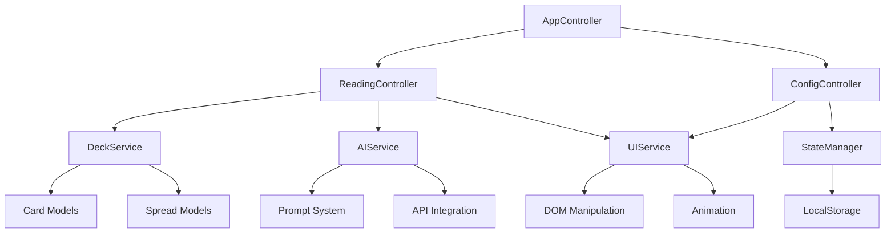

# Vue d'Ensemble de l'Architecture

## Architecture Globale

JodoTarot est une application web modulaire construite en JavaScript ES6. L'architecture suit un modèle orienté composants avec une séparation claire des responsabilités.

## Principes Architecturaux

L'application est structurée selon un modèle MVC (Modèle-Vue-Contrôleur) adapté, avec une organisation en couches :

```
Controllers (AppController, ReadingController, ConfigController)
     ↑↓                    ↑↓                     ↑↓
Services (AIService, DeckService, UIService, StateManager)
     ↑↓                    ↑↓                     ↑↓
Models (Personas, Spreads, Cards, Translations)
```

### Séparation des Responsabilités

- **Controllers**: Orchestrent les interactions entre services et vues
- **Services**: Implémentent la logique métier spécifique
- **Models**: Définissent et encapsulent les données
- **UI Components**: Gèrent l'affichage et les interactions utilisateur

### Principes Clés

1. **Modularité** : Chaque composant a une responsabilité unique et bien définie
2. **Extensibilité** : Architecture permettant d'ajouter facilement de nouvelles fonctionnalités
3. **Isolation** : Les modules communiquent via des interfaces clairement définies
4. **Réutilisabilité** : Les composants sont conçus pour être réutilisables
5. **Testabilité** : Architecture facilitant les tests unitaires et d'intégration

## Communication entre Composants

La communication entre les composants suit des principes stricts :

1. **Event-Driven** : Utilisation d'événements personnalisés pour la communication asynchrone
2. **Dépendance Explicite** : Les dépendances sont injectées via constructeurs ou méthodes
3. **État Centralisé** : Utilisation de StateManager comme source unique de vérité
4. **Interfaces Propres** : Communication via API publiques bien définies

## Structure Générale



## Points Forts de l'Architecture

- **Centralisation de l'État** : Gestion cohérente de l'état via StateManager
- **API Abstraction** : Séparation claire entre logique métier et intégrations externes
- **CSS Modulaire** : Organisation CSS par composants et fonctionnalités
- **Adaptation Responsive** : Conception adaptative via variables CSS et media queries
- **Internationalisation** : Support multilingue intégré au niveau architecture 