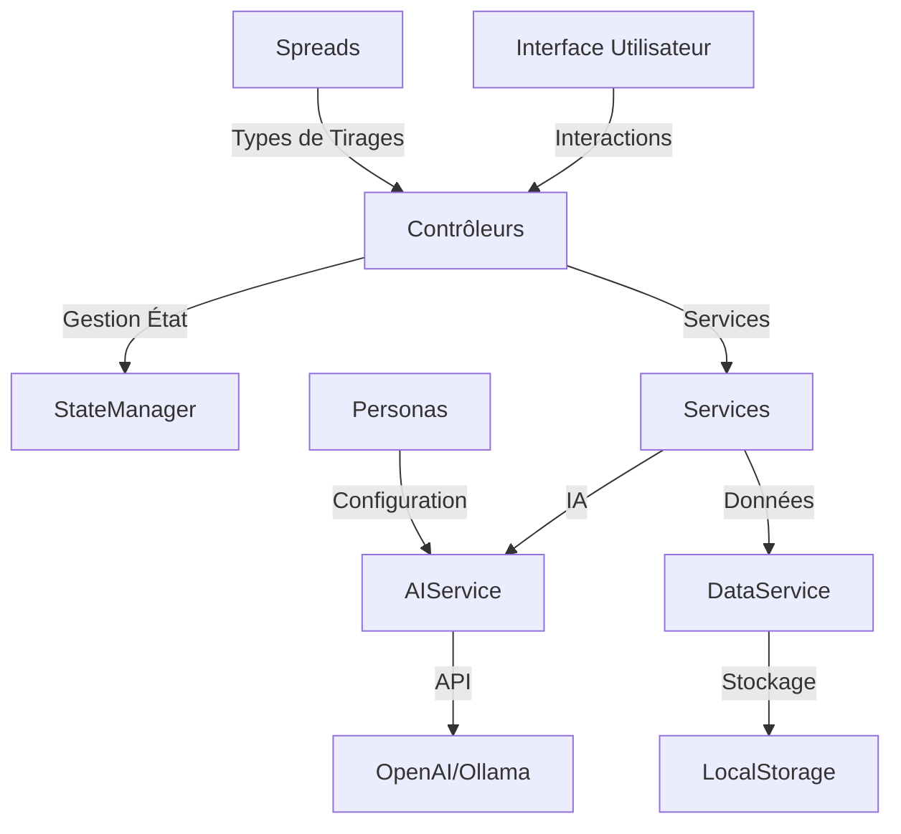

# 🏗️ Architecture Technique de JodoTarot

## 📋 Vue d'ensemble

JodoTarot est construit avec une architecture modulaire en JavaScript ES6, suivant les principes du pattern MVC (Modèle-Vue-Contrôleur).

## 🔧 Structure du Code

### 📁 Organisation des Fichiers

```
jodotarot/
├── assets/
│   ├── js/
│   │   ├── controllers/
│   │   ├── models/
│   │   ├── services/
│   │   └── views/
│   ├── css/
│   └── images/
├── docs/
└── index.html
```

### 🎯 Composants Principaux

#### Contrôleurs
- `AppController.js` (217 lignes) : Contrôleur principal
- `ReadingController.js` (869 lignes) : Gestion des tirages
- `ConfigController.js` (1320 lignes) : Configuration

#### Services
- `AIService.js` (883 lignes) : Communication IA
- `DeckService.js` (445 lignes) : Gestion des cartes
- `UIService.js` (187 lignes) : Interface utilisateur

#### Modèles
- `spreads/` : Types de tirages
  - `BaseSpread.js` : Classe de base
  - `CrossSpread.js` : Tirage en croix
  - `HorseshoeSpread.js` : Fer à cheval
  - `LoveSpread.js` : Tirage amour
  - `CelticCrossSpread.js` : Croix celtique

## 🎨 Interface Utilisateur

### Système CSS
- `main.css` : Point d'entrée
- Composants modulaires :
  - `buttons.css`
  - `cards.css`
  - `forms.css`
  - `modal.css`
  - `warnings.css`

### 🌍 Support Multilingue
- 6 langues supportées
- Fichiers de traduction par langue
- Système de changement dynamique

## 🔄 Gestion de l'État

- `StateManager.js` : Gestion centralisée
- Validation des données
- Persistance des préférences
- Système d'événements
- Migrations automatiques

## 🤖 Intégration IA

### Modèles Supportés
- OpenAI (GPT-3.5, GPT-4)
- Ollama (modèles locaux)

### Gestion des Prompts
- Templates personnalisés par persona
- Adaptation multilingue
- Optimisation des réponses

## 🔒 Sécurité

- Gestion sécurisée des clés API
- Validation des entrées
- Protection contre les injections
- Gestion des erreurs

## 📈 Performance

- Chargement asynchrone
- Cache des réponses IA
- Optimisation des images
- Gestion efficace de la mémoire

## Architecture Globale



## Composants Principaux

### 1. Interface Utilisateur
- Interface responsive et moderne
- Support multilingue
- Thèmes personnalisables
- Animations fluides

### 2. Gestionnaire d'État (StateManager)
- État global centralisé
- Persistance automatique
- Gestion des changements
- Synchronisation UI

### 3. Services
- **AIService** : Communication avec les IA
- **DataService** : Gestion des données
- **LocalizationService** : Traductions
- **ThemeService** : Gestion des thèmes

### 4. Contrôleurs
- **ReadingController** : Gestion des tirages
- **DeckController** : Gestion des jeux
- **PersonaController** : Gestion des personas
- **ConfigController** : Configuration

### 5. Modèles
- **Personas** : Styles d'interprétation
- **Spreads** : Types de tirages
- **Cards** : Cartes de tarot
- **Settings** : Paramètres

## Principes de Conception

1. **Modularité**
   - Composants indépendants
   - Couplage faible
   - Interfaces claires

2. **Extensibilité**
   - Architecture pluggable
   - Points d'extension définis
   - Configuration flexible

3. **Maintenabilité**
   - Code documenté
   - Tests automatisés
   - Standards de codage

4. **Performance**
   - Chargement optimisé
   - Mise en cache intelligente
   - Streaming des réponses

## Flux de Données

1. **Entrée Utilisateur**
   - Sélection des cartes
   - Configuration du tirage
   - Questions et paramètres

2. **Traitement**
   - Validation des données
   - Construction des prompts
   - Communication IA

3. **Sortie**
   - Interprétation
   - Affichage progressif
   - Sauvegarde locale

## Technologies Utilisées

- **Frontend** : JavaScript ES6+
- **UI** : HTML5, CSS3
- **Storage** : LocalStorage
- **IA** : OpenAI API, Ollama
- **Build** : Webpack/Vite

## Sécurité

1. **Protection des Données**
   - Stockage local sécurisé
   - Pas de données sensibles
   - Validation des entrées

2. **API Security**
   - Gestion sécurisée des clés
   - Rate limiting
   - Validation des réponses

## Évolutions Futures

1. **Fonctionnalités**
   - Support des arcanes mineurs
   - Historique des tirages
   - Mode hors-ligne complet

2. **Technique**
   - PWA complète
   - Synchronisation cloud
   - API publique

3. **IA**
   - Nouveaux modèles
   - Apprentissage continu
   - Personnalisation avancée 