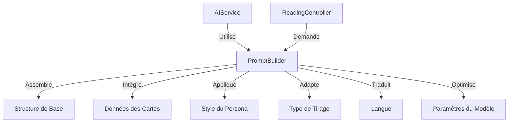

# Méthode de Construction des Prompts

## Vue d'Ensemble

La construction des prompts est un élément essentiel de JodoTarot qui détermine la qualité et la pertinence des interprétations de tarot. Cette documentation détaille la méthodologie, les composants et les techniques utilisées pour créer des prompts efficaces pour les différents modèles d'intelligence artificielle.

## Architecture du Système de Prompts



## Composants du Prompt

Chaque prompt est constitué de plusieurs sections soigneusement structurées :

### 1. Instructions Générales

Cette section définit le rôle fondamental et les consignes globales pour l'IA :

```
Tu es un interprète de tarot expérimenté. Tu vas analyser un tirage de tarot avec sensibilité et intuition.
Ton interprétation doit être personnalisée, cohérente et refléter la sagesse traditionnelle du tarot.
```

### 2. Données du Tirage

Cette section présente les informations essentielles sur le tirage :

```
Type de tirage : Croix Celtique (10 cartes)
Question : "Quelle direction prendre dans ma carrière?"

Cartes tirées :
1. La Roue de Fortune (Position : Situation actuelle) - Représente les cycles et les changements de circonstances
2. L'Hermite (Position : Obstacle ou défi) - Représente l'introspection et la recherche de sagesse intérieure
3. [...]
```

### 3. Style du Persona

Cette section intègre les instructions spécifiques au persona sélectionné :

```
Style d'interprétation :
Tu es un Psychologue Jungien. Ton approche est analytique et axée sur les archétypes.
- Ton ton est réfléchi et intellectuel, mais accessible
- Tu mets l'accent sur les processus psychologiques inconscients
- Tu utilises souvent des concepts jungiens (ombre, anima/animus, individuation)
- Tu relies les symboles des cartes à des patterns psychologiques
```

### 4. Structure de Réponse

Cette section guide le format et l'organisation de l'interprétation :

```
Structure ta réponse en :
1. Un résumé général du tirage (2-3 phrases)
2. Une analyse de chaque carte dans sa position
3. Les interactions entre les cartes (motifs, contradictions)
4. Une conclusion avec conseils pratiques
5. Une note d'encouragement finale
```

### 5. Consignes Techniques

Cette section fournit des directives pour optimiser la qualité de la réponse :

```
Consignes techniques :
- Utilise du formatage HTML basique (<b>, <i>, <h3>, <br>, <ul>) pour structurer ta réponse
- Limite ta réponse à environ 800-1000 mots
- N'invente pas de détails sur la personne ou sa situation au-delà des informations données
- Évite les affirmations absolues ou prédictions définitives
```

## Méthodologie de Construction

### Phase 1 : Préparation des Données

1. **Collecte des Informations** :
   - Cartes tirées (noms, positions, orientations)
   - Type de tirage et sa signification
   - Question ou intention si spécifiée
   - Préférences utilisateur (style, profondeur)

2. **Traduction des Éléments** :
   - Adaptation de tous les éléments à la langue sélectionnée
   - Respect des particularités culturelles et linguistiques

### Phase 2 : Assemblage Structuré

Le prompt est assemblé dans un ordre précis pour maximiser la cohérence :

```javascript
function buildTarotPrompt(cards, spread, persona, language, options) {
  // 1. Instructions de base
  let prompt = getBaseInstructions(language);
  
  // 2. Contextualisation du tirage
  prompt += getSpreadContext(spread, language);
  
  // 3. Données des cartes
  prompt += formatCardData(cards, spread.positions, language);
  
  // 4. Style du persona
  prompt += persona.getPromptStyle(language);
  
  // 5. Instructions sur la structure
  prompt += getStructureInstructions(options.depth, language);
  
  // 6. Consignes techniques
  prompt += getTechnicalGuidelines(options.format, language);
  
  return optimizePrompt(prompt, options.model);
}
```

### Phase 3 : Optimisation Spécifique au Modèle

Le prompt est ajusté selon le modèle d'IA ciblé :

1. **Ajustements pour OpenAI** :
   - Structuration claire avec des séparations
   - Instructions explicites et séquentielles
   - Optimisation token/performance

2. **Ajustements pour Ollama** :
   - Instructions plus détaillées et répétitives
   - Simplicité des structures
   - Contrôle des hallucinations

## Techniques d'Ingénierie de Prompt

### 1. Few-Shot Learning

Pour guider le modèle, des exemples de réponses souhaitées sont parfois inclus :

```
Exemple de format d'interprétation :
La carte X en position Y suggère que [...]. Ceci indique que vous pourriez [...].
L'interaction entre la carte A et la carte B crée une tension qui [...].
```

### 2. Chain-of-Thought

Pour les interprétations complexes, le prompt guide un raisonnement étape par étape :

```
Pour chaque carte, analyse :
1. Sa signification traditionnelle
2. Comment cette signification s'applique à sa position
3. Ses interactions avec les cartes adjacentes
4. Son message spécifique dans ce contexte
```

### 3. Directive d'Auto-Évaluation

Le prompt peut inclure des mécanismes d'auto-vérification :

```
Avant de conclure, vérifie que ton interprétation :
- Reste cohérente avec la symbolique traditionnelle des cartes
- Respecte le style du persona sélectionné
- Offre une perspective équilibrée (ni trop positive, ni trop négative)
- Fournit des conseils pratiques et applicables
```

## Adaptation aux Types de Tirages

### Tirages Simples (1-3 cartes)

- Prompts courts et directs
- Focus sur la signification profonde de chaque carte
- Exploration détaillée des nuances

```javascript
// Extrait pour tirages simples
if (cards.length <= 3) {
  prompt += `\nCe tirage étant simple, explore en profondeur la symbolique de chaque carte. 
  Propose plusieurs niveaux de lecture et des interprétations nuancées.`;
}
```

### Tirages Complexes (5+ cartes)

- Structure narrative claire
- Focus sur les patterns et relations
- Synthèse des tendances principales

```javascript
// Extrait pour tirages complexes
if (cards.length >= 5) {
  prompt += `\nCe tirage étant complexe, identifie les motifs récurrents et organise 
  ton interprétation autour des thèmes dominants. Privilégie la clarté et la synthèse.`;
}
```

## Techniques d'Optimisation

### Équilibre Contraintes-Créativité

Le système ajuste dynamiquement les paramètres :

```javascript
function getCreativityBalance(persona, spread) {
  // Personas créatifs (poète, mystique) -> plus de liberté
  if (persona.category === 'creative') {
    return "Exprime-toi avec créativité et imagination. N'hésite pas à utiliser des métaphores riches.";
  }
  
  // Personas analytiques (psychologue, logicien) -> plus de structure
  if (persona.category === 'analytical') {
    return "Maintiens une approche structurée et logique. Utilise des concepts précis et bien définis.";
  }
  
  return "Équilibre créativité et clarté dans ton interprétation.";
}
```

### Gestion des Tokens

Pour maximiser l'efficacité du prompt :

1. **Priorisation des Informations** :
   - Éléments essentiels en début de prompt
   - Détails secondaires en fin de prompt

2. **Compression Intelligente** :
   - Élimination des redondances
   - Formulations concises mais complètes

```javascript
function optimizePrompt(prompt, model) {
  // Différentes optimisations selon le modèle
  if (model.includes('gpt-4')) {
    // GPT-4 peut gérer des prompts plus complexes
    return prompt;
  } else {
    // Modèles plus limités nécessitent compression
    return compressPrompt(prompt);
  }
}
```

## Exemples Concrets

### Exemple 1 : Prompt pour Tirage en Croix (Persona Psychologue)

```
Tu es un interprète de tarot expérimenté spécialisé dans l'approche psychologique.

TIRAGE : Croix simple (4 cartes)
QUESTION : "Comment améliorer ma relation avec mon partenaire?"

CARTES :
1. Le Pendu (Position : Situation actuelle) - Représente le sacrifice, la perspective, l'attente
2. La Justice (Position : Obstacle) - Représente l'équilibre, la vérité, l'équité
3. Le Soleil (Position : Conseil) - Représente la joie, le succès, la vitalité
4. Le Monde (Position : Résultat possible) - Représente l'accomplissement, l'intégration, le voyage

STYLE D'INTERPRÉTATION :
Tu es un Psychologue Jungien. Ton approche est analytique et introspective.
- Utilise des concepts de psychologie des relations
- Explore les dynamiques inconscientes
- Propose des perspectives sur les patterns relationnels
- Offre des suggestions pratiques pour la croissance personnelle

STRUCTURE :
- Introduction brève (2-3 phrases)
- Analyse de chaque carte dans sa position
- Dynamique d'ensemble du tirage
- 3-4 conseils concrets et applicables
- Conclusion encourageante

FORMAT :
- Utilise des balises HTML simples pour structurer (<h3>, <b>, <i>, <br>)
- Longueur approximative : 600-800 mots
- Ton bienveillant mais objectif
```

### Exemple 2 : Prompt pour Grand Tableau (Persona Mystique)

```
Tu es un interprète de tarot avec des décennies d'expérience dans la lecture des arcanes.

TIRAGE : Grand Tableau (10 cartes)
INTENTION : "Vision globale pour les 6 prochains mois"

CARTES :
[Liste des 10 cartes avec positions]

STYLE D'INTERPRÉTATION :
Tu es un Oracle Mystique. Ton style est intuitif et visionnaire.
- Parle avec un langage évocateur et poétique
- Utilise des métaphores et des symboles puissants
- Perçois les courants énergétiques et les influences subtiles
- Connecte les synchronicités et les patterns cachés

STRUCTURE :
- Vision globale synthétique
- Analyse par domaines de vie (3-4 domaines principaux)
- Tendances temporelles (début, milieu, fin de période)
- Messages importants à retenir
- Rituel ou pratique suggérée

FORMAT :
- Structure claire avec sections distinctes
- Utilisation modérée de symbolisme
- Équilibre entre mystère et clarté
```

## Bonnes Pratiques

### Pour la Création de Prompts

1. **Clarté avant tout** : Instructions précises et sans ambiguïté
2. **Structuration logique** : Organisation progressive des informations
3. **Équilibre directive/liberté** : Guider sans trop contraindre
4. **Test et itération** : Affiner selon les résultats obtenus
5. **Adaptation au contexte** : Ajuster selon l'utilisateur et le tirage

### Pour l'Évolution du Système

1. **Documenter les modifications** de structure de prompt
2. **Tester systématiquement** avec différents modèles d'IA
3. **Recueillir les retours utilisateurs** sur la qualité des interprétations
4. **Maintenir une bibliothèque** de prompts efficaces comme référence
5. **Suivre les avancées** en ingénierie de prompt pour l'IA

## Évolutions Futures

- Prompts dynamiques s'adaptant en temps réel au feedback utilisateur
- Intégration de mémoire contextuelle (tirages précédents, préférences)
- Prompts multimodaux combinant texte et éléments visuels
- Systèmes de méta-prompts auto-optimisants
- Personnalisation avancée basée sur l'historique d'interprétation

## Références

- [Intégration IA](integration-ia.md)
- [Système des Personas](personas.md)
- [Gestionnaire d'État](state-manager.md)
- [Traduction](traduction.md) 