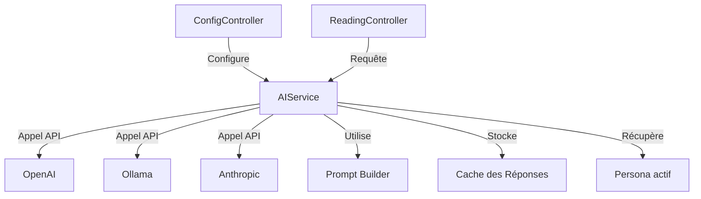

# Intégration de l'Intelligence Artificielle

## Vue d'Ensemble

L'intégration de l'intelligence artificielle est au cœur de JodoTarot, permettant des interprétations personnalisées des tirages de tarot. Le système est conçu pour être flexible, supportant plusieurs fournisseurs d'IA et différents modèles.

## Architecture de l'Intégration IA



## Fournisseurs d'IA Supportés

JodoTarot prend en charge trois fournisseurs d'IA principaux :

### 1. OpenAI
- **Modèles disponibles** : GPT-4o, GPT-4, GPT-3.5-Turbo, GPT-4o-mini
- **Configuration** : Nécessite une clé API valide
- **Format** : Utilise l'API standard d'OpenAI avec streaming

### 2. Ollama (Local)
- **Modèles disponibles** : Tous les modèles installés localement via Ollama
- **Configuration** : Nécessite une installation fonctionnelle d'Ollama sur la machine
- **Format** : Utilise l'API compatible avec la spécification OpenAI

### 3. Anthropic
- **Modèles disponibles** : Claude-3 Opus
- **Configuration** : Nécessite une clé API valide
- **Format** : Utilise l'API standard d'Anthropic

## Implémentation

L'intégration IA est implémentée via plusieurs composants clés :

### AIService

Classe centrale gérant toutes les interactions avec les services d'IA, située dans `assets/js/services/AIService.js`.

```javascript
class AIService {
  constructor(stateManager) {
    this.stateManager = stateManager;
    this.apiKey = this.loadApiKey() || API_KEY;
    this.interpreterCache = {};  // Cache pour éviter des appels redondants
    // ...
  }
  
  // Méthodes principales
  async getInterpretation(question, cards, persona, language, spread) { /* ... */ }
  async getOpenAIResponse(prompt, systemPrompts, model) { /* ... */ }
  async getOllamaResponse(prompt, systemPrompts, model) { /* ... */ }
  async getAnthropicResponse(prompt, systemPrompts, model) { /* ... */ }
  async testModelAvailability(modelName) { /* ... */ }
}
```

### Mécanisme de Construction des Prompts

Le système utilise un mécanisme sophistiqué pour générer des prompts adaptés à chaque modèle, persona et langue.

```javascript
import { getPersonaPrompt } from './models/personas/index.js';
import { getMetaPrompt, enrichirPromptContextuel } from './prompt.js';

// Construction d'un prompt
function buildPrompt(persona, cards, question, spreadType, language) {
  // Obtenir le prompt spécifique au persona
  const personaPrompt = getPersonaPrompt(persona, language);
  
  // Enrichir avec le contexte des cartes
  const cardsContext = formatCardsForPrompt(cards, spreadType);
  
  // Ajouter le meta-prompt qui contient les instructions générales
  const metaPrompt = getMetaPrompt(language);
  
  // Enrichir avec la question spécifique
  return enrichirPromptContextuel(question, 
    `${metaPrompt}\n${personaPrompt}\n${cardsContext}`, 
    language);
}
```

### Gestion des Erreurs et Résilience

Le système intègre des mécanismes robustes pour gérer les erreurs de connexion ou d'API :

1. **Timeouts adaptés** : Délais appropriés pour chaque type d'opération
2. **Retries automatiques** : Tentatives multiples en cas d'échec temporaire
3. **Fallback entre modèles** : Possibilité de basculer vers un modèle alternatif
4. **Détection de modèles incomplets** : Gestion des réponses tronquées

```javascript
// Exemple de fetchWithRetry avec timeout
async function fetchWithRetry(url, options, maxRetries = 2, timeoutMs = 5000) {
  let retries = 0;
  
  while (retries <= maxRetries) {
    try {
      const controller = new AbortController();
      const timeoutId = setTimeout(() => controller.abort(), timeoutMs);
      
      const response = await fetch(url, {
        ...options,
        signal: controller.signal
      });
      
      clearTimeout(timeoutId);
      return response;
    } catch (error) {
      retries++;
      if (retries > maxRetries) throw error;
      
      console.warn(`Tentative #${retries} échouée, nouvel essai...`);
      await new Promise(r => setTimeout(r, 1000));
    }
  }
}
```

## Configuration et Utilisation

### Initialisation du Service

```javascript
// Exemple d'initialisation dans main.js
import AIService from './services/AIService.js';

const stateManager = new StateManager();
const aiService = new AIService(stateManager);

// Vérification des modèles disponibles
await aiService.checkAvailableModels();
```

### Exécution d'une Requête d'Interprétation

```javascript
// Exemple d'utilisation dans ReadingController
async interpretReading() {
  const state = this.stateManager.getState();
  
  try {
    // Mettre à jour l'état pour indiquer le chargement
    this.stateManager.setState({ isLoading: true });
    
    const interpretation = await this.aiService.getInterpretation(
      state.question,
      state.selectedCards,
      state.persona,
      state.language,
      state.spreadType
    );
    
    // Mettre à jour l'état avec l'interprétation
    this.stateManager.setState({ 
      interpretation,
      isLoading: false
    });
    
    // Afficher l'interprétation
    this.displayInterpretation(interpretation);
  } catch (error) {
    console.error('Erreur lors de l\'interprétation:', error);
    this.stateManager.setState({ 
      error: error.message,
      isLoading: false
    });
  }
}
```

## Streaming des Réponses

JodoTarot utilise le streaming des réponses pour afficher les interprétations progressivement, améliorant l'expérience utilisateur :

```javascript
async function streamResponse(response, outputElement) {
  const reader = response.body.getReader();
  const decoder = new TextDecoder();
  let buffer = '';
  
  while (true) {
    const { done, value } = await reader.read();
    if (done) break;
    
    buffer += decoder.decode(value, { stream: true });
    
    // Traiter les lignes complètes (format SSE)
    const lines = buffer.split('\n');
    buffer = lines.pop();
    
    for (const line of lines) {
      if (line.startsWith('data: ')) {
        const jsonStr = line.slice(6);
        if (jsonStr === '[DONE]') continue;
        
        try {
          const json = JSON.parse(jsonStr);
          const content = json.choices[0]?.delta?.content || '';
          if (content) {
            outputElement.innerHTML += formatStreamingResponse(content);
            scrollToBottom();
          }
        } catch (e) {
          console.warn('Erreur de parsing JSON:', e);
        }
      }
    }
  }
}
```

## Détection et Configuration des Modèles

Le système détecte automatiquement les modèles disponibles, particulièrement pour Ollama :

```javascript
async function detectAvailableModels() {
  // Modèles OpenAI et Anthropic toujours disponibles si API key présente
  const models = {
    openai: ['gpt-3.5-turbo', 'gpt-4', 'gpt-4o', 'gpt-4o-mini'],
    anthropic: ['claude-3-opus-20240229'],
    ollama: []
  };
  
  // Tester la connexion à Ollama
  try {
    const ollamaTest = await verifierConnexionOllama();
    if (ollamaTest.success) {
      // Récupérer les modèles Ollama
      models.ollama = await obtenirModelesOllama();
    }
  } catch (error) {
    console.warn('Ollama non disponible:', error.message);
  }
  
  return models;
}
```

## Bonnes Pratiques pour l'Utilisation des APIs IA

1. **Gestion des clés API** : Stockage sécurisé, rotation périodique
2. **Économie de tokens** : Optimisation des prompts pour réduire la consommation
3. **Mise en cache** : Réutilisation des résultats pour les mêmes entrées
4. **Monitoring** : Surveillance de l'utilisation et des erreurs
5. **Gestion du quota** : Vérification préventive des limites de quotas 