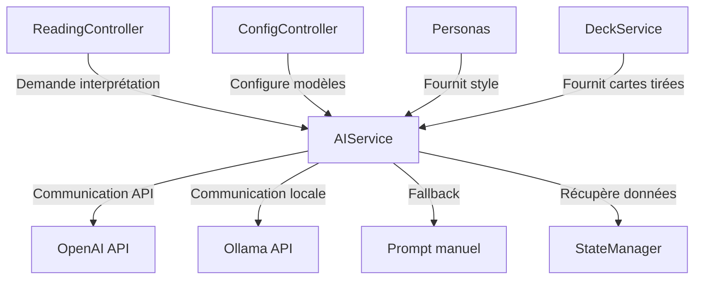

# Intégration de l'Intelligence Artificielle

## Vue d'Ensemble

L'intégration de l'intelligence artificielle est au cœur de JodoTarot, permettant des interprétations personnalisées des tirages de tarot. Le système est conçu pour être flexible, supportant plusieurs fournisseurs d'IA et différents modèles.

## Architecture de l'Intégration IA



### Composants Principaux

1. **AIService** (`assets/js/services/AIService.js`, 883 lignes)
   - Service central gérant toutes les interactions avec les modèles d'IA
   - Interface unifiée indépendante du fournisseur d'IA utilisé
   - Gestion des erreurs et des fallbacks

2. **Intégration OpenAI** (`assets/js/api.js`, section OpenAI)
   - Communication avec l'API OpenAI
   - Support de différents modèles (GPT-3.5, GPT-4, etc.)
   - Gestion du rate-limiting et des erreurs spécifiques

3. **Intégration Ollama** (`assets/js/api.js`, section Ollama)
   - Communication avec l'API Ollama pour modèles locaux
   - Détection automatique des modèles disponibles
   - Optimisations pour exécution locale

4. **Système de Prompt** (`assets/js/prompt.js`, 72 lignes)
   - Construction des prompts dynamiques pour l'IA
   - Intégration des traductions et des styles des personas
   - Personnalisation selon le type de tirage

## Fonctionnement du Système

### 1. Initialisation et Configuration

L'initialisation du système d'IA se fait lors du chargement de l'application :

```javascript
// Extrait simplifié de l'initialisation
const aiService = new AIService(stateManager, translationService);
aiService.initialize()
  .then(() => {
    // Modèles détectés et configurés
    renderAvailableModels(aiService.getAvailableModels());
  })
  .catch(error => {
    // Gestion des erreurs d'initialisation
    fallbackToPromptMode();
  });
```

### 2. Processus d'Interprétation

Le flux d'une demande d'interprétation suit ces étapes :

1. **Préparation des données du tirage**
   - Récupération des cartes tirées
   - Positions dans le tirage
   - Significations traditionnelles

2. **Construction du prompt**
   - Intégration du style du persona sélectionné
   - Adaptation au type de tirage
   - Inclusion des instructions spécifiques

3. **Sélection du modèle d'IA**
   - Priorité aux modèles configurés
   - Fallback automatique si nécessaire

4. **Envoi de la requête**
   - Gestion des paramètres (température, etc.)
   - Suivi de l'état de la requête

5. **Traitement de la réponse**
   - Parsing du contenu
   - Formatage pour l'affichage
   - Gestion des erreurs potentielles

### 3. Exemple de Construction de Prompt

```javascript
// Extrait de prompt.js
function buildTarotPrompt(cards, positions, persona, language) {
  const basePrompt = getTranslation('tarotPromptBase', language);
  const cardDetails = cards.map((card, index) => {
    const position = positions[index];
    return `${card.name} en position ${position.name} (${getTranslation(position.meaningKey, language)})`;
  }).join('\n');
  
  const personaStyle = persona.getPromptStyle(language);
  
  return `${basePrompt}\n\nCartes tirées:\n${cardDetails}\n\n${personaStyle}`;
}
```

## Gestion des Fournisseurs d'IA

### OpenAI

- **Modèles supportés** : GPT-3.5-turbo, GPT-4
- **Configuration** : Clé API stockée localement
- **Particularités** : 
  - Meilleure qualité d'interprétation
  - Nécessite une connexion internet
  - Coût associé aux requêtes

### Ollama

- **Modèles supportés** : Llama2, Mistral, etc.
- **Configuration** : Détection automatique des modèles installés
- **Particularités** :
  - Exécution locale (pas de connexion internet requise)
  - Performance variable selon matériel
  - Gratuit mais nécessite installation préalable

### Mode Prompt Manuel

- **Fonctionnement** : Affichage du prompt à l'utilisateur pour utilisation externe
- **Utilisation** : Fallback en cas d'échec des autres méthodes
- **Avantages** : Solution universelle sans dépendance

## Personnalisation via Personas

Chaque persona définit un style d'interprétation spécifique :

```javascript
// Extrait de OraclePersona.js
getPromptStyle(language) {
  return getTranslation('oraclePromptStyle', language) + 
    "\nTon style est mystique, sibyllin et empli de métaphores. " +
    "Tu parles comme si tu voyais au-delà du voile de la réalité.";
}
```

Ces instructions stylistiques sont intégrées au prompt envoyé à l'IA, permettant d'obtenir des interprétations variées selon le persona choisi.

## Gestion des Erreurs et Fallbacks

Le système implémente une cascade de fallbacks pour assurer la continuité de service :

1. Tentative avec le modèle principal configuré
2. En cas d'échec, essai avec modèles alternatifs disponibles
3. Si tous les modèles échouent, proposition du mode Prompt manuel
4. Messages d'erreur explicites à l'utilisateur

## Configuration et Paramètres

Les paramètres d'IA sont gérés via le ConfigController :

- Choix du fournisseur d'IA (OpenAI/Ollama)
- Sélection du modèle spécifique
- Paramètres de génération (température, tokens max)
- Configuration des clés API

Ces paramètres sont persistés dans le StateManager et restaurés entre les sessions.

## Optimisations Techniques

### Performance

- **Mise en cache des réponses** pour tirages similaires
- **Gestion optimisée des tokens** pour réduire les coûts
- **Streaming des réponses** pour améliorer l'expérience utilisateur

### Sécurité

- **Stockage local** des clés API
- **Validation des inputs** avant envoi à l'IA
- **Sanitization des réponses** pour éviter injections

## Évolutions Futures

- Support de nouvelles API (Claude, etc.)
- Interprétations multi-modales (avec images)
- Amélioration de la contextualisation des tirages
- Support avancé pour les arcanes mineurs
- Système de mémoire pour les interprétations précédentes

## Bonnes Pratiques

Pour l'extension ou la modification du système d'IA :

1. **Toujours utiliser AIService** comme point d'entrée
2. **Respecter l'interface commune** pour ajouter de nouveaux fournisseurs
3. **Gérer les cas d'erreur** à chaque niveau
4. **Maintenir la séparation** entre construction de prompt et appel d'API
5. **Documenter les particularités** de chaque modèle utilisé

## Références

- [Documentation OpenAI](https://platform.openai.com/docs/api-reference)
- [Documentation Ollama](https://ollama.ai/library)
- [Bonnes Pratiques](../standards/bonnes-pratiques.md)
- [Gestionnaire d'État](state-manager.md)
- [Construction des Prompts](construction-prompts.md) 