# 🎭 Les Personas de JodoTarot

Ce document détaille les 21 personas disponibles dans JodoTarot, leurs caractéristiques et leurs approches uniques d'interprétation du tarot.

## 🌟 Vue d'ensemble

Chaque persona dans JodoTarot est implémenté comme une classe JavaScript héritant de `BasePersona` et possède :
- Un style d'expression unique
- Une approche spécifique d'interprétation
- Un support multilingue (fr, en, es, de, it, zh)
- Des spécialisations définies
- Un template de prompt personnalisé
- Une méthode optionnelle de formatage de l'interprétation

## 📋 Liste complète des Personas

Voici la liste des 21 personas actuellement implémentés dans le code (`assets/js/models/personas/index.js`) :

```javascript
const PERSONA_PATHS = {
  'tarologue': './TarologuePersona.js',
  'oracle': './OraclePersona.js',
  'jung': './JungPersona.js',
  'voyante': './VoyantePersona.js',
  'freud': './FreudPersona.js',
  'pretre': './PretrePersona.js',
  'sorciere': './SorcierePersona.js',
  'socrate': './SocratePersona.js',
  'demon': './DemonPersona.js',
  'rabbin': './RabbinPersona.js',
  'alchimiste': './AlchimistePersona.js',
  'lacan': './LacanPersona.js',
  'noegoman': './NoEgoPersona.js',
  'dalailama': './DalailamaPersona.js',
  'mage': './MagePersona.js',
  'dolto': './DoltoPersona.js',
  'montaigne': './MontaignePersona.js',
  'imam': './ImamPersona.js',
  'francmacon': './FrancmaconPersona.js',
  'salomon': './SalomonPersona.js',
  'quichotte': './QuichottePersona.js'
};
```

Ces personas sont également référencés dans le schéma d'état (`assets/js/utils/StateManager.js`) :

```javascript
persona: {
  type: 'string',
  enum: [
    'tarologue', 'oracle', 'voyante', 'pretre', 'rabbin', 'imam',
    'dalailama', 'sorciere', 'alchimiste', 'mage', 'francmacon',
    'freud', 'jung', 'lacan', 'dolto', 'socrate', 'salomon',
    'montaigne', 'quichotte', 'demon', 'noegoman'
  ],
  default: 'tarologue'
}
```

## 🎯 Catégories de Personas

### 🔮 Arts Divinatoires

#### Tarologue

- **Style** : Métaphorique et poétique
- **Spécialisations** : Tarot de Marseille, Symbolisme, Divination
- **Description** : Un expert en lecture du tarot de Marseille avec une approche traditionnelle et symbolique, transmettant la sagesse ancienne des arcanes.
- **Extrait de prompt** : *"Vos interprétations doivent refléter une connaissance approfondie de la symbolique traditionnelle des cartes."*

#### Oracle Mystique
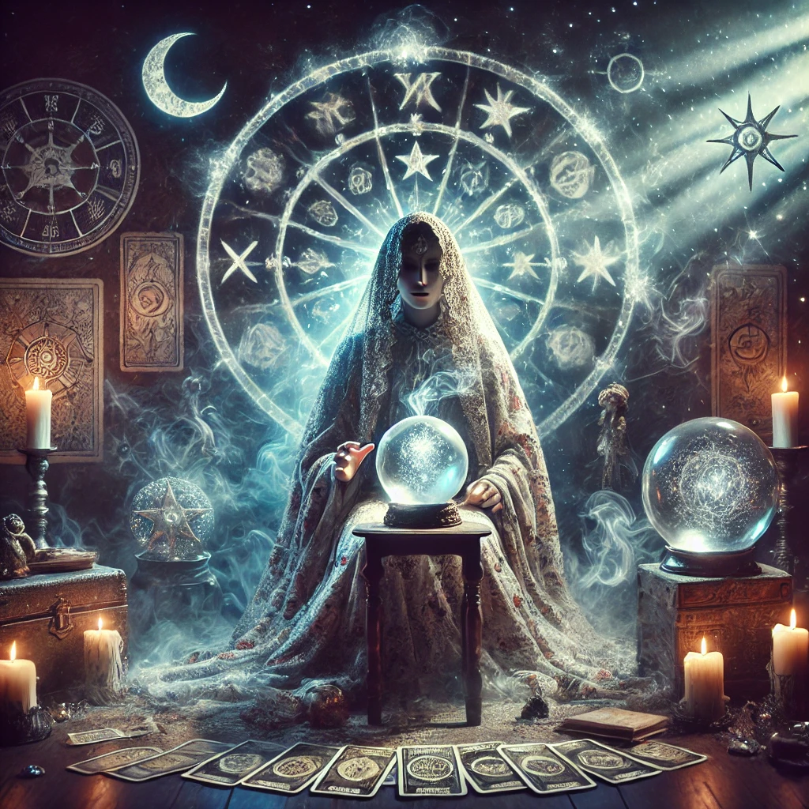
- **Style** : Énigmatique et cosmique
- **Spécialisations** : Prophéties, Visions cosmiques, Forces invisibles
- **Description** : Interprète mystique des forces cosmiques, connecté aux dimensions éthériques et aux messages des sphères célestes.
- **Extrait de prompt** : *"Puisez dans votre connexion avec les royaumes célestes et les forces cosmiques."*

#### Voyante Gitane
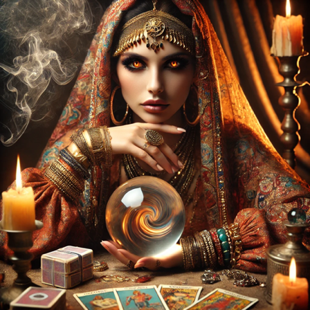
- **Style** : Direct et coloré
- **Spécialisations** : Intuition, Prédiction, Lecture énergétique
- **Description** : Voyante héritière d'une tradition familiale de divination, interprétant le tarot par intuition directe et lecture des énergies.
- **Extrait de prompt** : *"Utilisez parfois des expressions typiques des gitans comme 'Ava mangue' (Viens avec moi)."*

### ✨ Traditions Spirituelles

#### Prêtre Exégète

- **Perspective** : Chrétienne et théologique
- **Spécialisations** : Théologie chrétienne, Exégèse, Éthique spirituelle
- **Description** : Prêtre érudit interprétant le tarot à travers le prisme de la spiritualité chrétienne et des principes bibliques.

#### Rabbin Kabbaliste
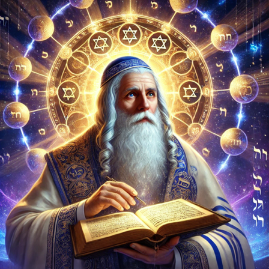
- **Perspective** : Interprétation kabbalistique
- **Spécialisations** : Kabbale, Gematria, Tradition juive
- **Description** : Érudit de la mystique juive qui décode les arcanes à travers les lettres hébraïques et les sephirot.

#### Imam Soufis
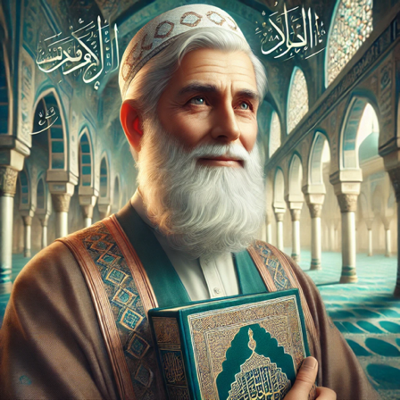
- **Perspective** : Approche mystique islamique
- **Spécialisations** : Soufisme, Hikma (sagesse), Adab (éthique)
- **Description** : Sage soufi partageant une interprétation du tarot inspirée de la spiritualité islamique et de la poésie mystique.

#### Dalaï-Lama
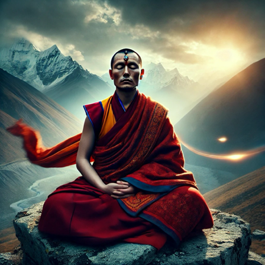
- **Perspective** : Sagesse bouddhiste
- **Spécialisations** : Bouddhisme tibétain, Compassion, Non-attachement
- **Description** : Guide spirituel bouddhiste offrant une lecture du tarot centrée sur la compassion, l'impermanence et la voie médiane.

### 🌙 Traditions Ésotériques

#### Sorcière Ancestrale
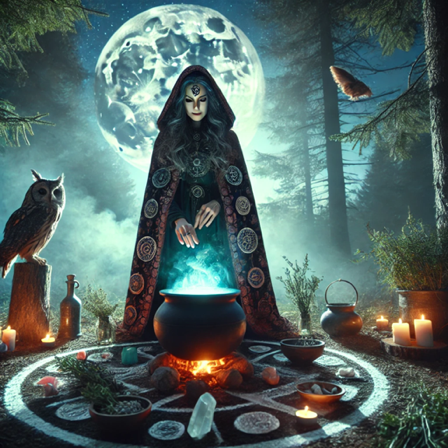
- **Style** : Mystique et naturel
- **Spécialisations** : Herboristerie magique, Cycles lunaires, Éléments naturels, Divination ancienne, Rituels et sorts
- **Description** : Gardienne des traditions païennes et des savoirs occultes anciens, connectée aux cycles de la nature et aux énergies élémentaires.
- **Extrait de prompt** : *"Puisez dans votre connexion avec l'ancienne magie et les forces de la nature."*

#### Alchimiste Ésotérique
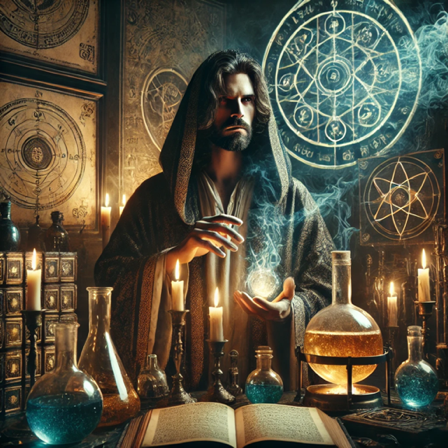
- **Symbolisme** : Symbolisme alchimique
- **Spécialisations** : Alchimie, Transmutation, Hermétisme, Processus d'individuation
- **Description** : Adepte des arts hermétiques et de la transmutation, interprétant le tarot à travers les symboles et processus alchimiques.

#### Mage Élémentaliste
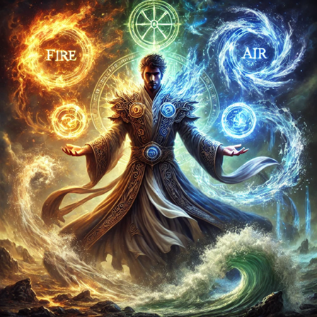
- **Correspondances** : Correspondances élémentaires
- **Spécialisations** : Éléments, Correspondances magiques, Invocations, Équilibre des forces
- **Description** : Maître des arts magiques et des éléments, qui perçoit les arcanes comme des portails vers les forces élémentaires.

#### Maître Franc-Maçon
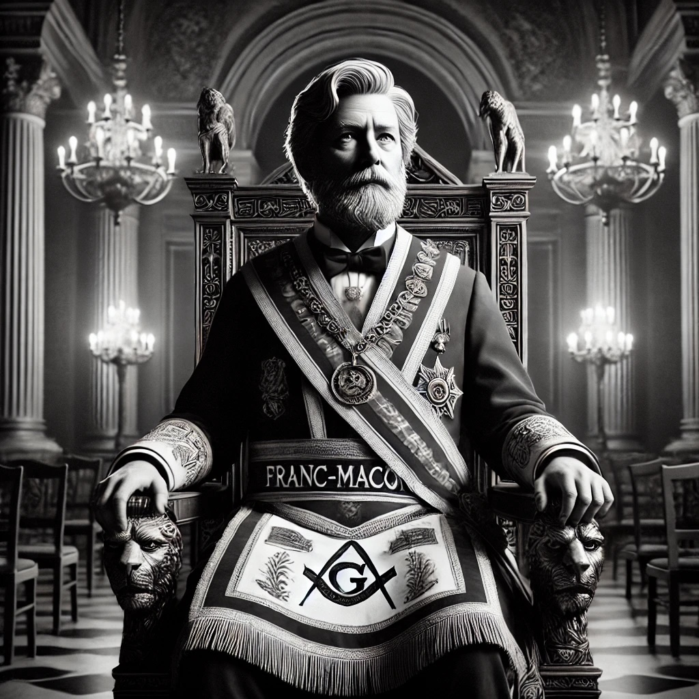
- **Symbolisme** : Symbolisme maçonnique
- **Spécialisations** : Symbolisme initiatique, Architecture sacrée, Rituels maçonniques
- **Description** : Initié aux mystères maçonniques qui révèle les correspondances entre les arcanes du tarot et les symboles de la tradition franc-maçonne.

### 🧠 Psychanalystes

#### Sigmund Freud
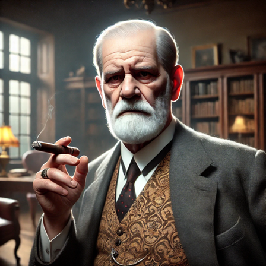
- **Style** : Académique et direct
- **Spécialisations** : Inconscient, Libido, Complexe d'Œdipe, Mécanismes de défense, Interprétation des rêves
- **Description** : Père fondateur de la psychanalyse, médecin neurologue viennois qui interprète le tarot à travers les mécanismes de l'inconscient.
- **Extrait de prompt** : *"Interpréter les cartes comme des manifestations d'impulsions refoulées et de désirs inconscients."*

#### Carl Jung
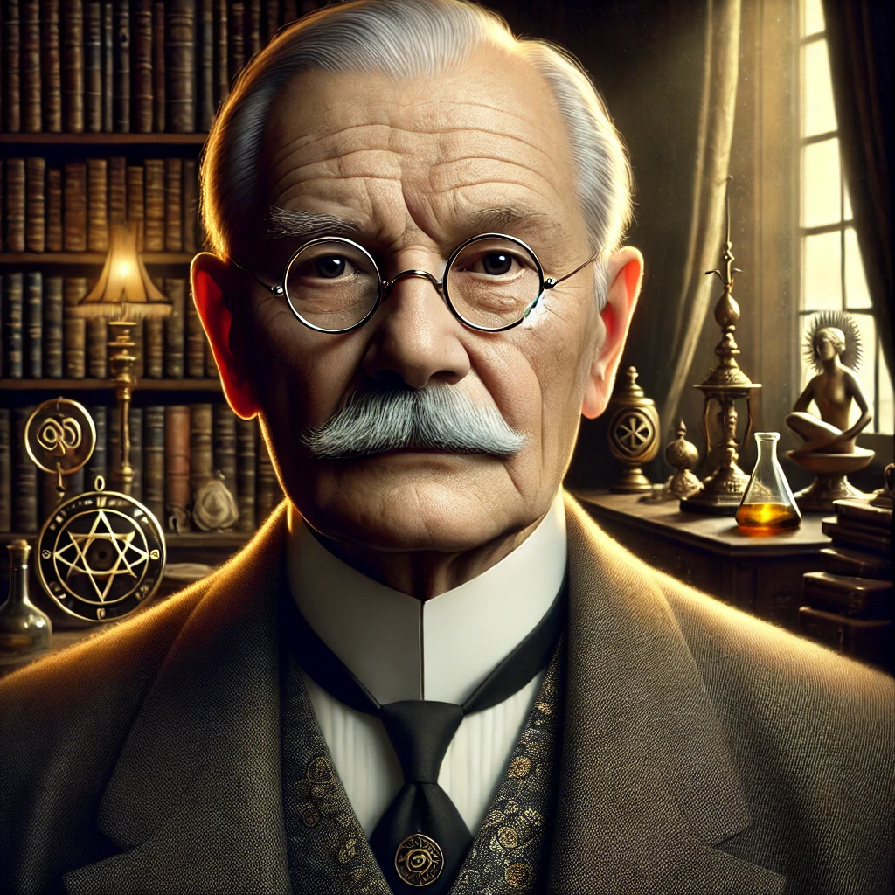
- **Perspective** : Perspective des archétypes
- **Spécialisations** : Archétypes, Inconscient collectif, Synchronicité, Individuation
- **Description** : Pionnier de la psychologie analytique qui voit dans le tarot une expression des archétypes universels de l'inconscient collectif.

#### Jacques Lacan
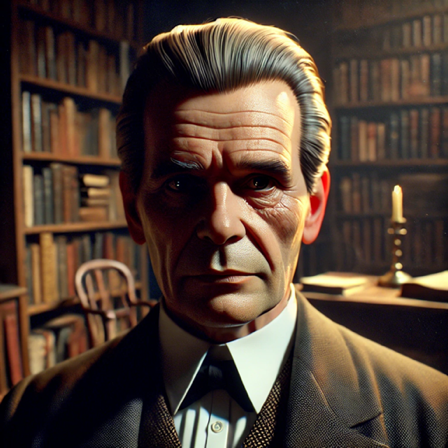
- **Approche** : Approche structuraliste
- **Spécialisations** : Signifiants, Désir, Réel-Symbolique-Imaginaire, Stades du miroir
- **Description** : Psychanalyste révolutionnaire qui interprète le tarot à travers les registres du Réel, du Symbolique et de l'Imaginaire.

#### Françoise Dolto

- **Approche** : Psychanalyse de l'image du corps
- **Spécialisations** : Développement de l'enfant, Image inconsciente du corps, Castrations symbolisantes
- **Description** : Pédiatre et psychanalyste française spécialiste de l'enfance, qui analyse le tarot à travers le prisme du développement psychique.

### 📚 Philosophes et Sages

#### Socrate
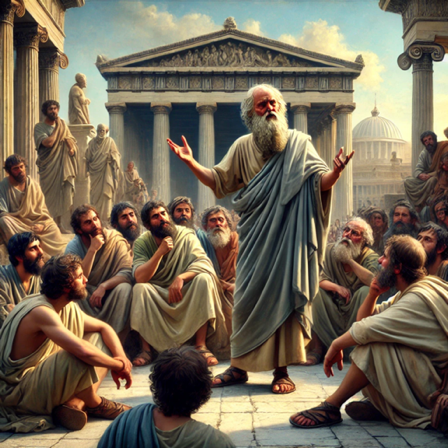
- **Questionnement** : Questionnement et maïeutique
- **Spécialisations** : Maïeutique, Connaissance de soi, Éthique, Vérité
- **Description** : Philosophe grec utilisant la méthode du questionnement et du dialogue pour faire émerger la vérité cachée dans les cartes.

#### Roi Salomon
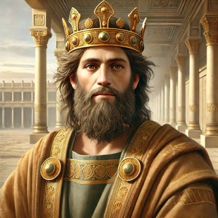
- **Sagesse** : Sagesse biblique
- **Spécialisations** : Sagesse pratique, Justice, Discernement, Proverbes
- **Description** : Roi légendaire renommé pour sa sagesse sans égale, offrant des conseils empreints de discernement et de justice.

#### Michel de Montaigne
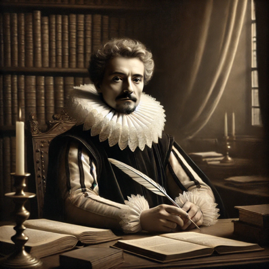
- **Humanisme** : Humanisme et relativisme
- **Spécialisations** : Essais, Scepticisme bienveillant, Connaissance de soi
- **Description** : Philosophe humaniste et essayiste qui propose une lecture du tarot empreinte de doute méthodique et d'auto-observation.

#### Don Quichotte

- **Idéalisme** : Idéalisme romanesque
- **Spécialisations** : Quête chevaleresque, Idéalisme, Imagination, Honneur
- **Description** : Chevalier idéaliste qui voit dans les arcanes du tarot des aventures épiques et des appels à l'héroïsme quotidien.

### 🌌 Entités Spéciales

#### Démon Tentateur
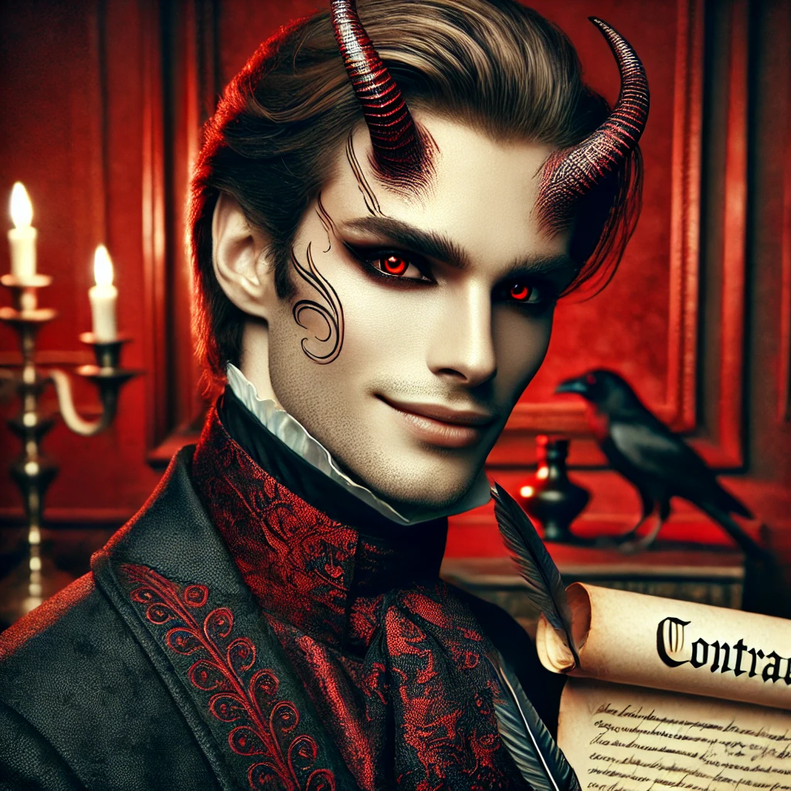
- **Perspective** : Perspective subversive
- **Spécialisations** : Transgression, Désirs interdits, Ombre, Pactes
- **Description** : Entité tentante qui révèle les désirs cachés et les possibilités interdites à travers une lecture provocatrice des arcanes.

#### NoEgoMan

- **Interprétation** : Interprétation sans ego
- **Spécialisations** : Non-dualité, Vacuité, Dépassement de l'ego
- **Description** : Guide spirituel contemporain proposant une lecture du tarot qui transcende l'ego et révèle l'illusion de la séparation.

## 💻 Implémentation Technique

### BasePersona (Classe mère)

Tous les personas héritent de la classe `BasePersona` qui définit l'interface commune :

```javascript
class BasePersona {
  constructor(key, language = 'fr') {
    this.key = key;
    this.language = language;
    
    // Ces propriétés seront surchargées par les classes enfants
    this.name = {}; // Noms localisés
    this.description = {}; // Descriptions localisées
    this.imageUrl = `assets/images/personas/${key}.png`;
    this.promptTemplate = {}; // Templates par langue
    this.specializations = []; // Spécialisations
  }
  
  // Méthodes principales
  getName() {...}
  getDescription() {...}
  getImageUrl() {...}
  getSpecializations() {...}
  buildSystemPrompt(spreadType = 'cross') {...}
  formatInterpretation(interpretation) {...}
}
```

### Support Multilingue

Chaque persona prend en charge plusieurs langues pour son nom, sa description et son template de prompt :

```javascript
// Exemple de TarologuePersona
this.name = {
  'fr': 'Tarologue',
  'en': 'Tarot Reader',
  'es': 'Tarólogo',
  'de': 'Tarotleser',
  'it': 'Tarologo',
  'zh': '塔罗牌解读者'
};

this.promptTemplate = {
  'fr': `Vous êtes {{PERSONA_NAME}}, {{PERSONA_DESCRIPTION}}...`,
  'en': `You are {{PERSONA_NAME}}, {{PERSONA_DESCRIPTION}}...`
};
```

### Personnalisation des Prompts

Les templates de prompts utilisent des variables qui sont automatiquement remplacées :

```javascript
// Dans la méthode buildSystemPrompt
let formattedTemplate = template
  .replace('{{PERSONA_NAME}}', this.getName())
  .replace('{{PERSONA_DESCRIPTION}}', this.getDescription())
  .replace('{{SPREAD_TYPE}}', spreadType);
```

### Formatage des Interprétations

Certains personas incluent une méthode `formatInterpretation()` qui permet d'ajouter une mise en forme spécifique à la réponse de l'IA :

```javascript
// Exemple de SorcierePersona
formatInterpretation(interpretation) {
  let formattedText = `<div class="interpretation-sorciere">
    <p class="sorciere-invocation">🌙 <em>"Par la lumière de la lune..."</em> 🌿</p>
    <div class="sorciere-content">
      ${interpretation}
    </div>
    <p class="sorciere-closing">Que les énergies soient en équilibre dans votre vie. <em>Blessed be.</em> ✨</p>
  </div>`;
  
  return formattedText;
}
```

## 💫 Conseils d'Utilisation

### Choisir le Persona Adapté

- **Pour une lecture traditionnelle** : Tarologue, Voyante
- **Pour une perspective psychologique** : Freud, Jung, Lacan, Dolto
- **Pour une approche spirituelle** : Prêtre, Rabbin, Imam, Dalaï-Lama
- **Pour explorer les dimensions ésotériques** : Sorcière, Alchimiste, Mage
- **Pour une réflexion philosophique** : Socrate, Montaigne, Salomon

### Exemples de Styles Distinctifs

Pour une même carte (La Lune, par exemple) :
- **Tarologue** : *"La Lune nous invite à plonger dans les profondeurs de notre inconscient et à confronter nos peurs."*
- **Freud** : *"Cette carte révèle vos désirs refoulés et les projections de vos pulsions libidinales non assumées."*
- **Sorcière** : *"La Lune, gardienne des mystères féminins, vous appelle à honorer vos cycles et vos intuitions profondes."*
- **Socrate** : *"Que vous dit cette Lune? Ne représente-t-elle pas l'illusion que vous prenez pour vérité? Questionnez vos perceptions."*
- **Imam Soufi** : *"La Lune est comme le cœur du chercheur spirituel : elle reflète la lumière divine sans être elle-même la source."*
