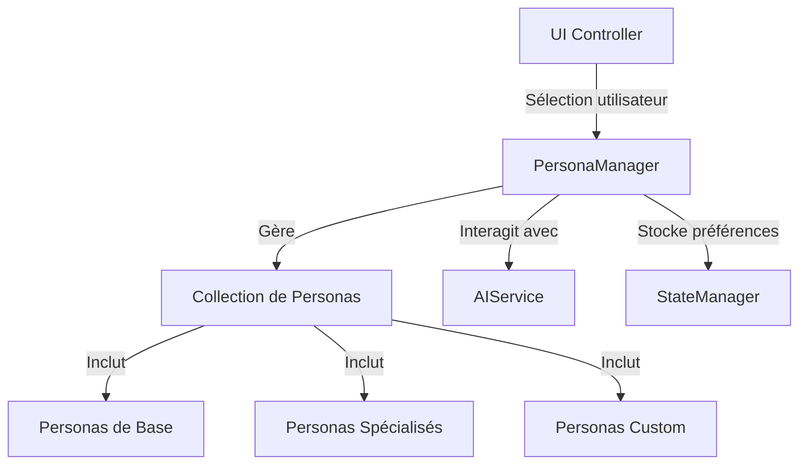

# Système des Personas dans JodoTarot

## Vue d'Ensemble

Le système des personas est un élément central de JodoTarot qui permet de personnaliser l'expérience d'interprétation des tirages de tarot. Chaque persona représente une "personnalité" différente qui interprète les cartes avec son propre style, ton et perspective.

## Architecture du Système des Personas



### Composants Principaux

1. **PersonaManager** 
   - Service central qui gère tous les personas disponibles
   - Permet la sélection, la persistance et la récupération du persona actif
   - Intègre les paramètres de personnalisation avec le système d'IA

2. **Classe de Base Persona**
   - Définit l'interface commune à tous les personas
   - Fournit les méthodes pour obtenir le style d'interprétation
   - Gère la traduction et l'adaptation multilingue

3. **Personas Spécialisés**
   - Extensions de la classe de base avec des comportements spécifiques
   - Adaptés à différents types de tirages et contextes
   - Exemples : MysticPersona, PsychologistPersona, AstrologerPersona, etc.

## Types de Personas Disponibles

JodoTarot offre actuellement 21 personas différents, chacun avec une approche unique :

### Catégories Principales

1. **Approches Traditionnelles**
   - **Oracle** : Style mystique et sibyllin
   - **Tarologue Traditionnel** : Interprétation classique du tarot
   - **Hermétiste** : Focus sur le symbolisme occulte

2. **Approches Contemporaines**
   - **Coach de Vie** : Orientation pratique et développement personnel
   - **Psychologue Jungien** : Perspective archétypale et psychologique
   - **Conseiller Spirituel** : Guidance spirituelle et éthique

3. **Approches Spécifiques**
   - **Astrologue** : Intègre des éléments d'astrologie
   - **Alchimiste** : Utilise la symbolique de transformation
   - **Poète** : Style littéraire et métaphorique

4. **Approches Culturelles**
   - **Chamane** : Perspective des traditions chamaniques
   - **Kabbaliste** : Interprétation basée sur la Kabbale
   - **Philosophe Taoïste** : Approche basée sur l'équilibre et le Tao

## Fonctionnement du Système

### 1. Définition d'un Persona

Chaque persona est défini par plusieurs attributs :

```javascript
class MysterieuxPersona extends BasePersona {
  constructor() {
    super({
      id: 'mysterieux',
      nameKey: 'mysterieuxPersonaName',
      descriptionKey: 'mysterieuxPersonaDesc',
      iconClass: 'fa-moon',
      category: 'esoteric'
    });
  }
  
  getPromptStyle(language) {
    return getTranslation('mysterieuxPromptStyle', language) + 
      "\nTon style est cryptique et mystérieux. " +
      "Tu parles par énigmes et suggères plus que tu n'affirmes. " +
      "Tu utilises beaucoup de symboles et de références ésotériques.";
  }
}
```

### 2. Sélection et Activation

Le processus de sélection d'un persona suit ces étapes :

1. L'utilisateur choisit un persona dans l'interface
2. Le PersonaManager active le persona sélectionné
3. La préférence est enregistrée dans le StateManager
4. L'AIService est notifié du changement pour adapter les interprétations

### 3. Intégration avec le Système d'IA

Lorsqu'une interprétation est demandée :

1. Le style du persona actif est récupéré via `getPromptStyle()`
2. Ce style est intégré dans le prompt envoyé à l'IA
3. L'IA adapte son interprétation en fonction du style demandé
4. Le résultat reflète la "personnalité" du persona choisi

## Personnalisation des Personas

### Style d'Interprétation

Le style d'interprétation est défini par la méthode `getPromptStyle()` qui renvoie des instructions spécifiques pour l'IA :

```javascript
getPromptStyle(language) {
  return `
    Tu es un ${this.getName(language)}.
    ${getTranslation('commonPromptInstructions', language)}
    
    Style spécifique :
    - Ton ton est ${this.getTone(language)}
    - Tu mets l'accent sur ${this.getFocus(language)}
    - Tu utilises souvent ${this.getLanguageStyle(language)}
    
    Évite de :
    - ${this.getAvoidance(language)}
    
    Structure ta réponse en ${this.getStructure(language)}
  `;
}
```

### Attributs Personnalisables

Chaque persona peut personnaliser :

- **Ton** : Formel, amical, mystérieux, direct, etc.
- **Focus** : Psychologie, spiritualité, pratique, symbolisme, etc.
- **Style de langage** : Métaphores, termes techniques, langage poétique, etc.
- **Structure** : Organisation de l'interprétation (sections, paragraphes)
- **Éléments à éviter** : Ce que le persona ne ferait jamais

## Implémentation Technique

### Enregistrement des Personas

Les personas sont enregistrés auprès du PersonaManager lors de l'initialisation :

```javascript
// Extrait simplifié
class PersonaManager {
  constructor() {
    this.personas = {};
    this.activePersona = null;
  }
  
  registerPersona(persona) {
    this.personas[persona.getId()] = persona;
  }
  
  initialize() {
    // Enregistrement des personas standard
    this.registerPersona(new MysticPersona());
    this.registerPersona(new PsychologistPersona());
    // etc.
    
    // Restauration du persona préféré
    const savedPersonaId = stateManager.getState('preferredPersona');
    if (savedPersonaId && this.personas[savedPersonaId]) {
      this.setActivePersona(savedPersonaId);
    } else {
      // Persona par défaut
      this.setActivePersona('tarotTraditional');
    }
  }
}
```

### Support Multilingue

Les personas supportent toutes les langues de l'application :

- Noms et descriptions traduits
- Instructions de style adaptées à chaque langue
- Terminologie spécifique ajustée selon le contexte culturel

## Bonnes Pratiques pour Étendre le Système

Pour créer de nouveaux personas :

1. **Hériter de BasePersona** pour maintenir la cohérence
2. **Définir un style unique** qui apporte une valeur distinctive
3. **Tester avec différents tirages** pour assurer la cohérence
4. **Documenter les particularités** de chaque nouveau persona
5. **Respecter la structure** des instructions pour l'IA

## Évolutions Futures

- Personas personnalisables par l'utilisateur
- Personas spécifiques à certains types de tirages
- Adaptation dynamique du style selon le contexte
- Métriques d'appréciation pour affiner les personas
- Personas à orientation culturelle plus diversifiée

## Références

- [Intégration IA](integration-ia.md)
- [Construction des Prompts](construction-prompts.md)
- [Gestionnaire d'État](state-manager.md)
- [Traduction](traduction.md) 