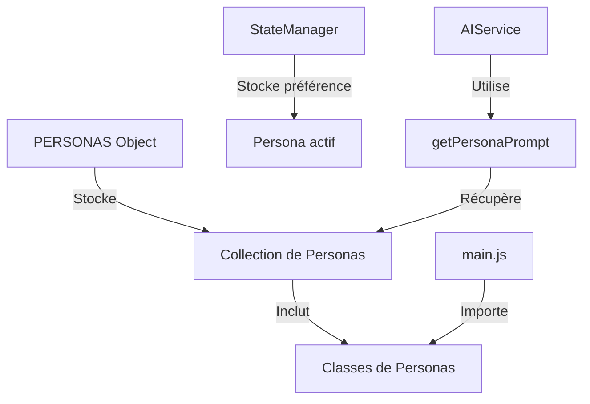

# Système des Personas dans JodoTarot

## Vue d'Ensemble

Le système des personas est un élément central de JodoTarot qui permet de personnaliser l'expérience d'interprétation des tirages de tarot. Chaque persona représente une "personnalité" différente qui interprète les cartes avec son propre style, ton et perspective.

## Architecture du Système des Personas



### Composants Principaux

1. **Objet PERSONAS** 
   - Collection centralisée des classes de personas
   - Implémenté dans `assets/js/models/personas/index.js`
   - Permet l'accès aux personas depuis le service IA

2. **Classe de Base Persona**
   - Définit l'interface commune à tous les personas (`BasePersona`)
   - Fournit les méthodes pour obtenir le style d'interprétation
   - Gère la traduction et l'adaptation multilingue

3. **Personas Spécialisés**
   - Extensions de la classe de base avec des comportements spécifiques
   - Personnalisent le prompt et le formatage des interprétations
   - Exemple : `TarologuePersona`, `JungPersona`, `SorcierePersona`, etc.

## Types de Personas Disponibles

JodoTarot offre actuellement 21 personas différents, chacun avec une approche unique :

### Catégories dans l'Interface

1. **Arts Divinatoires**
   - **Tarologue** : Interprétation traditionnelle du tarot
   - **Oracle Mystique** : Style sibyllin et énigmatique
   - **Voyante Gitane** : Approche intuitive et directe

2. **Traditions Spirituelles**
   - **Prêtre Exégète** : Perspective chrétienne et théologique
   - **Rabbin Kabbaliste** : Interprétation kabbalistique
   - **Imam Soufis** : Approche mystique islamique
   - **Dalaï-Lama** : Sagesse bouddhiste

3. **Traditions Ésotériques**
   - **Sorcière Ancestrale** : Savoir des traditions païennes
   - **Alchimiste Ésotérique** : Symbolisme alchimique
   - **Mage Élémentaliste** : Correspondances élémentaires
   - **Maître Franc-Maçon** : Symbolisme maçonnique

4. **Psychanalystes**
   - **Sigmund Freud** : Interprétation psychanalytique
   - **Carl Jung** : Perspective des archétypes
   - **Jacques Lacan** : Approche structuraliste
   - **Françoise Dolto** : Psychanalyse de l'image du corps

5. **Philosophes**
   - **Socrate** : Questionnement et maïeutique
   - **Roi Salomon** : Sagesse biblique
   - **Michel de Montaigne** : Humanisme et relativisme
   - **Don Quichotte** : Idéalisme romanesque

6. **Spéciaux**
   - **Démon Tentateur** : Perspective subversive
   - **NoEgoMan** : Interprétation sans ego

## Fonctionnement du Système

### 1. Définition d'un Persona

Chaque persona est défini comme une classe qui hérite de `BasePersona` :

```javascript
class TarologuePersona extends BasePersona {
  constructor(language = 'fr') {
    super('tarologue', language);
    
    // Noms localisés
    this.name = {
      'fr': 'Tarologue',
      'en': 'Tarot Reader',
      'es': 'Tarólogo',
      'de': 'Tarotleser',
      'it': 'Tarologo',
      'zh': '塔罗牌解读者'
    };
    
    // Descriptions localisées
    this.description = {
      'fr': 'Un expert en lecture du tarot de Marseille avec une approche traditionnelle et symbolique.',
      // ... autres langues
    };
    
    // Spécialisations
    this.specializations = ['Tarot de Marseille', 'Symbolisme', 'Divination'];
    
    // Templates de prompts par langue
    this.promptTemplate = {
      'fr': `Vous êtes {{PERSONA_NAME}}, {{PERSONA_DESCRIPTION}}
      
      Pour cette lecture de tarot en {{SPREAD_TYPE}}, adoptez le ton d'un tarologue expérimenté...`,
      // ... autres langues
    };
  }
  
  formatInterpretation(interpretation) {
    // Personnalisation optionnelle du formatage
    return interpretation;
  }
}
```

### 2. Enregistrement et Initialisation

Les personas sont définis comme des classes individuelles importées dans le système :

```javascript
// Import des personas dans models/personas/index.js
import TarologuePersona from './TarologuePersona.js';
import OraclePersona from './OraclePersona.js';
// ... autres imports

// Objet contenant tous les personas indexés par leur clé
const PERSONAS = {
  tarologue: TarologuePersona,
  oracle: OraclePersona,
  // ... autres personas
};

// Fonction pour obtenir le prompt système pour un persona
function getPersonaPrompt(personaKey, langue, spreadType = 'cross') {
  // Vérifier si le persona existe
  if (!PERSONAS[personaKey]) {
    console.error(`Persona non trouvé: ${personaKey}`);
    personaKey = 'tarologue'; // Utiliser le tarologue par défaut
  }
  
  // Créer une instance du persona avec la langue spécifiée
  const persona = new PERSONAS[personaKey](langue);
  
  // Retourner le prompt système
  return persona.buildSystemPrompt(spreadType);
}
```

### 3. Sélection et Utilisation

Le processus de sélection et d'utilisation d'un persona fonctionne ainsi :

1. L'utilisateur sélectionne un persona dans l'interface (menu déroulant)
2. Le StateManager stocke l'identifiant du persona choisi
3. Lors d'une interprétation, le service AI récupère le prompt du persona
4. La fonction `getPersonaPrompt` crée une instance du persona et génère le prompt système

## Personnalisation des Personas

### Construction du Prompt Système

Chaque persona définit un template de prompt qui est personnalisé selon plusieurs facteurs :

```javascript
buildSystemPrompt(spreadType = 'cross') {
  const template = this.promptTemplate[this.language] || this.promptTemplate['fr'] || '';
  
  // Remplacer les variables dans le template
  let formattedTemplate = template
    .replace('{{PERSONA_NAME}}', this.getName())
    .replace('{{PERSONA_DESCRIPTION}}', this.getDescription())
    .replace('{{SPREAD_TYPE}}', spreadType);
    
  // Ajouter les spécialisations si nécessaire
  if (this.specializations && this.specializations.length > 0) {
    // ... code pour ajouter les spécialisations
  }
  
  return formattedTemplate;
}
```

### Attributs des Personas

Chaque persona peut personnaliser :

- **Nom et description** : Traduits dans toutes les langues supportées
- **Template de prompt** : Instructions spécifiques pour l'IA selon la langue
- **Spécialisations** : Domaines d'expertise particuliers
- **Formatage** : Transformation optionnelle du texte d'interprétation

## Support Multilingue

Les personas supportent toutes les langues de l'application :

- Chaque persona définit ses attributs dans toutes les langues supportées
- La langue est passée au constructeur lors de l'instanciation
- Les méthodes comme `getName()` et `getDescription()` retournent les valeurs dans la langue demandée
- Le prompt système est généré dans la langue appropriée

## Bonnes Pratiques pour Étendre le Système

Pour créer de nouveaux personas :

1. **Créer une nouvelle classe** qui hérite de `BasePersona`
2. **Définir les attributs multilingues** (nom, description, prompt)
3. **Personnaliser le prompt template** avec un style unique
4. **Ajouter des spécialisations** pertinentes
5. **Enregistrer le persona** dans le registre global

## Références

- [Intégration IA](integration-ia.md)
- [Construction des Prompts](construction-prompts.md)
- [Gestionnaire d'État](state-manager.md)
- [Traduction](traduction.md) 