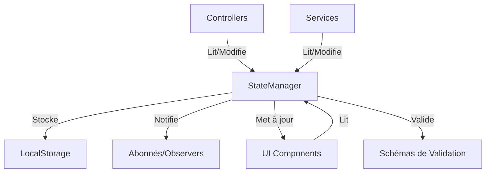

# Gestionnaire d'État (StateManager)

## Vue d'Ensemble

Le StateManager est le composant central de gestion d'état dans JodoTarot. Il agit comme une "source unique de vérité" (single source of truth) pour l'ensemble de l'application, assurant la cohérence des données entre les composants et leur persistance entre les sessions.

## Architecture du StateManager



### Caractéristiques Principales

- **Centralisation** : Point unique pour l'état global de l'application
- **Réactivité** : Système d'abonnement pour réagir aux changements d'état
- **Persistance** : Sauvegarde automatique dans le localStorage
- **Validation** : Vérification de la validité des données avant mise à jour
- **Immutabilité** : Modifications contrôlées pour éviter les effets de bord
- **Segmentation** : Organisation de l'état en domaines fonctionnels

## Structure du Code

Le StateManager est implémenté dans `assets/js/utils/StateManager.js` (816 lignes).

```javascript
// Structure simplifiée de StateManager
class StateManager {
  constructor() {
    this.state = {};
    this.subscribers = {};
    this.validators = {};
    this.loadFromStorage();
  }
  
  // Méthodes principales
  get(domain, key) { /* ... */ }
  set(domain, key, value) { /* ... */ }
  subscribe(domain, callback) { /* ... */ }
  unsubscribe(domain, callbackId) { /* ... */ }
  
  // Méthodes auxiliaires
  validate(domain, key, value) { /* ... */ }
  notifySubscribers(domain) { /* ... */ }
  loadFromStorage() { /* ... */ }
  saveToStorage() { /* ... */ }
}
```

## Domaines d'État

L'état est organisé en domaines fonctionnels distincts :

1. **`config`** : Configuration générale de l'application
   - Langue actuelle
   - Préférences d'interface
   - Configuration des API

2. **`reading`** : État du tirage courant
   - Cartes tirées
   - Type de tirage
   - Persona sélectionné
   - Question de l'utilisateur

3. **`ai`** : État des services d'IA
   - Modèles disponibles
   - Modèle sélectionné
   - État de la connexion
   - Historique des requêtes

4. **`ui`** : État de l'interface utilisateur
   - Sections visibles/cachées
   - Mode d'affichage
   - État des animations
   - Positions de défilement

5. **`history`** : Historique des tirages
   - Tirages précédents
   - Interprétations sauvegardées
   - Favoris

## Utilisation du StateManager

### Initialisation

```javascript
// Extrait de l'initialisation dans main.js
const stateManager = new StateManager();
stateManager.registerValidator('config', 'language', validateLanguage);
stateManager.registerValidator('reading', 'cards', validateCards);

// Chargement initial des données
stateManager.initialize();
```

### Lecture de l'État

```javascript
// Obtenir une valeur
const currentLanguage = stateManager.get('config', 'language');
const drawnCards = stateManager.get('reading', 'cards');

// Vérifier l'existence
if (stateManager.has('reading', 'interpretation')) {
  // ...
}
```

### Modification de l'État

```javascript
// Définir une valeur
stateManager.set('config', 'language', 'fr');

// Mettre à jour un objet
stateManager.update('reading', 'cards', cards => [...cards, newCard]);

// Réinitialiser un domaine
stateManager.reset('reading');
```

### Abonnement aux Changements

```javascript
// S'abonner aux changements de langue
const languageSubscriberId = stateManager.subscribe('config', (domain, changes) => {
  if ('language' in changes) {
    updateUILanguage(changes.language);
  }
});

// Se désabonner
stateManager.unsubscribe('config', languageSubscriberId);
```

## Persistance des Données

Le StateManager utilise le localStorage pour persister l'état entre les sessions :

```javascript
// Sauvegarde dans localStorage
saveToStorage() {
  const serializedState = {};
  for (const domain in this.state) {
    // Filtrer les données à ne pas sauvegarder
    if (this.persistentDomains.includes(domain)) {
      serializedState[domain] = this.state[domain];
    }
  }
  
  localStorage.setItem('jodotarot_state', JSON.stringify(serializedState));
}

// Chargement depuis localStorage
loadFromStorage() {
  try {
    const saved = localStorage.getItem('jodotarot_state');
    if (saved) {
      const parsed = JSON.parse(saved);
      for (const domain in parsed) {
        this.state[domain] = {...parsed[domain]};
      }
    }
  } catch (error) {
    console.error('Erreur lors du chargement de l\'état:', error);
  }
}
```

## Validation des Données

Le StateManager implémente un système de validation pour assurer l'intégrité des données :

```javascript
// Enregistrement d'un validateur
registerValidator(domain, key, validatorFn) {
  if (!this.validators[domain]) {
    this.validators[domain] = {};
  }
  this.validators[domain][key] = validatorFn;
}

// Validation avant mise à jour
validate(domain, key, value) {
  if (this.validators[domain] && this.validators[domain][key]) {
    return this.validators[domain][key](value);
  }
  return true;
}
```

Exemples de validateurs :

```javascript
// Validateur de langue
function validateLanguage(language) {
  const supportedLanguages = ['fr', 'en', 'es', 'de', 'it', 'zh'];
  return supportedLanguages.includes(language);
}

// Validateur de cartes
function validateCards(cards) {
  if (!Array.isArray(cards)) return false;
  return cards.every(card => 
    typeof card === 'object' && 'id' in card && 'name' in card
  );
}
```

## Gestion des Transactions

Pour les mises à jour complexes impliquant plusieurs modifications, le StateManager fournit un mécanisme de transaction :

```javascript
// Exemple de transaction
stateManager.transaction(() => {
  stateManager.set('reading', 'cards', selectedCards);
  stateManager.set('reading', 'spreadType', 'cross');
  stateManager.set('reading', 'timestamp', Date.now());
});
```

Cela permet d'éviter des notifications intermédiaires et d'assurer que les abonnés ne reçoivent qu'une seule notification lorsque l'état est stable.

## Intégration avec les Services et Contrôleurs

### Controllers

```javascript
// Exemple d'utilisation dans ReadingController
class ReadingController {
  constructor(stateManager, deckService, aiService) {
    this.stateManager = stateManager;
    this.deckService = deckService;
    this.aiService = aiService;
    
    // Abonnement aux changements
    this.stateSubscription = stateManager.subscribe('reading', 
      this.handleStateChange.bind(this)
    );
  }
  
  performReading(spreadType) {
    const cards = this.deckService.drawCards(spreadType);
    this.stateManager.set('reading', 'cards', cards);
    this.stateManager.set('reading', 'spreadType', spreadType);
    this.stateManager.set('reading', 'timestamp', Date.now());
  }
  
  handleStateChange(domain, changes) {
    // Réagir aux changements d'état
    if ('cards' in changes && 'spreadType' in changes) {
      this.updateUI(changes.cards, changes.spreadType);
    }
  }
}
```

### Services

```javascript
// Exemple d'utilisation dans AIService
class AIService {
  constructor(stateManager) {
    this.stateManager = stateManager;
    this.modelCache = new Map();
    
    // Initialisation de l'état AI
    if (!stateManager.has('ai', 'models')) {
      stateManager.set('ai', 'models', []);
    }
  }
  
  async detectAvailableModels() {
    const models = await this.fetchModels();
    this.stateManager.set('ai', 'models', models);
    return models;
  }
  
  async interpretReading() {
    const cards = this.stateManager.get('reading', 'cards');
    const spreadType = this.stateManager.get('reading', 'spreadType');
    const persona = this.stateManager.get('config', 'selectedPersona');
    
    // ... logique d'interprétation ...
    
    this.stateManager.set('reading', 'interpretation', interpretation);
  }
}
```

## Optimisations

Le StateManager inclut plusieurs optimisations :

1. **Comparaison intelligente** : Évite les notifications si la valeur n'a pas changé
2. **Mise à jour sélective** : Notifie uniquement pour les champs modifiés
3. **Memoization** : Cache des résultats de calculs dépendant de l'état
4. **Debouncing** : Limite la fréquence des sauvegardes dans le localStorage
5. **Lazy Loading** : Chargement à la demande de certains domaines d'état volumineux

## Débogage et Monitoring

Le StateManager intègre des fonctionnalités pour faciliter le débogage :

```javascript
// Activer le mode debug
stateManager.enableDebug();

// Logger les changements d'état
stateManager.on('change', (domain, key, oldValue, newValue) => {
  console.log(`[StateManager] ${domain}.${key} changed:`, 
              { old: oldValue, new: newValue });
});

// Exporter l'état actuel
const stateSnapshot = stateManager.export();
```

## Bonnes Pratiques

Pour travailler efficacement avec le StateManager :

1. **Accès Centralisé** : Toujours passer par le StateManager pour les données partagées
2. **Segmentation Logique** : Organiser l'état en domaines cohérents
3. **Validation Stricte** : Utiliser des validateurs pour tous les champs critiques
4. **Réactions Minimalistes** : Dans les abonnements, ne réagir qu'aux changements pertinents
5. **Transactions** : Regrouper les modifications liées en transactions
6. **Immutabilité** : Ne jamais modifier directement les objets obtenus du StateManager
7. **Désabonnement** : Toujours se désabonner quand un composant est détruit

## Références

- [Flux de Données](../architecture/flux-donnees.md)
- [Bonnes Pratiques](../standards/bonnes-pratiques.md)
- [Interactions entre Composants](../architecture/interactions-composants.md) 