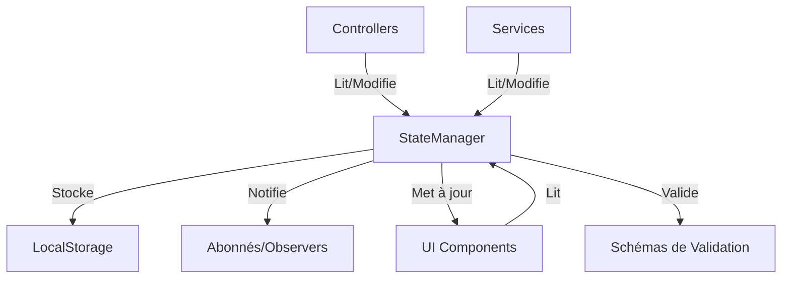

# Gestionnaire d'État (StateManager)

## Vue d'Ensemble

Le StateManager est le composant central de gestion d'état dans JodoTarot. Il agit comme une "source unique de vérité" pour l'ensemble de l'application, assurant la cohérence des données et leur persistance entre les sessions.

## Rôle dans l'Architecture

Le `StateManager` est l'élément central et nerveux de JodoTarot, agissant comme un "source unique de vérité" pour toute l'application. Voici ses fonctionnalités clés:

- **Validation automatique des données**: Toutes les modifications d'état sont validées selon un schéma strict pour garantir la cohérence des données
- **Pattern Observer**: Notification automatique des composants abonnés à chaque changement d'état
- **Système d'événements**: Émission d'événements spécifiques (`iaModel:changed`, `cardSet:changed`, etc.) pour des réactions ciblées
- **Persistance localStorage**: Sauvegarde automatique de l'état dans le stockage local du navigateur
- **Migrations de données**: Conversion automatique des anciennes versions d'état lors des mises à jour de l'application
- **Optimisation des performances**: Notification sélective uniquement lors de changements réels des valeurs
- **Débogage intégré**: Journalisation détaillée des changements d'état pour faciliter le développement

L'utilisation du StateManager dans JodoTarot suit un flux unidirectionnel:
1. Les contrôleurs appellent `stateManager.setState()` pour mettre à jour l'état
2. Le StateManager valide les changements et notifie les composants abonnés
3. Les composants réagissent aux changements et mettent à jour l'interface utilisateur
4. Les services utilisent `stateManager.getState()` pour accéder aux données actuelles

Ce pattern évite les problèmes de synchronisation et garantit la cohérence des données dans toute l'application.

## Architecture du StateManager



### Caractéristiques Principales

- **Centralisation** : Point unique pour l'état global de l'application
- **Réactivité** : Système d'abonnement pour réagir aux changements d'état
- **Persistance** : Sauvegarde automatique dans le localStorage
- **Validation** : Vérification de la validité des données avant mise à jour
- **Immutabilité** : Modifications contrôlées pour éviter les effets de bord
- **Segmentation** : Organisation de l'état en propriétés fonctionnelles

## Structure du Code

Le StateManager est implémenté dans `assets/js/utils/StateManager.js` (907 lignes).

```javascript
// Structure simplifiée de StateManager
class StateManager {
  constructor() {
    this.schema = {/* Schéma de validation */};
    this.state = this.getDefaultState();
    this.listeners = [];
    this.STATE_VERSION = '1.0.0';
  }
  
  // Méthodes principales
  async initialize() { /* ... */ }
  getState() { /* ... */ }
  setState(updates) { /* ... */ }
  subscribe(listener) { /* ... */ }
  
  // Méthodes de validation
  validateValue(key, value) { /* ... */ }
  validateState(state) { /* ... */ }
  validateCards(cards) { /* ... */ }
  
  // Méthodes de gestion d'état
  getDefaultState() { /* ... */ }
  isEqual(a, b) { /* ... */ }
  notifyListeners(changes) { /* ... */ }
  emitChangeEvents(changedValues) { /* ... */ }
  
  // Méthodes de persistance
  persistState() { /* ... */ }
  restoreState() { /* ... */ }
  applyRestoredState(data) { /* ... */ }
  
  // Méthodes de sérialisation
  serializeState(state) { /* ... */ }
  deserializeState(serialized) { /* ... */ }
  
  // Méthodes de migration
  migrateState(version, data) { /* ... */ }
}
```

## Propriétés d'État

L'état est organisé dans une structure plate avec des propriétés spécifiques définies dans le schéma :

1. **Configuration générale**
   - `language` : Langue actuelle (fr, en, es, de, it, zh)
   - `persona` : Persona sélectionné pour l'interprétation
   - `cardSet` : Jeu de cartes sélectionné (set01, set02, set03, set04)
   - `spreadType` : Type de tirage (cross, horseshoe, love, celticCross)
   - `iaModel` : Modèle d'IA à utiliser (prompt, openai/*, ollama:*)

2. **Tirage courant**
   - `cards` : Tableau des cartes tirées
   - `question` : Question de l'utilisateur
   - `interpretation` : Objet contenant l'interprétation générée

3. **Interface utilisateur**
   - `isLoading` : Indique si une opération est en cours
   - `error` : Message d'erreur éventuel
   - `isCardEnlarged` : Indique si une carte est agrandie
   - `enlargedCardId` : ID de la carte agrandie

4. **État du modèle d'IA**
   - `modelStatus` : État actuel du modèle d'IA (isLoading, isConnected, error, lastCheck)
   - `availableModels` : Liste des modèles disponibles par type (ollama, openai)
   - `currentSpreadType` : Type de tirage actuel
   - `currentCardsDrawn` : Cartes actuellement tirées (format JSON)

## Initialisation

Le StateManager s'initialise de manière asynchrone, en restaurant d'abord l'état depuis localStorage s'il existe :

```javascript
// Extrait de l'initialisation dans main.js
const stateManager = new StateManager();
await stateManager.initialize();
```

## Validation des Données

Le StateManager implémente un système de validation complet pour assurer l'intégrité des données :

```javascript
// Exemple de validation d'une valeur
validateValue(key, value) {
  const config = this.schema[key];
  if (!config) {
    return { isValid: false, error: `Propriété inconnue: ${key}` };
  }

  // Vérifier si la valeur peut être null
  if (value === null && config.nullable) {
    return { isValid: true, value: null };
  }

  // Vérifier le type
  if (config.type === 'array' && !Array.isArray(value)) {
    return { isValid: false, error: `Type invalide pour ${key}, array attendu` };
  }
  
  // Validation personnalisée
  if (config.validate && !config.validate(value)) {
    return { isValid: false, error: `Validation échouée pour ${key}` };
  }

  return { isValid: true, value };
}
```

Validation spécifique pour les cartes :

```javascript
validateCards(cards) {
  if (!Array.isArray(cards)) return false;
  
  for (let i = 0; i < cards.length; i++) {
    const card = cards[i];
    
    if (!card || typeof card !== 'object') return false;
    if (!card.id || !card.id.match(/^M\d{2}$/)) return false;
    if (!card.name || typeof card.name !== 'string') return false;
    if (!card.imageUrl || typeof card.imageUrl !== 'string') return false;
    if (!card.position || !['upright', 'reversed'].includes(card.position)) return false;
  }
  
  return true;
}
```

## Utilisation du StateManager

### Lecture de l'État

```javascript
// Obtenir l'état complet
const state = stateManager.getState();

// Accéder à des propriétés spécifiques
const currentLanguage = state.language;
const drawnCards = state.cards;

// Vérifier l'existence d'une propriété
if (state.interpretation) {
  // ...
}
```

### Modification de l'État

```javascript
// Définir une valeur
stateManager.setState({ language: 'fr' });

// Mettre à jour plusieurs propriétés
stateManager.setState({ 
  spreadType: 'cross',
  question: 'Ma nouvelle question',
  cards: []
});
```

### Abonnement aux Changements

```javascript
// S'abonner aux changements d'état
const unsubscribe = stateManager.subscribe((state, changes) => {
  // Réagir aux changements
  if ('language' in changes) {
    updateUILanguage(state.language);
  }
  
  if ('cards' in changes) {
    renderCards(state.cards);
  }
});

// Se désabonner
unsubscribe();
```

## Persistance des Données

Le StateManager sauvegarde automatiquement l'état dans localStorage après chaque changement :

```javascript
persistState() {
  try {
    // Ne pas persister les états temporaires
    const stateToPersist = {...this.state};
    const temporaryKeys = ['isLoading', 'error', 'isCardEnlarged', 'enlargedCardId'];
    temporaryKeys.forEach(key => delete stateToPersist[key]);
    
    // Convertir les types spéciaux pour la sérialisation
    const serializedState = {
      version: this.STATE_VERSION,
      timestamp: Date.now(),
      data: this.serializeState(stateToPersist)
    };
    
    // Sauvegarde dans localStorage
    localStorage.setItem('jodotarot_state', JSON.stringify(serializedState));
    
    return true;
  } catch (error) {
    console.error('Erreur lors de la sauvegarde de l\'état:', error);
    return false;
  }
}
```

La restauration se fait au démarrage:

```javascript
restoreState() {
  try {
    const savedState = localStorage.getItem('jodotarot_state');
    if (!savedState) return false;
    
    const parsed = JSON.parse(savedState);
    if (!parsed || !parsed.data) return false;
    
    const version = parsed.version || '0.0.0';
    
    // Vérifier la version pour les migrations
    if (version !== this.STATE_VERSION) {
      const migratedData = this.migrateState(version, parsed.data);
      this.applyRestoredState(migratedData);
    } else {
      this.applyRestoredState(parsed.data);
    }
    
    return true;
  } catch (error) {
    console.error('Erreur lors de la restauration de l\'état:', error);
    return false;
  }
}
```

## Sérialisation et Désérialisation

Le StateManager gère intelligemment la sérialisation des types spéciaux :

```javascript
serializeState(state) {
  const serialized = {};
  
  for (const [key, value] of Object.entries(state)) {
    if (value instanceof Set) {
      serialized[key] = {
        __type: 'Set',
        value: Array.from(value)
      };
    } else if (Array.isArray(value)) {
      serialized[key] = {
        __type: 'Array',
        value: value
      };
    } else if (value instanceof Date) {
      serialized[key] = {
        __type: 'Date',
        value: value.toISOString()
      };
    } else if (value === undefined) {
      continue;
    } else {
      serialized[key] = value;
    }
  }
  
  return serialized;
}

deserializeState(serialized) {
  const deserialized = {};
  
  for (const [key, value] of Object.entries(serialized)) {
    if (value && typeof value === 'object' && '__type' in value) {
      switch (value.__type) {
        case 'Set':
          deserialized[key] = new Set(value.value);
          break;
        case 'Array':
          deserialized[key] = value.value;
          break;
        case 'Date':
          deserialized[key] = new Date(value.value);
          break;
        default:
          deserialized[key] = value;
      }
    } else {
      deserialized[key] = value;
    }
  }
  
  return deserialized;
}
```

## Migrations de Données

Le StateManager supporte les migrations pour les changements de version :

```javascript
migrateState(version, data) {
  if (version === this.STATE_VERSION) {
    return data;
  }
  
  switch (version) {
    case '0.9.0':
      // Migration de 0.9.0 vers 1.0.0
      data = this.migrate_0_9_0_to_1_0_0(data);
      break;
    default:
      console.warn(`Version inconnue ${version}, utilisation des données telles quelles`);
  }
  
  return data;
}
```

## Événements du StateManager

Le StateManager émet des événements DOM pour les changements d'état :

```javascript
emitChangeEvents(changedValues) {
  for (const [key, value] of Object.entries(changedValues)) {
    const eventName = `${key}:changed`;
    
    // Émettre l'événement spécifique
    document.dispatchEvent(new CustomEvent(eventName, {
      detail: { [key]: value, state: this.state }
    }));
    
    // Pour iaModel, émettre un événement supplémentaire
    if (key === 'iaModel') {
      document.dispatchEvent(new CustomEvent('iaModelUI:update', {
        detail: { model: value, state: this.state }
      }));
    }
  }
  
  // Émettre un événement global
  if (Object.keys(changedValues).length > 0) {
    document.dispatchEvent(new CustomEvent('state:changed', {
      detail: { changes: changedValues, state: this.state }
    }));
  }
}
```

## Bonnes Pratiques

Pour travailler efficacement avec le StateManager :

1. **Accès Centralisé** : Toujours passer par le StateManager pour les données partagées
2. **Validation** : Utiliser le schéma de validation pour tous les champs
3. **Immutabilité** : Ne jamais modifier directement les objets obtenus du StateManager
4. **Abonnements Ciblés** : Dans les abonnements, ne réagir qu'aux changements pertinents
5. **Désabonnement** : Toujours se désabonner quand un composant est détruit
6. **Événements** : Utiliser les événements spécifiques pour des réactions ciblées
7. **Débogage** : Consulter les logs du StateManager pour suivre les changements d'état

## Références

- [Flux de Données](../architecture/flux-donnees.md)
- [Bonnes Pratiques](../standards/bonnes-pratiques.md)
- [Interactions entre Composants](../architecture/interactions-composants.md)

## Schéma de Validation

Le StateManager utilise un schéma de validation strict pour chaque propriété d'état :

```javascript
{
  language: {
    type: 'string',
    enum: ['fr', 'en', 'es', 'de', 'it', 'zh'],
    default: 'fr'
  },
  persona: {
    type: 'string',
    enum: [
      'tarologue', 'oracle', 'voyante', 'pretre', 'rabbin', 'imam',
      'dalailama', 'sorciere', 'alchimiste', 'mage', 'francmacon',
      'freud', 'jung', 'lacan', 'dolto', 'socrate', 'salomon',
      'montaigne', 'quichotte', 'demon', 'noegoman'
    ],
    default: 'tarologue'
  },
  cardSet: {
    type: 'string',
    enum: ['set01', 'set02', 'set03', 'set04'],
    default: 'set01',
    description: 'Identifiant du jeu de cartes (anciennement séparé en cardSet et deckId)'
  },
  spreadType: {
    type: 'string',
    enum: ['cross', 'horseshoe', 'love', 'celticCross'],
    default: 'cross'
  },
  iaModel: {
    type: 'string',
    description: 'Modèle d\'IA à utiliser',
    validate: (value) => {
      // Validation des modèles OpenAI et Ollama
      // Voir implémentation complète dans le code
    },
    default: 'prompt'
  },
  cards: {
    type: 'array',
    validate: (value) => {
      // Validation des cartes
      // Voir implémentation complète dans le code
    },
    default: []
  },
  // Autres propriétés...
}
```