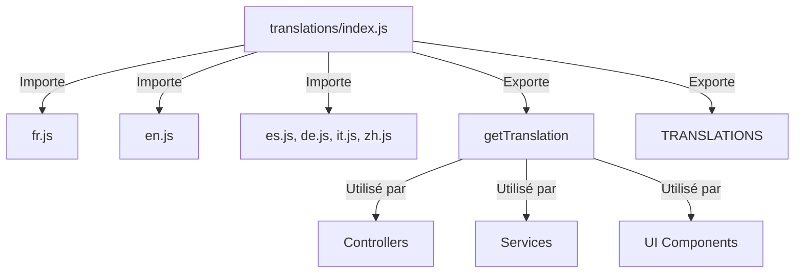

# Système de Traduction

## Vue d'Ensemble

Le système de traduction de JodoTarot permet une localisation complète de l'application dans plusieurs langues. Il est conçu pour être flexible, extensible et facile à maintenir, avec une interface simple pour les développeurs et les traducteurs.

## Langues Supportées

JodoTarot prend actuellement en charge six langues :

| Code | Langue   | Fichier        |
|------|----------|----------------|
| fr   | Français | `fr.js`        |
| en   | Anglais  | `en.js`        |
| es   | Espagnol | `es.js`        |
| de   | Allemand | `de.js`        |
| it   | Italien  | `it.js`        |
| zh   | Chinois  | `zh.js`        |

## Architecture du Système de Traduction



## Structure des Fichiers

Le système de traduction est organisé comme suit :

- **`assets/js/translations/`** : Dossier principal des traductions
  - **`index.js`** : Point d'entrée exposant les fonctions et la configuration
  - **`fr.js`** : Traductions françaises (langue par défaut)
  - **`en.js`** : Traductions anglaises
  - **`es.js`**, **`de.js`**, **`it.js`**, **`zh.js`** : Autres langues
  - **`README.md`** : Documentation pour les traducteurs

## Format des Traductions

Les fichiers de traduction sont structurés comme des objets JavaScript avec une hiérarchie par sections :

```javascript
// Extrait de fr.js
export default {
  // Interface générale
  pageTitle: "Tirage en Croix",
  appTitle: "JodoTarot:",
  
  // Éléments d'en-tête
  header: {
    language: "Langue :",
    persona: "Personnage :",
    cardSet: "Jeu de cartes :",
    spreadType: "Type de tirage :",
    iaModel: "Modèle d'IA :",
    question: "Votre question :",
    questionPlaceholder: "Entrez votre question pour ce tirage...",
    drawButton: "Tirer les cartes",
    drawButtonGenerating: "Génération en cours... Veuillez patienter",
    streamingOption: "Réponse en direct :",
    stopGeneration: "Arrêter la génération"
  },
  
  // Types de tirage
  spreadTypes: {
    cross: "➕ Croix",
    horseshoe: "🧲 Fer à Cheval",
    love: "❤️ Tarot de l'Amour",
    celticCross: "☘️ Croix Celtique"
  },
  
  // Noms des personas
  personas: {
    tarologue: "🎴 Tarologue",
    oracle: "🌟 Oracle Mystique",
    voyante: "🔮 Voyante Gitane",
    // ... autres personas ...
  },
  
  // Groupes de modèles IA
  iaGroups: {
    ollama: "🧠 Ollama",
    openai: "🤖 OpenAI"
  }
};
```

## Utilisation du Système de Traduction

### API Principale

Le système expose la fonction `getTranslation` et un objet `TRANSLATIONS` :

```javascript
// Importation de la fonction
import { getTranslation, TRANSLATIONS } from '../translations/index.js';

// Récupérer une traduction simple (langue 'fr' par défaut)
const welcomeText = getTranslation('header.language', 'fr');

// Avec langue explicite
const englishTitle = getTranslation('pageTitle', 'en');

// Avec paramètres de remplacement
const loadingMessage = getTranslation('interpretation.loadingWithModel', 'fr', { 
  model: 'GPT-4', 
  persona: 'Tarologue' 
});
```

### Fonctionnement de getTranslation

```javascript
getTranslation(key, lang = 'fr', params = {}) {
  // Vérifier si la langue est supportée
  if (!TRANSLATIONS[lang]) {
    lang = 'fr';  // Fallback vers le français
  }
  
  // Naviguer dans l'objet de traductions pour trouver la valeur
  const keys = key.split('.');
  let translation = TRANSLATIONS[lang];
  
  for (const k of keys) {
    if (translation && translation[k] !== undefined) {
      translation = translation[k];
    } else {
      // Si la traduction n'existe pas, essayer le français
      const frenchTranslation = getFrenchTranslation(key);
      return frenchTranslation !== undefined ? frenchTranslation : key;
    }
  }
  
  // Substitution des paramètres {param}
  if (params && typeof translation === 'string') {
    return translation.replace(/\{(\w+)\}/g, (match, paramName) => {
      return params[paramName] !== undefined ? params[paramName] : match;
    });
  }
  
  return translation;
}
```

### Intégration dans les Composants UI

```javascript
// Exemple de mise à jour des textes d'interface
function updateUILanguage(language) {
  // Mettre à jour le titre de la page
  document.title = getTranslation('pageTitle', language);
  
  // Mettre à jour les labels des inputs
  document.getElementById('language-label').textContent = 
    getTranslation('header.language', language);
  
  document.getElementById('question-input').placeholder = 
    getTranslation('header.questionPlaceholder', language);
  
  // Mettre à jour le bouton de tirage
  const drawButton = document.getElementById('draw-button');
  if (drawButton) {
    drawButton.textContent = getTranslation('header.drawButton', language);
  }
}
```

### Intégration avec le StateManager

Le système de traduction s'intègre avec le StateManager pour réagir aux changements de langue :

```javascript
// Exemple de ConfigController.js
import { getTranslation } from '../translations/index.js';

// Abonnement aux changements de langue
constructor(stateManager) {
  this.stateManager = stateManager;
  
  // S'abonner aux changements d'état
  stateManager.subscribe((state, changes) => {
    if ('language' in changes) {
      this.updateUILanguage(state.language);
    }
  });
}

// Mise à jour de l'interface selon la langue
updateUILanguage(language) {
  // Mettre à jour les textes des options de persona
  const personaSelect = document.getElementById('persona-select');
  if (personaSelect) {
    const options = personaSelect.querySelectorAll('option');
    options.forEach(option => {
      const value = option.value;
      if (value && value !== '') {
        const key = `personas.${value}`;
        option.textContent = getTranslation(key, language);
      }
    });
  }
  
  // Mettre à jour d'autres éléments d'interface
  // ...
}
```

## Fonctionnalités Spécifiques

### Fallback vers le Français

Si une traduction n'est pas disponible dans la langue demandée, le système utilise automatiquement la traduction française :

```javascript
// Fonction auxiliaire pour obtenir une traduction en français
function getFrenchTranslation(key) {
  const keys = key.split('.');
  let translation = TRANSLATIONS['fr'];
  
  for (const k of keys) {
    if (translation && translation[k] !== undefined) {
      translation = translation[k];
    } else {
      return undefined;
    }
  }
  
  return translation;
}
```

### Substitution de Paramètres

Le système prend en charge la substitution de paramètres avec la syntaxe `{paramName}` :

```javascript
// Dans le fichier de traduction
{
  "loadingWithModel": "Analyse du tirage en croix avec {model} interprété par un {persona}..."
}

// Dans le code
getTranslation('interpretation.loadingWithModel', 'fr', { 
  model: 'GPT-4', 
  persona: 'Tarologue' 
});
// Résultat: "Analyse du tirage en croix avec GPT-4 interprété par un Tarologue..."
```

## Exemples d'Utilisation dans le Projet

### Dans les Services

```javascript
// Dans DeckService.js
import { getTranslation } from '../translations/index.js';

class DeckService {
  // ...
  
  getCardName(card, language) {
    // Récupérer le nom traduit de la carte
    return getTranslation(`cards.${card.id}`, language);
  }
}
```

### Dans les Modèles de Prompt

```javascript
// Dans prompt.js
import { getTranslation } from './translations/index.js';

function getMetaPrompt(langue = 'fr') {
  // Récupérer le prompt de base dans la langue appropriée
  return getTranslation('metaprompt.base', langue);
}
```

## Extension du Système

### Ajout d'une Nouvelle Langue

Pour ajouter une nouvelle langue au système :

1. Créer un nouveau fichier (ex: `jp.js`) dans le dossier `translations/`
2. Structure le fichier comme les autres fichiers de traduction existants
3. Importer le fichier dans `index.js` et l'ajouter à l'objet `TRANSLATIONS`

```javascript
// Dans index.js
import fr from './fr.js';
import en from './en.js';
// ... autres langues ...
import jp from './jp.js';

export const TRANSLATIONS = {
  fr,
  en,
  // ... autres langues ...
  jp
};
```

### Exemple de Fichier de Traduction

```javascript
// Structure minimale d'un nouveau fichier de traduction (jp.js)
export default {
  pageTitle: "クロスタロットリーディング",
  appTitle: "ジョドタロット:",
  
  header: {
    language: "言語:",
    persona: "キャラクター:",
    // ... autres traductions ...
  },
  
  // ... autres sections ...
};
```

## Bonnes Pratiques

### Pour les Développeurs

1. **TOUJOURS utiliser getTranslation()** pour les textes visibles dans l'interface
2. **NE JAMAIS hardcoder les chaînes** directement dans le HTML/JS
3. **ORGANISER les clés** de manière hiérarchique et logique
4. **UTILISER des identifiants explicites** pour les clés
5. **DOCUMENTER les paramètres** dans les chaînes avec substitution

### Pour les Traducteurs

1. **RESPECTER le formatage** des textes (variables, balises HTML)
2. **MAINTENIR la cohérence** entre les langues
3. **ADAPTER les expressions** plutôt que traduire littéralement
4. **CONSERVER les emojis** et autres caractères spéciaux
5. **TESTER visuellement** les traductions dans l'application

## Références

- [Vue d'Ensemble de l'Architecture](../architecture/vue-ensemble.md)
- [Gestionnaire d'État](state-manager.md)
- [Bonnes Pratiques](../standards/bonnes-pratiques.md) 