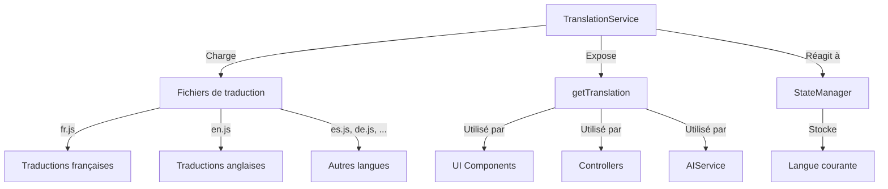

# Système de Traduction

## Vue d'Ensemble

Le système de traduction de JodoTarot permet une localisation complète de l'application dans plusieurs langues. Il est conçu pour être flexible, extensible et facile à maintenir, avec une interface simple pour les développeurs et les traducteurs.

## Langues Supportées

JodoTarot prend actuellement en charge six langues :

| Code | Langue   | Niveau de Complétion | Fichier           |
|------|----------|----------------------|-------------------|
| fr   | Français | 100%                 | `fr.js` (246 lignes) |
| en   | Anglais  | 100%                 | `en.js` (246 lignes) |
| es   | Espagnol | 70%                  | `es.js` (166 lignes) |
| de   | Allemand | 70%                  | `de.js` (166 lignes) |
| it   | Italien  | 70%                  | `it.js` (166 lignes) |
| zh   | Chinois  | 70%                  | `zh.js` (167 lignes) |

## Architecture du Système de Traduction



## Structure des Fichiers

Le système de traduction est organisé comme suit :

- **`assets/js/translations/`** : Dossier principal des traductions
  - **`index.js`** (80 lignes) : Point d'entrée exposant les fonctions et la configuration
  - **`fr.js`** (246 lignes) : Traductions françaises (langue par défaut)
  - **`en.js`** (246 lignes) : Traductions anglaises
  - **`es.js`**, **`de.js`**, **`it.js`**, **`zh.js`** (≈166 lignes chacun) : Autres langues
  - **`README.md`** (66 lignes) : Documentation pour les traducteurs

## Format des Traductions

Les fichiers de traduction sont structurés comme des objets JavaScript avec une hiérarchie par sections :

```javascript
// Extrait de fr.js
export default {
  // Interface générale
  ui: {
    title: "JodoTarot",
    welcome: "Bienvenue dans JodoTarot",
    language: "Langue",
    
    // Boutons
    buttons: {
      start: "Commencer",
      draw: "Tirer les cartes",
      interpret: "Interpréter",
      back: "Retour",
      next: "Suivant"
    },
    
    // Messages
    messages: {
      loading: "Chargement en cours...",
      error: "Une erreur s'est produite",
      noConnection: "Pas de connexion à l'IA"
    }
  },
  
  // Spreads (types de tirages)
  spreads: {
    cross: {
      name: "Tirage en Croix",
      description: "Un tirage simple pour une question spécifique",
      positions: {
        center: "Situation actuelle",
        top: "Ce qui influence",
        right: "Futur",
        bottom: "Fondation",
        left: "Passé"
      }
    },
    // ... autres types de tirages ...
  },
  
  // Personas
  personas: {
    tarologue: {
      name: "Tarologue",
      description: "Interprète traditionnel de tarot"
    },
    // ... autres personas ...
  },
  
  // Système IA
  ai: {
    prompt: {
      base: "Interprète ce tirage de tarot...",
      instructions: "Sois précis et informatif..."
    }
  }
};
```

## Utilisation du Système de Traduction

### API Principale

Le système expose une fonction principale `getTranslation` :

```javascript
// Utilisation de base
import { getTranslation } from '../translations';

// Récupérer une traduction simple
const welcomeText = getTranslation('ui.welcome');

// Avec paramètres de remplacement
const errorText = getTranslation('ui.messages.specificError', { code: 404 });

// Spécifier explicitement la langue
const spanishTitle = getTranslation('ui.title', null, 'es');
```

### Intégration dans les Composants UI

```javascript
// Exemple dans un composant UI
function updateInterfaceTexts() {
  document.getElementById('welcome-title').textContent = 
    getTranslation('ui.welcome');
  
  document.getElementById('draw-button').textContent = 
    getTranslation('ui.buttons.draw');
  
  // Mise à jour des placeholders
  const inputElement = document.getElementById('question-input');
  inputElement.placeholder = 
    getTranslation('ui.placeholders.enterQuestion');
}
```

### Intégration avec le StateManager

Le système de traduction s'intègre avec le StateManager pour réagir aux changements de langue :

```javascript
// Configuration dans main.js
import { initializeTranslations, setLanguage } from './translations';
import { stateManager } from './utils/StateManager';

// Initialisation
initializeTranslations(stateManager);

// Abonnement aux changements de langue
stateManager.subscribe('config', (domain, changes) => {
  if (changes.language) {
    setLanguage(changes.language);
    updateAllUITexts();
  }
});

// Changement de langue par l'utilisateur
function handleLanguageChange(newLanguage) {
  stateManager.set('config', 'language', newLanguage);
  // La mise à jour de l'UI est gérée par l'abonnement ci-dessus
}
```

## Fonctionnalités Avancées

### Interpolation de Variables

Le système prend en charge l'interpolation de variables :

```javascript
// Dans le fichier de traduction
{
  "greetings": "Bonjour, {{name}} !",
  "cardPosition": "La carte {{cardName}} en position {{position}}"
}

// Dans le code
getTranslation('greetings', { name: 'Alice' }); // "Bonjour, Alice !"
getTranslation('cardPosition', { 
  cardName: 'Le Soleil', 
  position: 'avenir' 
}); // "La carte Le Soleil en position avenir"
```

### Pluralisation

Le système gère les formes plurielles :

```javascript
// Dans le fichier de traduction
{
  "cardsRemaining": {
    "one": "{{count}} carte restante",
    "other": "{{count}} cartes restantes"
  }
}

// Dans le code
getTranslation('cardsRemaining', { count: 1 }); // "1 carte restante"
getTranslation('cardsRemaining', { count: 5 }); // "5 cartes restantes"
```

### Fallback à la Langue Par Défaut

Si une clé n'est pas traduite dans la langue sélectionnée, le système utilise automatiquement la langue par défaut (français) :

```javascript
// Si la clé 'ui.newFeature' existe en français mais pas en espagnol
// et que la langue courante est l'espagnol
getTranslation('ui.newFeature'); // Retourne la version française
```

## Fonctionnement Interne

### Initialisation

```javascript
// Dans translations/index.js
let currentLanguage = 'fr';
let translations = {};
let stateManagerInstance = null;

export function initializeTranslations(stateManager) {
  stateManagerInstance = stateManager;
  
  // Charge la langue stockée ou la langue par défaut
  const savedLanguage = stateManager.get('config', 'language') || 'fr';
  setLanguage(savedLanguage);
}

export async function setLanguage(languageCode) {
  if (!supportedLanguages.includes(languageCode)) {
    console.warn(`Language ${languageCode} not supported, falling back to fr`);
    languageCode = 'fr';
  }
  
  // Charge dynamiquement le fichier de traduction
  try {
    const module = await import(`./${languageCode}.js`);
    translations[languageCode] = module.default;
    currentLanguage = languageCode;
    
    // Mise à jour de l'état global si nécessaire
    if (stateManagerInstance && 
        stateManagerInstance.get('config', 'language') !== languageCode) {
      stateManagerInstance.set('config', 'language', languageCode);
    }
    
    document.documentElement.lang = languageCode;
  } catch (error) {
    console.error(`Error loading translations for ${languageCode}`, error);
  }
}
```

### Fonction getTranslation

```javascript
export function getTranslation(key, params = null, lang = null) {
  const targetLang = lang || currentLanguage;
  
  // Recherche de la clé dans la langue cible
  let translation = getNestedTranslation(translations[targetLang], key);
  
  // Fallback à la langue par défaut si nécessaire
  if (translation === undefined && targetLang !== 'fr') {
    translation = getNestedTranslation(translations['fr'], key);
  }
  
  // Fallback à la clé si aucune traduction n'est trouvée
  if (translation === undefined) {
    console.warn(`Translation missing for key: ${key}`);
    return key;
  }
  
  // Gestion de la pluralisation
  if (typeof translation === 'object' && params && 'count' in params) {
    const form = params.count === 1 ? 'one' : 'other';
    translation = translation[form] || translation['other'];
  }
  
  // Interpolation des paramètres
  if (params) {
    translation = interpolateParams(translation, params);
  }
  
  return translation;
}

// Fonction auxiliaire pour naviguer dans l'objet de traduction
function getNestedTranslation(obj, path) {
  const keys = path.split('.');
  return keys.reduce((o, k) => (o && o[k] !== undefined) ? o[k] : undefined, obj);
}

// Fonction pour remplacer les placeholders
function interpolateParams(text, params) {
  return text.replace(/\{\{(\w+)\}\}/g, (_, key) => 
    params[key] !== undefined ? params[key] : `{{${key}}}`
  );
}
```

## Gestion des Traductions Manquantes

Le système inclut des fonctionnalités pour identifier les traductions manquantes :

```javascript
// Activer le mode debug des traductions
import { enableTranslationDebug } from './translations';
enableTranslationDebug();

// Dans translations/index.js
let missingTranslations = {};

export function enableTranslationDebug() {
  window.addEventListener('beforeunload', () => {
    console.log('Missing translations:', missingTranslations);
  });
}

// Version modifiée de getTranslation avec journalisation des manques
export function getTranslation(key, params = null, lang = null) {
  // ... code existant ...
  
  // Journalisation des traductions manquantes
  if (translation === undefined) {
    if (!missingTranslations[targetLang]) {
      missingTranslations[targetLang] = {};
    }
    missingTranslations[targetLang][key] = true;
    return key;
  }
  
  // ... reste du code ...
}
```

## Extension du Système

### Ajout d'une Nouvelle Langue

Pour ajouter une nouvelle langue :

1. Créer un nouveau fichier (ex: `jp.js`) dans le dossier `translations/`
2. Copier la structure du fichier `fr.js` et traduire les valeurs
3. Ajouter la langue dans la liste `supportedLanguages` dans `index.js`
4. Ajouter la langue dans les sélecteurs d'interface

```javascript
// Dans translations/index.js
export const supportedLanguages = ['fr', 'en', 'es', 'de', 'it', 'zh', 'jp'];
```

### Scripts d'Aide pour les Traducteurs

L'application inclut des scripts utilitaires pour faciliter le travail des traducteurs :

```javascript
// Exemple de script pour générer un fichier de traduction vide
function generateEmptyTranslation(sourceLang, targetLang) {
  const source = translations[sourceLang];
  const result = {};
  
  function processObject(src, target, path = '') {
    Object.keys(src).forEach(key => {
      const currentPath = path ? `${path}.${key}` : key;
      
      if (typeof src[key] === 'object' && !Array.isArray(src[key])) {
        target[key] = {};
        processObject(src[key], target[key], currentPath);
      } else {
        // Marquer les traductions manquantes
        target[key] = `[MISSING] ${currentPath}`;
      }
    });
  }
  
  processObject(source, result);
  return result;
}

// Exemple de script pour vérifier la couverture des traductions
function checkTranslationCoverage(lang) {
  const reference = translations['fr'];
  const target = translations[lang];
  const missing = [];
  
  function checkObject(ref, tgt, path = '') {
    Object.keys(ref).forEach(key => {
      const currentPath = path ? `${path}.${key}` : key;
      
      if (tgt[key] === undefined) {
        missing.push(currentPath);
      } else if (typeof ref[key] === 'object' && !Array.isArray(ref[key])) {
        checkObject(ref[key], tgt[key] || {}, currentPath);
      }
    });
  }
  
  checkObject(reference, target);
  return {
    total: countKeys(reference),
    missing: missing.length,
    missingKeys: missing,
    coverage: `${(100 - (missing.length / countKeys(reference) * 100)).toFixed(1)}%`
  };
}
```

## Bonnes Pratiques

### Pour les Développeurs

1. **TOUJOURS utiliser getTranslation()** pour les textes visibles
2. **NE JAMAIS hardcoder les chaînes** directement dans le HTML/JS
3. **ORGANISER les clés** de manière hiérarchique et logique
4. **UTILISER des identifiants explicites** pour les clés
5. **DOCUMENTER les variables** dans les chaînes interpolées

### Pour les Traducteurs

1. **RESPECTER le formatage** des textes (variables, HTML, etc.)
2. **MAINTENIR la longueur** approximative des textes
3. **ADAPTER les expressions** plutôt que traduire littéralement
4. **PRÉSERVER les pluralisations** correctes
5. **TESTER visuellement** les traductions dans l'application

## Références

- [Vue d'Ensemble de l'Architecture](../architecture/vue-ensemble.md)
- [Gestionnaire d'État](state-manager.md)
- [Bonnes Pratiques](../standards/bonnes-pratiques.md) 